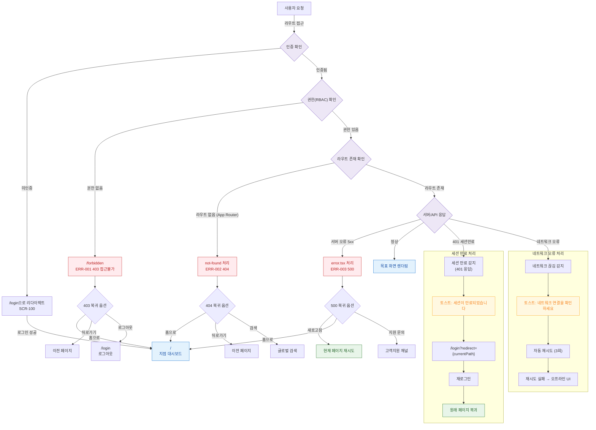

# N6 — 에러 복귀 경로

> 404/500/403 에러 발생 시 사용자 복귀 경로. 공통.md 에러 페이지(SCR-108) 기준.



---

## 에러 유형별 복귀 경로 요약

| 에러 | 코드 | 발생 원인 | 복귀 경로 1 | 복귀 경로 2 | 복귀 경로 3 |
|------|------|---------|-----------|-----------|-----------|
| 403 접근불가 | ERR-001 | 권한 미보유 | `/` (홈) | 뒤로가기 | `/login` (로그아웃) |
| 404 페이지없음 | ERR-002 | 잘못된 URL | `/` (홈) | 뒤로가기 | 글로벌 검색 |
| 500 서버오류 | ERR-003 | 서버/API 오류 | 새로고침 | `/` (홈) | 고객지원 |
| 401 세션만료 | - | 토큰 만료 | `/login?redirect=` | - | - |
| 네트워크 오류 | - | 연결 끊김 | 자동 재시도 | 오프라인 UI | - |

## Next.js App Router 에러 파일 매핑

| 파일 | 처리 에러 | 라우트 |
|------|---------|--------|
| `app/(error)/not-found/page.tsx` | 404 Not Found | `/not-found` |
| `app/(error)/forbidden/page.tsx` | 403 Forbidden | `/forbidden` |
| `app/error.tsx` (글로벌) | 500 Server Error | 모든 라우트 |
| `app/not-found.tsx` (글로벌) | 404 (App Router) | 모든 라우트 |

## 비인증 리다이렉트 규칙

```
미인증 접근 → /login?redirect={원래경로}
로그인 성공 → redirect 파라미터 경로로 복귀
redirect 없음 → / (지점 대시보드)
```
