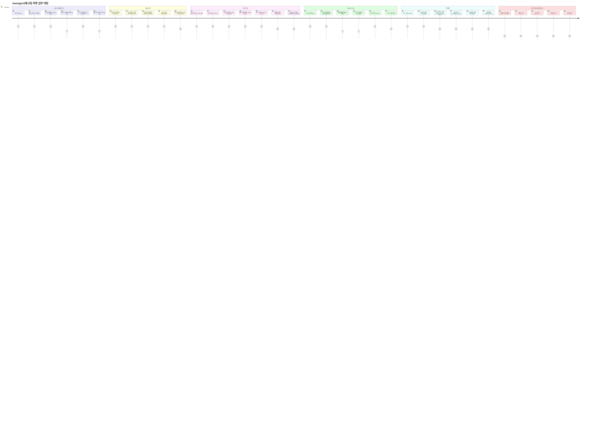

# R4 — manager(매니저) Journey

> 운영 전반 관리. 매출 조회만(○), 직원/급여/상품/설정 접근 불가.

---

## manager 역할 접근 상세

| 화면 | 라우트 | 접근 | 비고 |
|------|--------|:---:|------|
| 대시보드 | `/`, `/today-tasks` | ● | |
| KPI 대시보드 | `/kpi` | ○ | 조회만 |
| KPI 프리뷰 | `/kpi-preview` | ● | |
| 감사 로그 | `/audit-log` | ● | |
| 리포트 | `/reports` | ○ | 조회만 |
| 회원 목록/등록/수정/상세 | `/members*` | ● | |
| 회원 이관 | `/members/transfer` | — | 차단 |
| 캘린더 | `/calendar` | ● | |
| 수업 관리 | `/lessons` | ● | |
| 시간표 등록 | `/class-schedule` | ● | |
| 수업 현황 | `/class-stats` | ● | |
| 횟수/유효수업/페널티 | `/lesson-counts*` | ● | |
| 매출 현황 | `/sales` | ● | |
| 매출 통계 | `/sales/stats` | ○ | 조회만 |
| POS 전체 | `/pos*` | ● | |
| 환불 관리 | `/refunds` | — | 차단 |
| 이연매출 | `/deferred-revenue` | ● | |
| 미수금 | `/unpaid` | ○ | 조회만 |
| 상품 관리 | `/products*` | — | 차단 |
| 락커/사물함/RFID/운동복 | `/locker*`, `/rfid`, `/clothing` | ● | |
| 운동룸/골프타석 | `/rooms`, `/golf-bays` | ● | |
| 직원 관리 | `/staff*` | — | 차단 |
| 직원 근태 | `/staff/attendance` | ○ | 조회만 |
| 급여 관리 | `/payroll*` | — | 차단 |
| 리드/메시지/쿠폰/마일리지 | `/leads`, `/message*`, `/mileage` | ● | |
| 전자계약 | `/contracts/new` | ● | |
| 센터 설정/권한/키오스크/IoT | `/settings*` | — | 차단 |
| 공지사항/출석 | `/notices`, `/attendance` | ● | |
