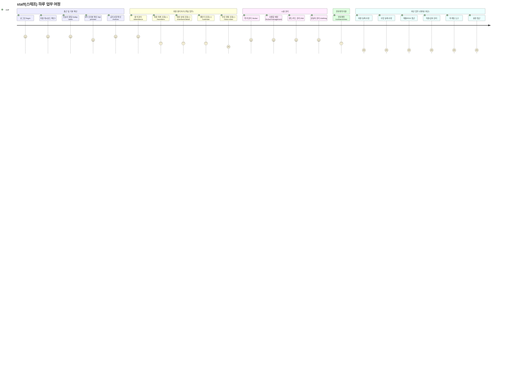

# R6 — staff(스태프) Journey

> 기본 조회/출석 확인 담당. 대부분 화면 차단. 시설 일부(락커/운동복) 접근 가능.

---

## staff 역할 접근 상세

| 화면 | 라우트 | 접근 | 비고 |
|------|--------|:---:|------|
| 대시보드/할일 | `/`, `/today-tasks` | ● | |
| KPI 프리뷰 | `/kpi-preview` | ● | |
| 공지사항 | `/notices` | ● | |
| 출석 관리 | `/attendance` | ● | |
| 회원 목록 | `/members` | ○ | 조회만 |
| 회원 상세 | `/members/detail` | ○ | 조회만 |
| 회원 등록/수정/이관 | `/members/new`, `/members/edit`, `/members/transfer` | — | 차단 |
| 캘린더 | `/calendar` | ○ | 조회만 |
| 수업 관리 | `/lessons` | — | 차단 |
| 수업 현황 | `/class-stats` | — | 차단 |
| 전자계약 | `/contracts/new` | ● | |
| 락커 관리 | `/locker` | ● | |
| 사물함 배정 | `/locker/management` | ● | |
| 밴드/카드 | `/rfid` | ● | |
| 운동복 | `/clothing` | ● | |
| 운동룸/골프타석 | `/rooms`, `/golf-bays` | — | 차단 |
| 매출 전체 | `/sales*`, `/pos*`, `/refunds*` | — | 차단 |
| 상품 전체 | `/products*` | — | 차단 |
| 직원/급여 | `/staff*`, `/payroll*` | — | 차단 |
| 마케팅 전체 | `/leads`, `/message*`, `/mileage` | — | 차단 |
| 설정 전체 | `/settings*` | — | 차단 |
| 본사관리 | `/super-dashboard`, `/kpi`, `/audit-log` 등 | — | 차단 |

**접근 가능: 13개 / 조회만: 2개 / 차단: 52개**
