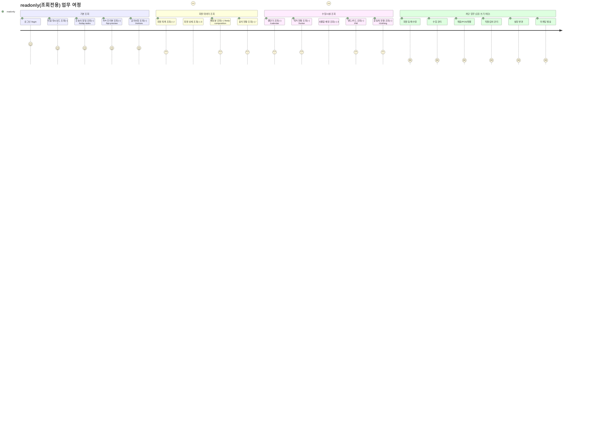

# R7 — readonly(조회전용) Journey

> 읽기 전용 전체. 허용된 모든 화면에서 조회만 가능. CRUD 액션 비활성.
> 설정관리 SCR-081 6번째 시스템 역할.

---

## readonly 역할 접근 상세

| 화면 | 라우트 | 접근 | 비고 | |------|--------|:---:|------| | 대시보드 | `/` | ● | 버튼 비활성 | | 오늘의 할일 | `/today-tasks` | ● | 완료 버튼 비활성 | | KPI 프리뷰 | `/kpi-preview` | ● | |
| 공지사항 | `/notices` | ● | 등록 버튼 비활성 | | 출석 관리 | `/` | ● | 출석 처리 버튼 비활성 | | 회원 목록 | `/` | ○ | 등록 버튼 숨김 | | 회원 상세 | `` | ○ | 수정 버튼 숨김 | | 체성분 관리 | `/body-composition` | ○ | 입력 버튼 숨김 | | 캘린더 | `/calendar` | ○ | 등록 버튼 숨김 | | 락커 관리 | `/locker` | ● | 배정 버튼 비활성 | | 사물함 배정 | `` | ● | 수정 버튼 비활성 | | 밴드/카드 | `/rfid` | ● | 등록 버튼 비활성 | | 운동복 | `/clothing` | ● | 수정 버튼 비활성 | | 회원 등록/수정 | ``, `` | — | 차단 | | 회원 이관 | `` | — | 차단 | | 수업 관리 전체 | `/lessons*`, `/class-schedule*` | — | 차단 | | 매출 전체 | `/sales*`, `/pos*`, `/*` | — | 차단 | | 상품 전체 | `/*` | — | 차단 | | 직원/급여 | `/staff*`, `/payroll*` | — | 차단 | | 마케팅 전체 | `/`, `/message*`, `/mileage` | — | 차단 | | 설정 전체 | `/settings*` | — | 차단 | | 본사관리 | `/super-dashboard`, `/kpi`, `/branches` 등 | — | 차단 |

## readonly UI 처리 원칙

| UI 요소 | 처리 방식 | |---------|---------| | 등록/생성 버튼 | `hidden` 또는 `disabled` | | 수정/삭제 버튼 | `hidden` 또는 `disabled` | | 폼 필드 | `` 속성 적용 | | 테이블 행 클릭 | 상세 조회만 허용 | | 저장/확인 버튼 | `disabled` 처리 | | 403 리다이렉트 | 차단된 라우트 직접 접근 시 `/forbidden` |

**접근 가능(조회): 13개 / 차단: 54개**
