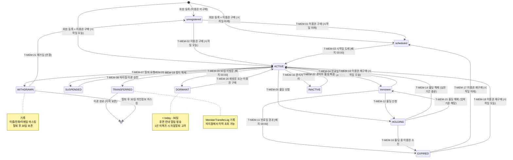

## 1. 개요

회원(Member) 엔티티의 생명주기 상태를 정의한다. DB 저장 상태 8종과 UI 계산 표시 상태 3종으로 구성되며, 복수 이용권 보유 시 우선순위(활성 > 임박 > 예정 > 홀딩 > 만료)로 대표 상태를 표시한다.

- **엔티티**: `Member`
- **저장 방식**: DB enum
- **관련 화면**: SCR-M001(회원 목록), SCR-M002(회원 등록), SCR-M003(회원 수정), SCR-M004(회원 상세)

---

## 2. 상태 정의

### 2.1 DB 저장 상태

| 상태값 | 한글명 | 설명 | UI 색상 | 종료 여부 | |--------|--------|------|---------|-----------| | `ACTIVE` | 활성 | 유효한 이용권 보유, 기간 내 | #4CAF50 (녹색) | 비종료 | | `INACTIVE` | 비활성 | 관리자 수동 비활성 처리 | #9E9E9E (회색) | 비종료 | | `EXPIRED` | 만료 | 모든 이용권 기간 종료 | #F44336 (빨강) | 비종료 | | `HOLDING` | 홀딩 | 기간정지 중 | #9C27B0 (보라) | 비종료 | | `SUSPENDED` | 정지 | 이용 제한 (징계 등) | #FF5722 (주황) | 비종료 | | `WITHDRAWN` | 탈퇴 | 자발적 탈퇴 | #795548 (갈색) | 준종료 | | `DORMANT` | 휴면 | 장기 미방문 (90일 이상) | #607D8B (청회색) | 비종료 | | `TRANSFERRED` | 이관 | 타지점으로 이관 완료 | #2196F3 (파랑) | 준종료 |

### 2.2 UI 계산 표시 상태 (DB 미저장)

| 표시 상태 | 한글명 | 판정 조건 | UI 색상 | |-----------|--------|-----------|---------| | `unregistered` | 미등록 | 이용권 미보유 | #BDBDBD (연회색) | | `scheduled` | 예정 | 이용권 시작일 미도래 | #03A9F4 (하늘색) | | `imminent` | 임박 | 만료일 N일(기본 30일) 이내 | #FF9800 (주황) |

---

## 3. 상태 전이 다이어그램

---

## 4. 전이 이벤트 목록

| 이벤트 ID | From | To | 트리거 | 권한 | 부수효과 | TC 후보 | |-----------|------|----|--------|------|----------|---------| | T-MEM-01 | unregistered | scheduled | 전자계약/POS 결제 완료 (시작일 미래) | STAFF 이상 | 이용권 레코드 생성, 시작일 예약 | TC-MEM-01 | | T-MEM-02 | unregistered | ACTIVE | 전자계약/POS 결제 완료 (시작일 오늘) | STAFF 이상 | 이용권 레코드 생성, 즉시 활성화 | TC-MEM-02 | | T-MEM-03 | scheduled | ACTIVE | 배치 스케줄러 (매일 00:00, ≤ today) | 시스템 | 활성화 알림 발송 | TC-MEM-03 | | T-MEM-04 | ACTIVE | imminent | 배치 스케줄러 (만료일 - today ≤ N일) | 시스템 | 만료 임박 알림 발송 (Push/SMS) | TC-MEM-04 | | T-MEM-05 | ACTIVE | HOLDING | 관리자 홀딩 신청 처리 | MANAGER 이상 | /EndAt 기록, 알림 발송 | TC-MEM-05 | | T-MEM-06 | ACTIVE | SUSPENDED | 관리자 수동 정지 처리 | MANAGER 이상 | 정지 사유 기록, 이용 제한 적용 | TC-MEM-06 | | T-MEM-07 | ACTIVE | WITHDRAWN | 관리자 탈퇴 처리 | MANAGER 이상 | 탈퇴 사유 필수, 기록 | TC-MEM-07 | | T-MEM-08 | ACTIVE | TRANSFERRED | 이관 승인 완료 | OWNER 이상 | MemberTransferLog 생성, 타지점 연동 | TC-MEM-08 | | T-MEM-09 | ACTIVE | DORMANT | 배치 스케줄러 ( < today - 90일) | 시스템 | 휴면 안내 알림 발송 | TC-MEM-09 | | T-MEM-10 | ACTIVE | INACTIVE | 관리자 수동 비활성 처리 | MANAGER 이상 | 비활성 사유 기록 | TC-MEM-10 | | T-MEM-11 | imminent | EXPIRED | 배치 스케줄러 (만료일 < today) | 시스템 | 만료 알림 발송, 이용 제한 | TC-MEM-11 | | T-MEM-12 | imminent | HOLDING | 관리자 홀딩 신청 처리 | MANAGER 이상 | /EndAt 기록 | TC-MEM-12 | | T-MEM-13 | imminent | ACTIVE | 이용권 재구매 (시작일 오늘) | STAFF 이상 | 이용권 갱신, 상태 재계산 | TC-MEM-13 | | T-MEM-14 | HOLDING | ACTIVE | 홀딩 해제 (관리자 수동 또는 도래) | MANAGER 이상 | 남은 기간 재계산, 해제 알림 | TC-MEM-14 | | T-MEM-15 | HOLDING | imminent | 홀딩 해제 (임박 기준 해당) | MANAGER 이상 | 남은 기간 재계산 | TC-MEM-15 | | T-MEM-16 | HOLDING | EXPIRED | 홀딩 중 이용권 만료 | 시스템 | 만료 알림 발송 | TC-MEM-16 | | T-MEM-17 | EXPIRED | scheduled | 이용권 재구매 (시작일 미래) | STAFF 이상 | 새 이용권 레코드 생성 | TC-MEM-17 | | T-MEM-18 | EXPIRED | ACTIVE | 이용권 재구매 (시작일 오늘) | STAFF 이상 | 새 이용권 레코드 생성, 즉시 활성화 | TC-MEM-18 | | T-MEM-19 | SUSPENDED | ACTIVE | 관리자 정지 해제 | MANAGER 이상 | 정지 해제 일시 기록 | TC-MEM-19 | | T-MEM-20 | DORMANT | ACTIVE | 출석 체크 또는 이용권 결제 | STAFF 이상 | 휴면 해제 일시 기록 | TC-MEM-20 | | T-MEM-21 | WITHDRAWN | unregistered | 관리자 재가입 처리 | MANAGER 이상 | 연결, 새 계정 생성 | TC-MEM-21 | | T-MEM-22 | INACTIVE | ACTIVE | 관리자 활성 복원 | MANAGER 이상 | 활성화 일시 기록 | TC-MEM-22 |

---

## 5. 예외/롤백 분기

| 시나리오 | 조건 | 처리 | 에러 코드 | |----------|------|------|-----------| | 홀딩 신청 불가 | 센터 설정 홀딩 제한 초과 | 홀딩 거부, 경고 토스트 표시 | E400201 | | 이관 취소 | 이관 승인 전 취소 | ACTIVE 상태 유지, MemberTransferLog 취소 기록 | - | | 탈퇴 후 개인정보 마스킹 실패 | 배치 오류 | 수동 마스킹 처리 필요, 관리자 알림 | E500101 | | 홀딩 자동 해제 실패 | 배치 오류 | 수동 해제 처리 필요 | E500102 | | 재가입 시 마스킹된 데이터 | WITHDRAWN 후 30일 이후 | 만 연결, 기존 정보 복원 불가 | - | | DORMANT 자동 전환 중복 | 배치 중복 실행 | 멱등 처리 (이미 DORMANT이면 스킵) | - |
