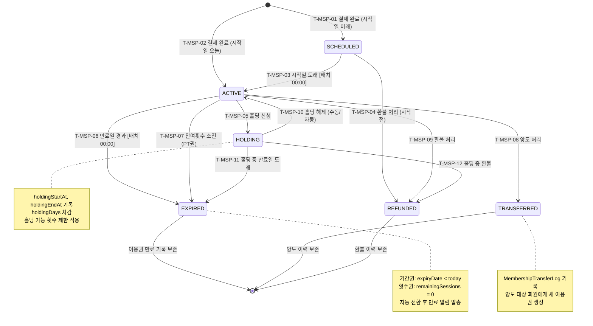

## 1. 개요

이용권(Membership) 엔티티의 생명주기 상태를 정의한다. 기간권/횟수권 모두 동일한 상태 체계를 공유하며, 배치 스케줄러에 의한 자동 전환과 관리자 수동 처리가 혼재한다.

- **엔티티**: `Membership.status`
- **저장 방식**: DB enum
- **관련 화면**: SCR-M004(회원 상세 - 이용권 탭), SCR-S001(매출 현황)

---

## 2. 상태 정의

| 상태값 | 한글명 | 설명 | UI 색상 | 종료 여부 |
|--------|--------|------|---------|-----------|
| `SCHEDULED` | 예정 | 결제 완료, 시작일 미도래 | #03A9F4 (하늘색) | 비종료 |
| `ACTIVE` | 활성 | 시작일 ≤ 오늘 ≤ 만료일, 잔여횟수 > 0 | #4CAF50 (녹색) | 비종료 |
| `HOLDING` | 홀딩 | 기간정지 중 | #9C27B0 (보라) | 비종료 |
| `EXPIRED` | 만료 | 만료일 경과 또는 잔여횟수 = 0 | #F44336 (빨강) | 종료 |
| `TRANSFERRED` | 양도 | 타 회원으로 양도 완료 | #2196F3 (파랑) | 종료 |
| `REFUNDED` | 환불 | 환불 처리로 비활성화 | #FF5722 (주황) | 종료 |

---

## 3. 상태 전이 다이어그램

---

## 4. 전이 이벤트 목록

| 이벤트 ID | From | To | 트리거 | 권한 | 부수효과 | TC 후보 |
|-----------|------|----|--------|------|----------|---------|
| T-MSP-01 | [신규] | SCHEDULED | 전자계약/POS 결제 완료 (시작일 미래) | STAFF 이상 | 이용권 레코드 생성, 회원 상태 재계산 | TC-MSP-01 |
| T-MSP-02 | [신규] | ACTIVE | 전자계약/POS 결제 완료 (시작일 오늘) | STAFF 이상 | 이용권 레코드 생성, 즉시 활성화 | TC-MSP-02 |
| T-MSP-03 | SCHEDULED | ACTIVE | 배치 스케줄러 (membershipStart ≤ today) | 시스템 | 활성화 알림 발송, 회원 상태 재계산 | TC-MSP-03 |
| T-MSP-04 | SCHEDULED | REFUNDED | 관리자 환불 처리 | MANAGER 이상 | 환불 레코드 생성, 결제 취소 연동 | TC-MSP-04 |
| T-MSP-05 | ACTIVE | HOLDING | 관리자 홀딩 신청 | MANAGER 이상 | holdingStartAt/EndAt 기록, 홀딩 알림 발송 | TC-MSP-05 |
| T-MSP-06 | ACTIVE | EXPIRED | 배치 스케줄러 (expiryDate < today) | 시스템 | 만료 알림 발송, 회원 상태 재계산 | TC-MSP-06 |
| T-MSP-07 | ACTIVE | EXPIRED | 수업 완료 시 잔여횟수 차감 → 0 | 시스템 | 횟수 소진 알림 발송 | TC-MSP-07 |
| T-MSP-08 | ACTIVE | TRANSFERRED | 관리자 양도 처리 | MANAGER 이상 | MembershipTransferLog 생성, 대상 회원에 새 이용권 | TC-MSP-08 |
| T-MSP-09 | ACTIVE | REFUNDED | 관리자 환불 처리 | MANAGER 이상 | 환불 레코드 생성, 결제 취소, 회원 상태 재계산 | TC-MSP-09 |
| T-MSP-10 | HOLDING | ACTIVE | 홀딩 해제 (수동) 또는 holdingEndAt 도래 | MANAGER 이상 / 시스템 | 남은 기간 재계산, 해제 알림 발송 | TC-MSP-10 |
| T-MSP-11 | HOLDING | EXPIRED | 홀딩 중 만료일 도래 | 시스템 | 만료 알림 발송 | TC-MSP-11 |
| T-MSP-12 | HOLDING | REFUNDED | 홀딩 중 환불 처리 | MANAGER 이상 | 환불 레코드 생성, 홀딩 해제 후 환불 | TC-MSP-12 |

---

## 5. 예외/롤백 분기

| 시나리오 | 조건 | 처리 | 에러 코드 |
|----------|------|------|-----------|
| 홀딩 횟수 초과 | 센터 설정 홀딩 제한 초과 | 홀딩 거부, 경고 토스트 | E400201 |
| 환불 금액 초과 | 환불금 > 결제금 | 환불 거부 | E400301 |
| 양도 대상 미존재 | 대상 회원 미등록 | 양도 거부, 오류 안내 | E400401 |
| 만료 자동 전환 중복 | 배치 중복 실행 | 멱등 처리 (이미 EXPIRED이면 스킵) | - |
| 홀딩 자동 해제 실패 | 배치 오류 | 수동 처리 필요, 관리자 알림 | E500102 |
