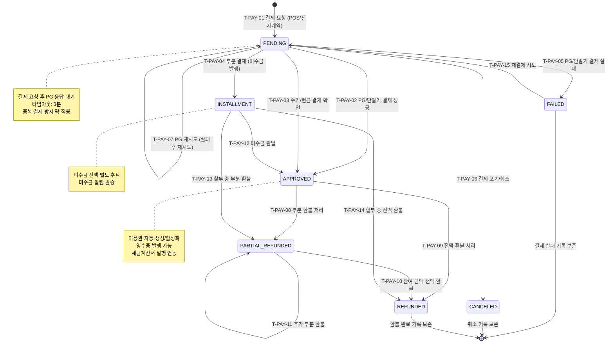

## 1. 개요

결제(Payment/Sale) 엔티티의 생명주기 상태를 정의한다. PG 연동 결제, 수기 결제, 분할 납부(INSTALLMENT), 미수금(PARTIAL_REFUNDED 포함) 처리를 포함한다.

- **엔티티**: `Sale` / `Payment`
- **저장 방식**: DB enum
- **관련 화면**: SCR-S001(매출 현황), SCR-M004(회원 상세 - 결제 탭), DLG-M012(환불처리), DLG-M014(결제상세)

---

## 2. 상태 정의

| 상태값 | 한글명 | 설명 | UI 색상 | 종료 여부 | |--------|--------|------|---------|-----------| | `PENDING` | 대기 | PG/단말기 응답 대기 중 | #FF9800 (주황) | 비종료 | | `APPROVED` | 승인완료 | 정상 결제 처리 완료 | #4CAF50 (녹색) | 준종료 | | `PARTIAL_REFUNDED` | 부분환불 | 일부 금액 환불 처리 | #03A9F4 (하늘색) | 준종료 | | `REFUNDED` | 전액환불 | 전액 환불 처리 완료 | #F44336 (빨강) | 종료 | | `CANCELED` | 취소 | 결제 취소 (승인 전) | #9E9E9E (회색) | 종료 | | `FAILED` | 실패 | PG/단말기 결제 실패 | #FF5722 (주황빨강) | 종료 | | `INSTALLMENT` | 분할납부 | 할부/미수금 납부 진행 중 | #9C27B0 (보라) | 비종료 |

---

## 3. 상태 전이 다이어그램

---

## 4. 전이 이벤트 목록

| 이벤트 ID | From | To | 트리거 | 권한 | 부수효과 | TC 후보 | |-----------|------|----|--------|------|----------|---------| | T-PAY-01 | [신규] | PENDING | POS/전자계약 결제 시작 | STAFF 이상 | 결제 레코드 생성, PG 요청 전송 | TC-PAY-01 | | T-PAY-02 | PENDING | APPROVED | PG/단말기 성공 응답 수신 | 시스템 | 이용권 자동 생성, 영수증 발행 | TC-PAY-02 | | T-PAY-03 | PENDING | APPROVED | 관리자 수기/현금 결제 확인 | STAFF 이상 | 수기 결제 메모 기록 | TC-PAY-03 | | T-PAY-04 | PENDING | INSTALLMENT | 부분 결제 금액 입력 | STAFF 이상 | 기록, 미수금 알림 | TC-PAY-04 | | T-PAY-05 | PENDING | FAILED | PG/단말기 실패 응답 | 시스템 | 실패 사유 기록, 관리자 알림 | TC-PAY-05 | | T-PAY-06 | PENDING | CANCELED | 결제 포기 | STAFF 이상 / 시스템 | 결제 레코드 취소 처리 | TC-PAY-06 | | T-PAY-07 | PENDING | PENDING | PG 재시도 | 시스템 | 재시도 횟수 증가 (최대 3회) | TC-PAY-07 | | T-PAY-08 | APPROVED | PARTIAL_REFUNDED | 관리자 부분 환불 | MANAGER 이상 | 환불 레코드 생성, 이용권 조정 | TC-PAY-08 | | T-PAY-09 | APPROVED | REFUNDED | 관리자 전액 환불 | MANAGER 이상 | 환불 레코드 생성, 이용권 비활성화 | TC-PAY-09 | | T-PAY-10 | PARTIAL_REFUNDED | REFUNDED | 잔여 금액 전액 환불 | MANAGER 이상 | 이용권 완전 비활성화 | TC-PAY-10 | | T-PAY-11 | PARTIAL_REFUNDED | PARTIAL_REFUNDED | 추가 부분 환불 | MANAGER 이상 | 환불 누적 금액 갱신 | TC-PAY-11 | | T-PAY-12 | INSTALLMENT | APPROVED | 미수금 완납 처리 | STAFF 이상 | , 완납 알림 | TC-PAY-12 | | T-PAY-13 | INSTALLMENT | PARTIAL_REFUNDED | 할부 중 부분 환불 | MANAGER 이상 | 환불 레코드 생성 | TC-PAY-13 | | T-PAY-14 | INSTALLMENT | REFUNDED | 할부 중 전액 환불 | MANAGER 이상 | 이용권 비활성화, 미수금 정리 | TC-PAY-14 | | T-PAY-15 | FAILED | PENDING | 재결제 시도 | STAFF 이상 | 새 결제 시도 레코드 생성 | TC-PAY-15 |

---

## 5. 예외/롤백 분기

| 시나리오 | 조건 | 처리 | 에러 코드 | |----------|------|------|-----------| | 환불 금액 초과 | 환불금 > 결제금 | 환불 거부 | E400301 | | PG 타임아웃 | 3분 내 응답 없음 | FAILED 전환, 재시도 안내 | E408001 | | 중복 결제 방지 | 동일 세션 중복 요청 | 두 번째 요청 거부 | E409001 | | 이용권 생성 실패 | 결제 성공 후 이용권 생성 오류 | 롤백 후 관리자 수동 처리 필요 | E500201 | | 부분 환불 후 전액 환불 | PARTIAL_REFUNDED → REFUNDED | 잔여 환불 금액만 처리 | - |
