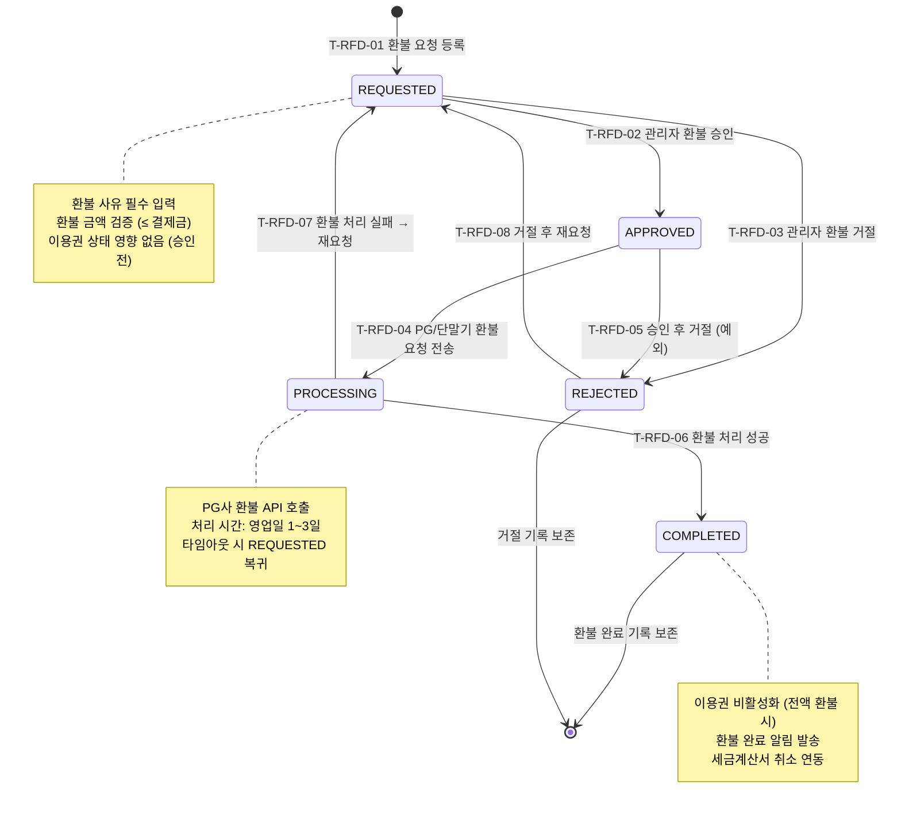

## 1. 개요

환불(Refund) 엔티티의 생명주기 상태를 정의한다. 환불 요청부터 승인/거절, 처리, 완료까지의 단계별 상태와 각 단계의 승인 권한을 명시한다.

- **엔티티**: `Refund`
- **저장 방식**: DB enum
- **관련 화면**: SCR-S001(매출 현황 - 환불 탭), SCR-M004(회원 상세 - 결제 탭), DLG-M012(환불처리)

---

## 2. 상태 정의

| 상태값 | 한글명 | 설명 | UI 색상 | 종료 여부 | |--------|--------|------|---------|-----------| | `REQUESTED` | 요청 | 환불 요청 등록, 검토 대기 | #FF9800 (주황) | 비종료 | | `APPROVED` | 승인 | 관리자 환불 승인, 처리 대기 | #03A9F4 (하늘색) | 비종료 | | `REJECTED` | 거절 | 환불 요청 거절 | #F44336 (빨강) | 종료 | | `PROCESSING` | 처리중 | PG/단말기 환불 요청 중 | #9C27B0 (보라) | 비종료 | | `COMPLETED` | 완료 | 환불 처리 완료 | #4CAF50 (녹색) | 종료 |

---

## 3. 상태 전이 다이어그램

---

## 4. 전이 이벤트 목록

| 이벤트 ID | From | To | 트리거 | 권한 | 부수효과 | TC 후보 | |-----------|------|----|--------|------|----------|---------| | T-RFD-01 | [신규] | REQUESTED | 관리자 환불 요청 등록 | STAFF 이상 | 환불 레코드 생성, 환불 사유 기록 | TC-RFD-01 | | T-RFD-02 | REQUESTED | APPROVED | 관리자 승인 | MANAGER 이상 | 승인 일시 기록, 처리 담당자 지정 | TC-RFD-02 | | T-RFD-03 | REQUESTED | REJECTED | 관리자 거절 | MANAGER 이상 | 거절 사유 필수 기록, 거절 알림 발송 | TC-RFD-03 | | T-RFD-04 | APPROVED | PROCESSING | PG/단말기 환불 API 호출 | 시스템 / MANAGER 이상 | 환불 요청 전송, 처리 시작 일시 기록 | TC-RFD-04 | | T-RFD-05 | APPROVED | REJECTED | 예외적 승인 취소 | OWNER 이상 | 취소 사유 기록 | TC-RFD-05 | | T-RFD-06 | PROCESSING | COMPLETED | PG 환불 성공 응답 | 시스템 | 이용권 상태 갱신, 환불 완료 알림 발송, 세금계산서 취소 | TC-RFD-06 | | T-RFD-07 | PROCESSING | REQUESTED | PG 환불 실패 | 시스템 | 실패 사유 기록, 관리자 알림, 재처리 안내 | TC-RFD-07 | | T-RFD-08 | REJECTED | REQUESTED | 거절 후 재요청 | STAFF 이상 | 재요청 사유 기록 | TC-RFD-08 |

---

## 5. 예외/롤백 분기

| 시나리오 | 조건 | 처리 | 에러 코드 | |----------|------|------|-----------| | 환불 금액 초과 | 환불금 > 원결제금 | 요청 거부 | E400301 | | PG 환불 타임아웃 | 처리 응답 없음 | REQUESTED 복귀, 수동 처리 필요 | E408002 | | 이미 환불 완료 | 동일 결제 중복 환불 시도 | 거부, 중복 안내 | E409002 | | 이용권 비활성화 실패 | 전액 환불 완료 후 이용권 갱신 실패 | 수동 이용권 비활성화 필요 | E500202 | | 세금계산서 취소 실패 | COMPLETED 후 세금계산서 취소 오류 | 수동 취소 처리, 관리자 알림 | E500203 |
