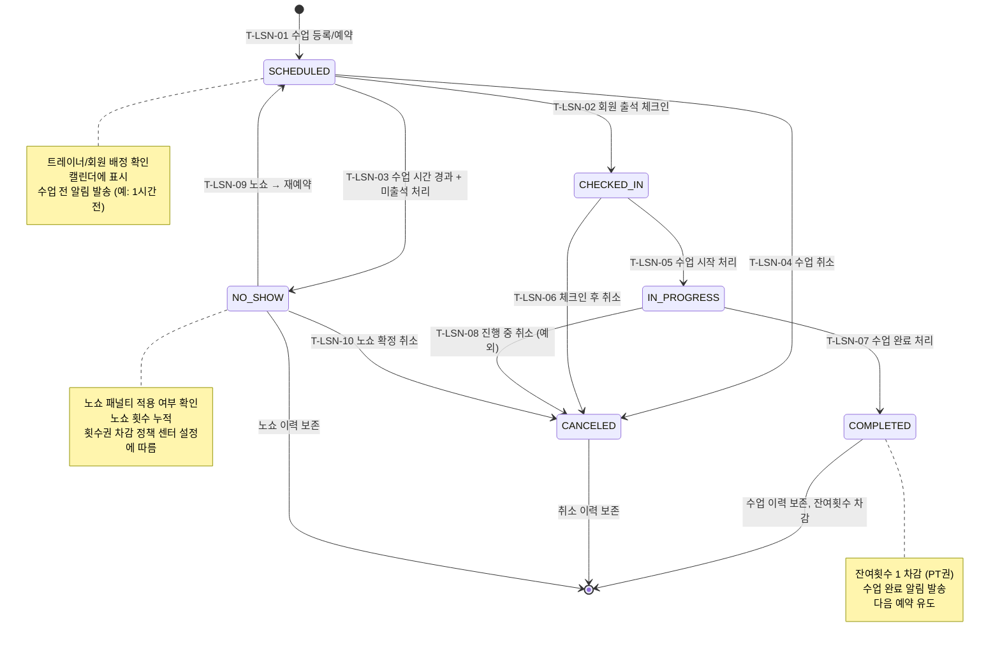

## 1. 개요

수업(Lesson) 엔티티의 생명주기 상태를 정의한다. PT 수업, 그룹 수업 모두 동일한 상태 체계를 공유하며, 출석 체크인부터 완료/노쇼/취소까지의 전이를 포함한다.

- **엔티티**: `Lesson`
- **저장 방식**: DB enum
- **관련 화면**: SCR-L001(수업 목록), SCR-L002(수업 상세), SCR-M004(회원 상세 - 레슨 탭), SCR-C001(캘린더)

---

## 2. 상태 정의

| 상태값 | 한글명 | 설명 | UI 색상 | 종료 여부 | |--------|--------|------|---------|-----------| | `SCHEDULED` | 예정 | 수업 예약 완료, 시작 전 | #03A9F4 (하늘색) | 비종료 | | `CHECKED_IN` | 체크인 | 회원 출석 확인 완료 | #FF9800 (주황) | 비종료 | | `IN_PROGRESS` | 진행중 | 수업 진행 중 | #9C27B0 (보라) | 비종료 | | `COMPLETED` | 완료 | 수업 정상 완료 | #4CAF50 (녹색) | 종료 | | `NO_SHOW` | 노쇼 | 회원 미출석 | #F44336 (빨강) | 종료 | | `CANCELED` | 취소 | 수업 취소 | #9E9E9E (회색) | 종료 |

---

## 3. 상태 전이 다이어그램

---

## 4. 전이 이벤트 목록

| 이벤트 ID | From | To | 트리거 | 권한 | 부수효과 | TC 후보 | |-----------|------|----|--------|------|----------|---------| | T-LSN-01 | [신규] | SCHEDULED | 관리자/트레이너 수업 등록 | TRAINER 이상 | 수업 레코드 생성, 캘린더 등록, 예약 알림 | TC-LSN-01 | | T-LSN-02 | SCHEDULED | CHECKED_IN | 관리자/트레이너 출석 체크인 | TRAINER 이상 | 출석 레코드 생성, 체크인 시간 기록 | TC-LSN-02 | | T-LSN-03 | SCHEDULED | NO_SHOW | 수업 시간 경과 후 관리자 노쇼 처리 | TRAINER 이상 | 노쇼 카운트 증가, 노쇼 알림 발송 | TC-LSN-03 | | T-LSN-04 | SCHEDULED | CANCELED | 관리자/트레이너/회원 취소 | TRAINER 이상 | 취소 사유 기록, 취소 알림 발송, 횟수 미차감 | TC-LSN-04 | | T-LSN-05 | CHECKED_IN | IN_PROGRESS | 트레이너 수업 시작 처리 | TRAINER 이상 | 수업 시작 시간 기록 | TC-LSN-05 | | T-LSN-06 | CHECKED_IN | CANCELED | 체크인 후 취소 처리 | MANAGER 이상 | 취소 사유 기록, 횟수 미차감 | TC-LSN-06 | | T-LSN-07 | IN_PROGRESS | COMPLETED | 트레이너 수업 완료 처리 | TRAINER 이상 | 잔여횟수 차감, 완료 시간 기록, 완료 알림 | TC-LSN-07 | | T-LSN-08 | IN_PROGRESS | CANCELED | 진행 중 예외 취소 | MANAGER 이상 | 취소 사유 기록, 차감 여부 별도 결정 | TC-LSN-08 | | T-LSN-09 | NO_SHOW | SCHEDULED | 노쇼 회원 재예약 | TRAINER 이상 | 새 수업 레코드 생성 | TC-LSN-09 | | T-LSN-10 | NO_SHOW | CANCELED | 노쇼 확정 후 취소 처리 | MANAGER 이상 | 노쇼 패널티 적용 | TC-LSN-10 |

---

## 5. 예외/롤백 분기

| 시나리오 | 조건 | 처리 | 에러 코드 | |----------|------|------|-----------| | 잔여횟수 부족 | 완료 시 잔여횟수 = 0 | 이용권 EXPIRED 전환, 알림 발송 | - | | 트레이너 미배정 | 수업 등록 시 트레이너 없음 | 등록 거부 또는 경고 | E400501 | | 중복 수업 시간 | 동일 트레이너 동일 시간 | 등록 거부, 충돌 안내 | E409501 | | 노쇼 자동 처리 실패 | 배치 오류 | 수동 노쇼 처리 필요 | E500501 | | 완료 후 잔여횟수 차감 실패 | DB 오류 | 수동 차감, 관리자 알림 | E500502 |
