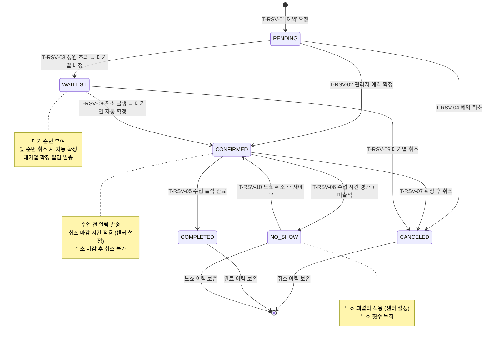

## 1. 개요

예약(Reservation) 엔티티의 생명주기 상태를 정의한다. 그룹 수업 예약, PT 예약, 시설 예약을 포함하며 대기열(WAITLIST) 처리를 포함한다.

- **엔티티**: `Reservation`
- **저장 방식**: DB enum
- **관련 화면**: SCR-L003(예약 관리), SCR-M004(회원 상세 - 예약 탭), SCR-C001(캘린더)

---

## 2. 상태 정의

| 상태값 | 한글명 | 설명 | UI 색상 | 종료 여부 | |--------|--------|------|---------|-----------| | `PENDING` | 대기 | 예약 요청, 확정 전 | #FF9800 (주황) | 비종료 | | `CONFIRMED` | 확정 | 예약 확정 완료 | #4CAF50 (녹색) | 비종료 | | `WAITLIST` | 대기열 | 정원 초과로 대기 중 | #03A9F4 (하늘색) | 비종료 | | `CANCELED` | 취소 | 예약 취소 | #9E9E9E (회색) | 종료 | | `NO_SHOW` | 노쇼 | 예약 시간 미출석 | #F44336 (빨강) | 종료 | | `COMPLETED` | 완료 | 수업 참여 완료 | #607D8B (청회색) | 종료 |

---

## 3. 상태 전이 다이어그램

---

## 4. 전이 이벤트 목록

| 이벤트 ID | From | To | 트리거 | 권한 | 부수효과 | TC 후보 | |-----------|------|----|--------|------|----------|---------| | T-RSV-01 | [신규] | PENDING | 회원/관리자 예약 요청 | STAFF 이상 | 예약 레코드 생성, 정원 확인 | TC-RSV-01 | | T-RSV-02 | PENDING | CONFIRMED | 관리자 예약 확정 | STAFF 이상 | 확정 알림 발송, 캘린더 등록 | TC-RSV-02 | | T-RSV-03 | PENDING | WAITLIST | 정원 초과 감지 | 시스템 | 대기 순번 부여, 대기열 알림 발송 | TC-RSV-03 | | T-RSV-04 | PENDING | CANCELED | 예약 취소 | STAFF 이상 | 취소 알림 발송 | TC-RSV-04 | | T-RSV-05 | CONFIRMED | COMPLETED | 수업 출석 체크인 완료 | TRAINER 이상 | 출석 레코드 생성, 잔여횟수 차감 | TC-RSV-05 | | T-RSV-06 | CONFIRMED | NO_SHOW | 수업 시간 경과 후 노쇼 처리 | TRAINER 이상 | 노쇼 카운트 증가, 패널티 적용 | TC-RSV-06 | | T-RSV-07 | CONFIRMED | CANCELED | 확정 후 취소 | STAFF 이상 | 취소 마감 시간 확인, 취소 알림 | TC-RSV-07 | | T-RSV-08 | WAITLIST | CONFIRMED | 앞순번 취소로 자동 확정 | 시스템 | 대기열 확정 알림 발송, 순번 조정 | TC-RSV-08 | | T-RSV-09 | WAITLIST | CANCELED | 대기열 취소 | STAFF 이상 | 취소 알림 발송, 대기 순번 재정렬 | TC-RSV-09 | | T-RSV-10 | NO_SHOW | CONFIRMED | 노쇼 회원 재예약 | STAFF 이상 | 새 예약 레코드 생성 | TC-RSV-10 |

---

## 5. 예외/롤백 분기

| 시나리오 | 조건 | 처리 | 에러 코드 | |----------|------|------|-----------| | 취소 마감 후 취소 시도 | 취소 마감 시간 경과 | 취소 거부, 안내 메시지 | E400601 | | 정원 초과 직접 확정 시도 | 정원 초과 상태에서 확정 | 거부 또는 대기열 유도 | E400602 | | 중복 예약 | 동일 회원 동일 수업 | 거부, 중복 안내 | E409601 | | 대기열 자동 확정 실패 | 배치 오류 | 수동 확정 처리 필요 | E500601 |
