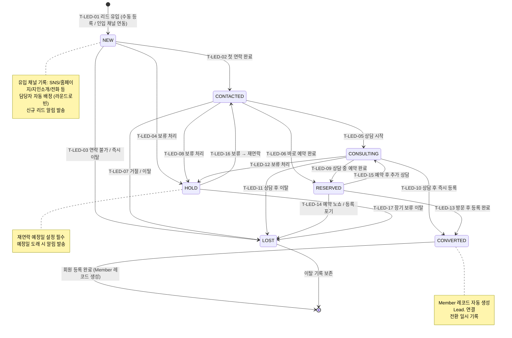

## 1. 개요

리드(Lead/잠재회원) 엔티티의 생명주기 상태를 정의한다. 신규 유입부터 상담, 등록 전환, 이탈까지의 영업 파이프라인 상태를 관리한다.

- **엔티티**: `Lead`
- **저장 방식**: DB enum
- **관련 화면**: SCR-K001(리드 목록), SCR-K002(리드 상세), SCR-K003(상담 관리)

---

## 2. 상태 정의

| 상태값 | 한글명 | 설명 | UI 색상 | 종료 여부 | |--------|--------|------|---------|-----------| | `NEW` | 신규 | 최초 유입, 미접촉 | #03A9F4 (하늘색) | 비종료 | | `CONTACTED` | 접촉완료 | 첫 연락 완료 | #FF9800 (주황) | 비종료 | | `CONSULTING` | 상담중 | 상담 진행 중 | #9C27B0 (보라) | 비종료 | | `RESERVED` | 예약완료 | 체험/상담 예약 | #2196F3 (파랑) | 비종료 | | `CONVERTED` | 전환 | 회원 등록 완료 | #4CAF50 (녹색) | 종료 | | `LOST` | 이탈 | 미등록 최종 이탈 | #F44336 (빨강) | 종료 | | `HOLD` | 보류 | 추후 재연락 예정 | #9E9E9E (회색) | 비종료 |

---

## 3. 상태 전이 다이어그램

---

## 4. 전이 이벤트 목록

| 이벤트 ID | From | To | 트리거 | 권한 | 부수효과 | TC 후보 | |-----------|------|----|--------|------|----------|---------| | T-LED-01 | [신규] | NEW | 관리자 수동 등록 또는 채널 자동 유입 | STAFF 이상 / 시스템 | 리드 레코드 생성, 유입 채널 기록, 담당자 배정 | TC-LED-01 | | T-LED-02 | NEW | CONTACTED | 관리자 첫 연락 완료 처리 | STAFF 이상 | 첫 연락 일시 기록, 상담 메모 등록 | TC-LED-02 | | T-LED-03 | NEW | LOST | 연락 불가 / 즉시 이탈 처리 | STAFF 이상 | 이탈 사유 기록 | TC-LED-03 | | T-LED-04 | NEW | HOLD | 보류 처리 | STAFF 이상 | 재연락 예정일 설정 필수 | TC-LED-04 | | T-LED-05 | CONTACTED | CONSULTING | 상담 시작 | STAFF 이상 | 상담 시작 일시 기록 | TC-LED-05 | | T-LED-06 | CONTACTED | RESERVED | 바로 예약 완료 | STAFF 이상 | 예약 레코드 연결, 예약 확정 알림 | TC-LED-06 | | T-LED-07 | CONTACTED | LOST | 이탈 처리 | STAFF 이상 | 이탈 사유 기록 | TC-LED-07 | | T-LED-08 | CONTACTED | HOLD | 보류 처리 | STAFF 이상 | 재연락 예정일 설정 | TC-LED-08 | | T-LED-09 | CONSULTING | RESERVED | 상담 중 예약 완료 | STAFF 이상 | 예약 레코드 생성, 예약 알림 | TC-LED-09 | | T-LED-10 | CONSULTING | CONVERTED | 상담 후 즉시 등록 | STAFF 이상 | Member 레코드 생성, Lead. 연결 | TC-LED-10 | | T-LED-11 | CONSULTING | LOST | 상담 후 이탈 | STAFF 이상 | 이탈 사유 기록 | TC-LED-11 | | T-LED-12 | CONSULTING | HOLD | 보류 처리 | STAFF 이상 | 재연락 예정일 설정 | TC-LED-12 | | T-LED-13 | RESERVED | CONVERTED | 방문 후 등록 완료 | STAFF 이상 | Member 레코드 생성, 전환 일시 기록 | TC-LED-13 | | T-LED-14 | RESERVED | LOST | 노쇼 / 등록 포기 | STAFF 이상 | 이탈 사유 기록 | TC-LED-14 | | T-LED-15 | RESERVED | CONSULTING | 추가 상담 필요 | STAFF 이상 | 상담 메모 추가 | TC-LED-15 | | T-LED-16 | HOLD | CONTACTED | 보류 → 재연락 | STAFF 이상 / 시스템 | 재연락 예정일 도래 알림 | TC-LED-16 | | T-LED-17 | HOLD | LOST | 장기 보류 이탈 | STAFF 이상 | 이탈 사유 기록 | TC-LED-17 |

---

## 5. 예외/롤백 분기

| 시나리오 | 조건 | 처리 | 에러 코드 | |----------|------|------|-----------| | 전환 시 중복 회원 | 동일 전화번호 회원 존재 | 중복 경고, 병합 또는 연결 유도 | E400701 | | 담당자 미배정 | 모든 담당자 비활성 | 관리자에게 배정 | E400702 | | 재연락 예정일 미설정 | HOLD 전환 시 예정일 없음 | 전환 거부, 예정일 입력 요청 | E400703 | | 자동 유입 리드 중복 | 동일 전화번호 중복 유입 | 기존 리드 업데이트, 중복 생성 방지 | E409701 |
