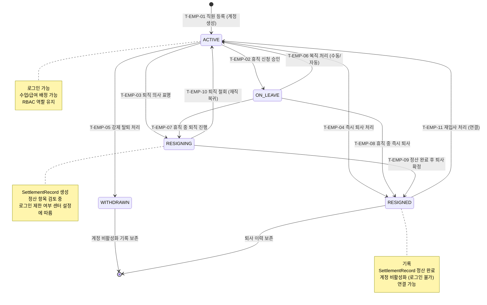

## 1. 개요

직원(Employee/Staff) 엔티티의 생명주기 상태를 정의한다. 기존 상태전이도(StaffStatus)를 계승하되 RESIGNING(퇴직 진행중) 상태를 추가하여 정산 워크플로우를 명시한다.

- **엔티티**: `Employee`
- **저장 방식**: DB enum
- **관련 화면**: SCR-E001(직원 목록), SCR-E002(직원 상세), SCR-E003(직원 등록), SCR-E004(급여 관리)

---

## 2. 상태 정의

| 상태값 | 한글명 | 설명 | UI 색상 | 종료 여부 | |--------|--------|------|---------|-----------| | `ACTIVE` | 재직 | 정상 근무 중 | #4CAF50 (녹색) | 비종료 | | `ON_LEAVE` | 휴직 | 일시 휴직 (기간 설정) | #9C27B0 (보라) | 비종료 | | `RESIGNING` | 퇴직진행 | 퇴직 의사 표명, 정산 진행 중 | #FF9800 (주황) | 비종료 | | `RESIGNED` | 퇴사 | 퇴사 처리 완료 | #9E9E9E (회색) | 준종료 | | `WITHDRAWN` | 강제탈퇴 | 징계/계약 해지 | #F44336 (빨강) | 종료 |

---

## 3. 상태 전이 다이어그램

---

## 4. 전이 이벤트 목록

| 이벤트 ID | From | To | 트리거 | 권한 | 부수효과 | TC 후보 | |-----------|------|----|--------|------|----------|---------| | T-EMP-01 | [신규] | ACTIVE | 관리자 직원 등록 | MANAGER 이상 | 계정 생성, RBAC 역할 배정, 입사일 기록 | TC-EMP-01 | | T-EMP-02 | ACTIVE | ON_LEAVE | 관리자 휴직 승인 | MANAGER 이상 | / 기록, 휴직 알림 | TC-EMP-02 | | T-EMP-03 | ACTIVE | RESIGNING | 관리자 퇴직 진행 등록 | OWNER 이상 | SettlementRecord 생성, 퇴직 예정일 기록 | TC-EMP-03 | | T-EMP-04 | ACTIVE | RESIGNED | 관리자 즉시 퇴사 처리 | OWNER 이상 | 기록, 계정 비활성화, 정산 생성 | TC-EMP-04 | | T-EMP-05 | ACTIVE | WITHDRAWN | 관리자 강제 탈퇴 | OWNER 이상 | 강제 탈퇴 사유 기록, 계정 즉시 비활성화 | TC-EMP-05 | | T-EMP-06 | ON_LEAVE | ACTIVE | 관리자 복직 또는 도래 | MANAGER 이상 / 시스템 | 복직 일시 기록, 계정 재활성화 | TC-EMP-06 | | T-EMP-07 | ON_LEAVE | RESIGNING | 휴직 중 퇴직 진행 | OWNER 이상 | SettlementRecord 생성 | TC-EMP-07 | | T-EMP-08 | ON_LEAVE | RESIGNED | 휴직 중 즉시 퇴사 | OWNER 이상 | 기록, 계정 비활성화 | TC-EMP-08 | | T-EMP-09 | RESIGNING | RESIGNED | 정산 완료 후 퇴사 확정 | OWNER 이상 | SettlementRecord 확정, 계정 비활성화 | TC-EMP-09 | | T-EMP-10 | RESIGNING | ACTIVE | 퇴직 철회 | OWNER 이상 | SettlementRecord 취소, 재직 복귀 기록 | TC-EMP-10 | | T-EMP-11 | RESIGNED | ACTIVE | 재입사 처리 | MANAGER 이상 | 연결, 새 계정 활성화 | TC-EMP-11 |

---

## 5. 예외/롤백 분기

| 시나리오 | 조건 | 처리 | 에러 코드 | |----------|------|------|-----------| | 정산 미완료 퇴사 확정 | SettlementRecord 미승인 | 경고 표시, 강제 확정 시 OWNER 권한 필요 | E400801 | | 복직 일 미도래 자동 복직 실패 | 배치 오류 | 수동 복직 처리 필요 | E500801 | | 재입사 시 이전 급여 이력 | RESIGNED 상태 재입사 | 로 이력 연결, 새 계약 시작 | - | | WITHDRAWN 후 재등록 | 강제탈퇴 직원 재등록 | OWNER 승인 필요, 이력 별도 관리 | E400802 |
