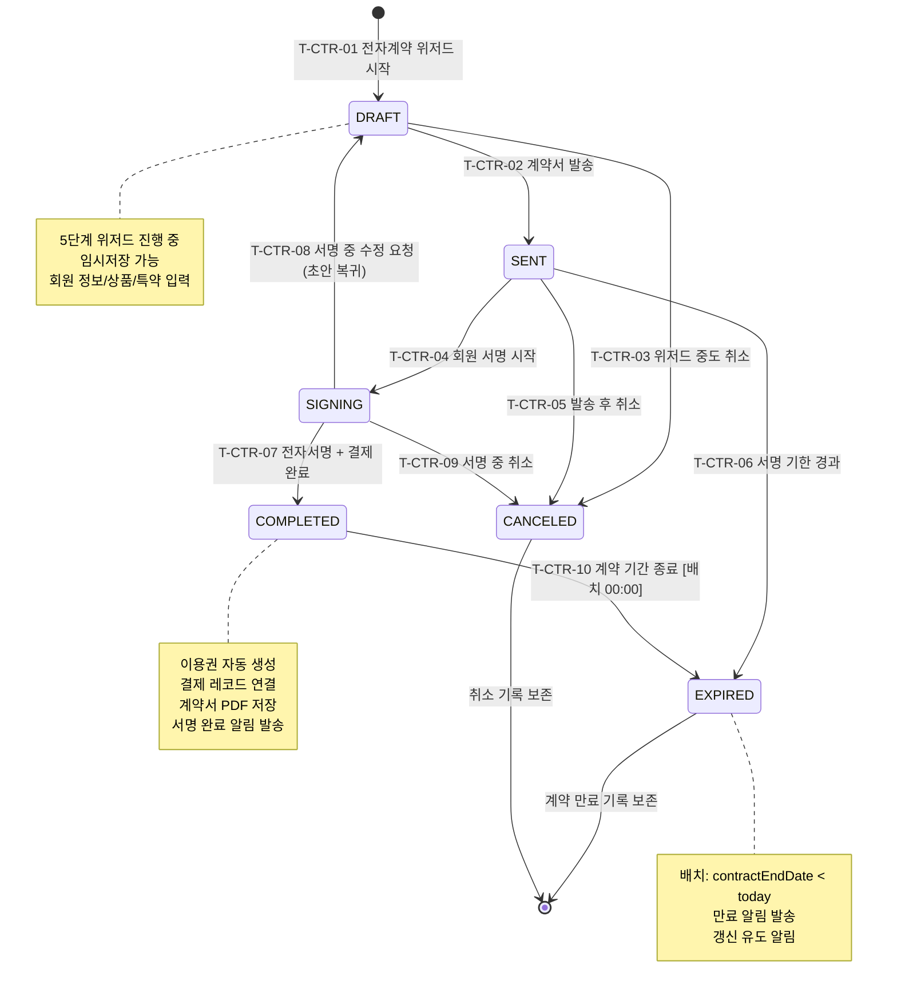

## 1. 개요

전자계약(Contract) 엔티티의 생명주기 상태를 정의한다. 기존 상태전이도의 대기/서명완료/만료를 확장하여 DRAFT→SENT→SIGNING→COMPLETED→EXPIRED 단계별 워크플로우를 명시한다.

- **엔티티**: `Contract.status`
- **저장 방식**: DB enum
- **관련 화면**: SCR-M002(회원 등록 전자계약), SCR-S002(전자계약 목록), 전자계약 5단계 위저드

---

## 2. 상태 정의

| 상태값 | 한글명 | 설명 | UI 색상 | 종료 여부 |
|--------|--------|------|---------|-----------|
| `DRAFT` | 초안 | 계약 작성 중 (위저드 진행 중) | #9E9E9E (회색) | 비종료 |
| `SENT` | 발송 | 계약서 발송 완료, 서명 대기 | #03A9F4 (하늘색) | 비종료 |
| `SIGNING` | 서명중 | 전자서명 진행 중 | #FF9800 (주황) | 비종료 |
| `COMPLETED` | 완료 | 전자서명 + 결제 완료 | #4CAF50 (녹색) | 준종료 |
| `EXPIRED` | 만료 | 계약 기간 종료 | #F44336 (빨강) | 종료 |
| `CANCELED` | 취소 | 계약 취소 | #9E9E9E (회색) | 종료 |

---

## 3. 상태 전이 다이어그램

---

## 4. 전이 이벤트 목록

| 이벤트 ID | From | To | 트리거 | 권한 | 부수효과 | TC 후보 |
|-----------|------|----|--------|------|----------|---------|
| T-CTR-01 | [신규] | DRAFT | 관리자 전자계약 위저드 시작 | STAFF 이상 | 계약 레코드 생성, 임시저장 가능 | TC-CTR-01 |
| T-CTR-02 | DRAFT | SENT | 계약서 발송 (SMS/카카오/이메일) | STAFF 이상 | 서명 링크 생성, 발송 알림 | TC-CTR-02 |
| T-CTR-03 | DRAFT | CANCELED | 위저드 중도 취소 | STAFF 이상 | 임시 레코드 삭제 또는 취소 기록 | TC-CTR-03 |
| T-CTR-04 | SENT | SIGNING | 회원 서명 링크 클릭 → 서명 시작 | 시스템 (회원 액션) | 서명 시작 시간 기록 | TC-CTR-04 |
| T-CTR-05 | SENT | CANCELED | 발송 후 취소 처리 | STAFF 이상 | 서명 링크 무효화, 취소 알림 | TC-CTR-05 |
| T-CTR-06 | SENT | EXPIRED | 서명 기한 경과 [배치] | 시스템 | 링크 만료, 기한 만료 알림 | TC-CTR-06 |
| T-CTR-07 | SIGNING | COMPLETED | 전자서명 완료 + 결제 처리 | 시스템 | 이용권 생성, PDF 저장, 완료 알림 | TC-CTR-07 |
| T-CTR-08 | SIGNING | DRAFT | 관리자 수정 요청 (초안 복귀) | MANAGER 이상 | 수정 사유 기록, 재발송 필요 | TC-CTR-08 |
| T-CTR-09 | SIGNING | CANCELED | 서명 중 취소 | STAFF 이상 | 서명 링크 무효화, 취소 기록 | TC-CTR-09 |
| T-CTR-10 | COMPLETED | EXPIRED | 계약 기간 종료 [배치 00:00] | 시스템 | 만료 알림 발송, 갱신 유도 | TC-CTR-10 |

---

## 5. 예외/롤백 분기

| 시나리오 | 조건 | 처리 | 에러 코드 |
|----------|------|------|-----------|
| 서명 링크 만료 | 발송 후 기한 초과 | EXPIRED 전환, 재발송 필요 | E400901 |
| 서명 완료 후 결제 실패 | 서명 OK, PG 실패 | SIGNING 유지, 결제 재시도 유도 | E400902 |
| 계약 취소 후 이용권 처리 | CANCELED 시 이용권 존재 | 이용권 REFUNDED 전환 필요 | E400903 |
| PDF 생성 실패 | COMPLETED 후 PDF 저장 오류 | 수동 PDF 재생성 필요 | E500901 |
