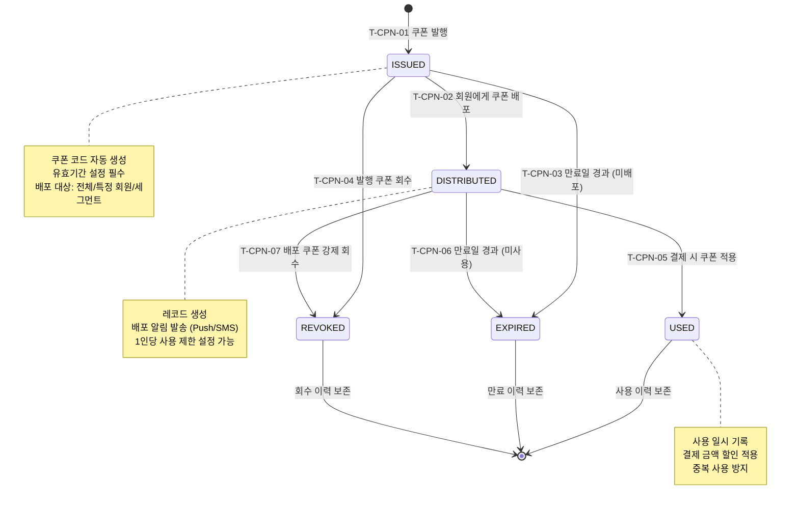

## 1. 개요

쿠폰(Coupon) 엔티티의 생명주기 상태를 정의한다. 쿠폰 발행부터 배포, 사용, 만료, 회수까지의 전이를 관리한다.

- **엔티티**: `Coupon`
- **저장 방식**: DB enum
- **관련 화면**: SCR-MK001(마케팅 - 쿠폰 관리), SCR-M004(회원 상세 - 쿠폰 탭), DLG 쿠폰 적용

---

## 2. 상태 정의

| 상태값 | 한글명 | 설명 | UI 색상 | 종료 여부 | |--------|--------|------|---------|-----------| | `ISSUED` | 발행 | 쿠폰 발행 완료, 미배포 | #03A9F4 (하늘색) | 비종료 | | `DISTRIBUTED` | 배포 | 회원에게 배포 완료, 미사용 | #FF9800 (주황) | 비종료 | | `USED` | 사용 | 쿠폰 사용 완료 | #4CAF50 (녹색) | 종료 | | `EXPIRED` | 만료 | 유효기간 경과 | #F44336 (빨강) | 종료 | | `REVOKED` | 회수 | 관리자 강제 회수 | #9E9E9E (회색) | 종료 |

---

## 3. 상태 전이 다이어그램

---

## 4. 전이 이벤트 목록

| 이벤트 ID | From | To | 트리거 | 권한 | 부수효과 | TC 후보 | |-----------|------|----|--------|------|----------|---------| | T-CPN-01 | [신규] | ISSUED | 관리자 쿠폰 발행 | MANAGER 이상 | 쿠폰 레코드 생성, 코드 자동 생성, 유효기간 설정 | TC-CPN-01 | | T-CPN-02 | ISSUED | DISTRIBUTED | 관리자 배포 처리 | MANAGER 이상 | 레코드 생성, 배포 알림 발송 | TC-CPN-02 | | T-CPN-03 | ISSUED | EXPIRED | 만료일 경과 [배치 00:00] | 시스템 | 만료 처리, 미사용 통계 업데이트 | TC-CPN-03 | | T-CPN-04 | ISSUED | REVOKED | 관리자 강제 회수 | MANAGER 이상 | 회수 사유 기록 | TC-CPN-04 | | T-CPN-05 | DISTRIBUTED | USED | 결제 시 쿠폰 코드 적용 | STAFF 이상 / 시스템 | 사용 일시 기록, 할인 금액 적용 | TC-CPN-05 | | T-CPN-06 | DISTRIBUTED | EXPIRED | 만료일 경과 [배치 00:00] | 시스템 | 만료 알림 발송, 미사용 통계 업데이트 | TC-CPN-06 | | T-CPN-07 | DISTRIBUTED | REVOKED | 관리자 배포 쿠폰 강제 회수 | MANAGER 이상 | 회수 사유 기록, 회원에게 회수 알림 | TC-CPN-07 |

---

## 5. 예외/롤백 분기

| 시나리오 | 조건 | 처리 | 에러 코드 | |----------|------|------|-----------| | 중복 사용 | 이미 USED 상태 쿠폰 재사용 | 거부, 이미 사용된 쿠폰 안내 | E401001 | | 만료 쿠폰 적용 시도 | EXPIRED 상태 쿠폰 적용 | 거부, 만료 안내 | E401002 | | 회수 쿠폰 적용 시도 | REVOKED 상태 쿠폰 적용 | 거부, 회수된 쿠폰 안내 | E401003 | | 쿠폰 적용 후 결제 취소 | USED 후 결제 환불 | DISTRIBUTED 복귀 여부 센터 정책에 따름 | - | | 만료 배치 실패 | 배치 오류 | 수동 만료 처리 필요 | E501001 |
