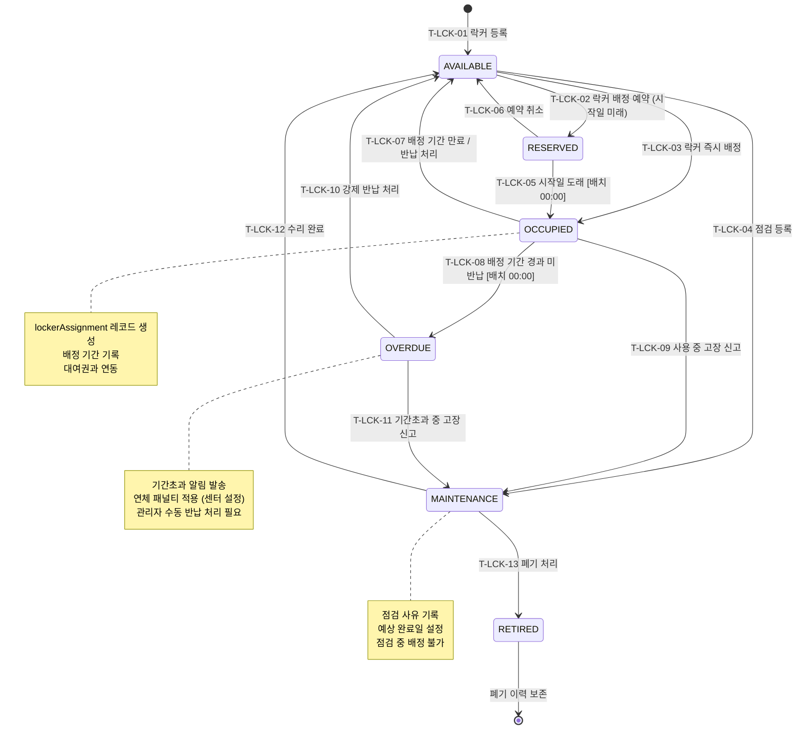

## 1. 개요

락커(Locker) 엔티티의 생명주기 상태를 정의한다. 기존 상태(AVAILABLE/IN_USE/MAINTENANCE)를 확장하여 RESERVED(예약), OVERDUE(기간초과), RETIRED(폐기) 상태를 추가한다.

- **엔티티**: `Locker.status`
- **저장 방식**: DB enum
- **관련 화면**: SCR-F001(시설 관리 - 락커), SCR-M004(회원 상세 - 락커 탭)

---

## 2. 상태 정의

| 상태값 | 한글명 | 설명 | UI 색상 | 종료 여부 |
|--------|--------|------|---------|-----------|
| `AVAILABLE` | 사용가능 | 배정되지 않은 빈 락커 | #4CAF50 (녹색) | 비종료 |
| `RESERVED` | 예약 | 배정 예약 완료, 기간 미시작 | #03A9F4 (하늘색) | 비종료 |
| `OCCUPIED` | 사용중 | 회원에게 배정, 기간 내 | #FF9800 (주황) | 비종료 |
| `OVERDUE` | 기간초과 | 배정 기간 경과, 미반납 | #F44336 (빨강) | 비종료 |
| `MAINTENANCE` | 점검중 | 고장/수리 중 | #9C27B0 (보라) | 비종료 |
| `RETIRED` | 폐기 | 영구 사용 불가 처리 | #9E9E9E (회색) | 종료 |

---

## 3. 상태 전이 다이어그램

---

## 4. 전이 이벤트 목록

| 이벤트 ID | From | To | 트리거 | 권한 | 부수효과 | TC 후보 |
|-----------|------|----|--------|------|----------|---------|
| T-LCK-01 | [신규] | AVAILABLE | 관리자 락커 등록 | MANAGER 이상 | 락커 레코드 생성, 번호 부여 | TC-LCK-01 |
| T-LCK-02 | AVAILABLE | RESERVED | 관리자 배정 예약 (시작일 미래) | STAFF 이상 | 예약 레코드 생성, 시작일 기록 | TC-LCK-02 |
| T-LCK-03 | AVAILABLE | OCCUPIED | 관리자 즉시 배정 | STAFF 이상 | lockerAssignment 생성, 배정 알림 | TC-LCK-03 |
| T-LCK-04 | AVAILABLE | MAINTENANCE | 관리자 점검 등록 | MANAGER 이상 | 점검 사유/예상 완료일 기록 | TC-LCK-04 |
| T-LCK-05 | RESERVED | OCCUPIED | 시작일 도래 [배치 00:00] | 시스템 | 배정 시작 알림 발송 | TC-LCK-05 |
| T-LCK-06 | RESERVED | AVAILABLE | 예약 취소 | STAFF 이상 | 예약 레코드 취소, 취소 알림 | TC-LCK-06 |
| T-LCK-07 | OCCUPIED | AVAILABLE | 기간 만료 [배치] 또는 수동 반납 | STAFF 이상 / 시스템 | lockerAssignment.endAt 기록, 회원 연결 해제 | TC-LCK-07 |
| T-LCK-08 | OCCUPIED | OVERDUE | 배정 기간 경과 [배치 00:00] | 시스템 | 기간초과 알림 발송, 연체 패널티 적용 | TC-LCK-08 |
| T-LCK-09 | OCCUPIED | MAINTENANCE | 고장 신고 | STAFF 이상 | 점검 등록, 회원 다른 락커 재배정 안내 | TC-LCK-09 |
| T-LCK-10 | OVERDUE | AVAILABLE | 관리자 강제 반납 처리 | MANAGER 이상 | 강제 반납 일시 기록, 연체료 정산 | TC-LCK-10 |
| T-LCK-11 | OVERDUE | MAINTENANCE | 기간초과 중 고장 신고 | STAFF 이상 | 점검 등록 | TC-LCK-11 |
| T-LCK-12 | MAINTENANCE | AVAILABLE | 수리 완료 | MANAGER 이상 | 점검 완료 일시 기록 | TC-LCK-12 |
| T-LCK-13 | MAINTENANCE | RETIRED | 폐기 처리 | MANAGER 이상 | 폐기 사유/일시 기록, 총 락커 수 감소 | TC-LCK-13 |

---

## 5. 예외/롤백 분기

| 시나리오 | 조건 | 처리 | 에러 코드 |
|----------|------|------|-----------|
| 이미 점검 중 재배정 시도 | MAINTENANCE 상태 배정 | 거부, 점검 중 안내 | E401101 |
| 배정 만료 자동 반납 실패 | 배치 오류 | 수동 반납 처리 필요 | E501101 |
| 폐기 후 재활성화 시도 | RETIRED 상태 배정 | 거부, 폐기된 락커 안내 | E401102 |
| 기간초과 자동 전환 실패 | 배치 오류 | 수동 OVERDUE 처리 필요 | E501102 |
