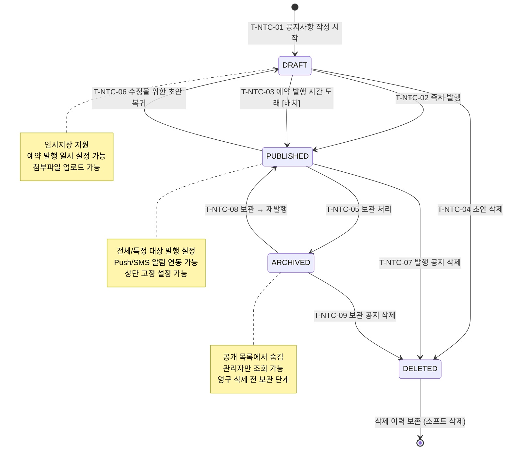

## 1. 개요

공지사항(Notice) 엔티티의 생명주기 상태를 정의한다. 작성부터 발행, 보관, 삭제까지의 콘텐츠 관리 워크플로우를 포함한다.

- **엔티티**: `Notice`
- **저장 방식**: DB enum
- **관련 화면**: SCR-NT001(공지사항 목록), SCR-NT002(공지사항 작성/수정)

---

## 2. 상태 정의

| 상태값 | 한글명 | 설명 | UI 색상 | 종료 여부 | |--------|--------|------|---------|-----------| | `DRAFT` | 초안 | 작성 중, 미발행 | #9E9E9E (회색) | 비종료 | | `PUBLISHED` | 발행 | 공개 발행 완료 | #4CAF50 (녹색) | 비종료 | | `ARCHIVED` | 보관 | 비공개 보관 처리 | #607D8B (청회색) | 비종료 | | `DELETED` | 삭제 | 소프트 삭제 | #F44336 (빨강) | 종료 |

---

## 3. 상태 전이 다이어그램

---

## 4. 전이 이벤트 목록

| 이벤트 ID | From | To | 트리거 | 권한 | 부수효과 | TC 후보 | |-----------|------|----|--------|------|----------|---------| | T-NTC-01 | [신규] | DRAFT | 관리자 공지사항 작성 시작 | MANAGER 이상 | 공지 레코드 생성, 임시저장 | TC-NTC-01 | | T-NTC-02 | DRAFT | PUBLISHED | 관리자 즉시 발행 | MANAGER 이상 | 발행 일시 기록, 알림 발송 (설정 시) | TC-NTC-02 | | T-NTC-03 | DRAFT | PUBLISHED | 예약 발행 시간 도래 [배치] | 시스템 | 발행 일시 기록, 알림 발송 | TC-NTC-03 | | T-NTC-04 | DRAFT | DELETED | 관리자 초안 삭제 | MANAGER 이상 | 소프트 삭제, 기록 | TC-NTC-04 | | T-NTC-05 | PUBLISHED | ARCHIVED | 관리자 보관 처리 | MANAGER 이상 | 기록, 공개 목록 제거 | TC-NTC-05 | | T-NTC-06 | PUBLISHED | DRAFT | 관리자 수정 (초안 복귀) | MANAGER 이상 | 발행 취소, 수정 시작 | TC-NTC-06 | | T-NTC-07 | PUBLISHED | DELETED | 관리자 삭제 | MANAGER 이상 | 소프트 삭제, 공개 목록 즉시 제거 | TC-NTC-07 | | T-NTC-08 | ARCHIVED | PUBLISHED | 관리자 재발행 | MANAGER 이상 | 재발행 일시 기록, 공개 목록 복원 | TC-NTC-08 | | T-NTC-09 | ARCHIVED | DELETED | 관리자 삭제 | MANAGER 이상 | 소프트 삭제, 기록 | TC-NTC-09 |

---

## 5. 예외/롤백 분기

| 시나리오 | 조건 | 처리 | 에러 코드 | |----------|------|------|-----------| | 예약 발행 배치 실패 | 배치 오류 | 수동 발행 처리 필요, 관리자 알림 | E501201 | | 삭제된 공지 조회 | DELETED 상태 직접 URL 접근 | 404 처리 | E404001 | | 발행 중 첨부파일 누락 | 파일 스토리지 오류 | 발행 거부, 파일 재업로드 요청 | E401201 |
