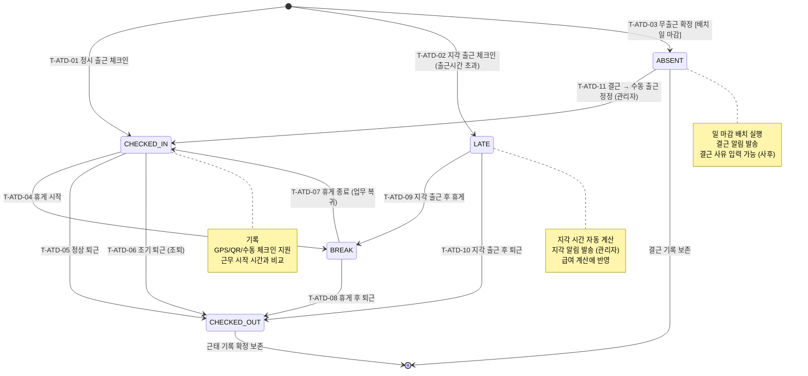

## 1. 개요

직원 근태(StaffAttendanceRecord) 엔티티의 상태를 정의한다. 기존 상태전이도(normal)를 계승하며 BREAK(휴게) 상태를 추가하여 일중 상태 전이를 포함한다.

- **엔티티**: `StaffAttendanceRecord`
- **저장 방식**: DB enum
- **관련 화면**: SCR-E005(직원 근태 관리), SCR-E006(근태 현황)

---

## 2. 상태 정의

| 상태값 | 한글명 | 설명 | UI 색상 | 종료 여부 | |--------|--------|------|---------|-----------| | `CHECKED_IN` | 출근 | 정상 출근 기록 | #4CAF50 (녹색) | 비종료 | | `BREAK` | 휴게 | 휴게 시간 중 | #FF9800 (주황) | 비종료 | | `CHECKED_OUT` | 퇴근 | 퇴근 기록 완료 | #607D8B (청회색) | 종료 | | `ABSENT` | 결근 | 출근 기록 없음 | #F44336 (빨강) | 종료 | | `LATE` | 지각 | 출근 시간 초과 출근 | #FF5722 (주황빨강) | 비종료 |

---

## 3. 상태 전이 다이어그램

---

## 4. 전이 이벤트 목록

| 이벤트 ID | From | To | 트리거 | 권한 | 부수효과 | TC 후보 | |-----------|------|----|--------|------|----------|---------| | T-ATD-01 | [신규] | CHECKED_IN | 직원 출근 체크인 (정시) | STAFF 본인 / MANAGER | 기록, 출근 확인 알림 | TC-ATD-01 | | T-ATD-02 | [신규] | LATE | 출근 체크인 (근무시간 초과) | STAFF 본인 / MANAGER | 기록, 지각 시간 계산, 지각 알림 | TC-ATD-02 | | T-ATD-03 | [신규] | ABSENT | 일 마감 배치 (출근 기록 없음) | 시스템 | 결근 레코드 생성, 결근 알림 발송 | TC-ATD-03 | | T-ATD-04 | CHECKED_IN | BREAK | 직원 휴게 시작 | STAFF 본인 | 기록 | TC-ATD-04 | | T-ATD-05 | CHECKED_IN | CHECKED_OUT | 정상 퇴근 체크아웃 | STAFF 본인 / MANAGER | 기록, 근무 시간 계산 | TC-ATD-05 | | T-ATD-06 | CHECKED_IN | CHECKED_OUT | 조기 퇴근 (조퇴) | STAFF 본인 / MANAGER | 기록, 조퇴 시간 계산, 급여 반영 | TC-ATD-06 | | T-ATD-07 | BREAK | CHECKED_IN | 휴게 종료, 업무 복귀 | STAFF 본인 | 기록, 총 휴게 시간 누적 | TC-ATD-07 | | T-ATD-08 | BREAK | CHECKED_OUT | 휴게 후 바로 퇴근 | STAFF 본인 / MANAGER | = , 근무 시간 계산 | TC-ATD-08 | | T-ATD-09 | LATE | BREAK | 지각 출근 후 휴게 시작 | STAFF 본인 | 기록 | TC-ATD-09 | | T-ATD-10 | LATE | CHECKED_OUT | 지각 출근 후 퇴근 | STAFF 본인 / MANAGER | 총 근무 시간 계산, 지각/퇴근 기록 | TC-ATD-10 | | T-ATD-11 | ABSENT | CHECKED_IN | 관리자 출근 정정 | MANAGER 이상 | 정정 사유 기록, 원래 결근 이력 유지 | TC-ATD-11 |

---

## 5. 예외/롤백 분기

| 시나리오 | 조건 | 처리 | 에러 코드 | |----------|------|------|-----------| | 중복 출근 체크인 | 이미 CHECKED_IN 상태에서 재체크인 | 거부, 이미 출근 처리 안내 | E401301 | | 퇴근 후 체크인 시도 | CHECKED_OUT 상태에서 체크인 | 거부, 관리자 정정 요청 | E401302 | | 결근 배치 중복 실행 | 이미 ABSENT 처리된 직원 | 멱등 처리 (스킵) | - | | 미래 날짜 근태 입력 | 미래 날짜로 근태 생성 | 거부, 날짜 검증 오류 | E400001 |
