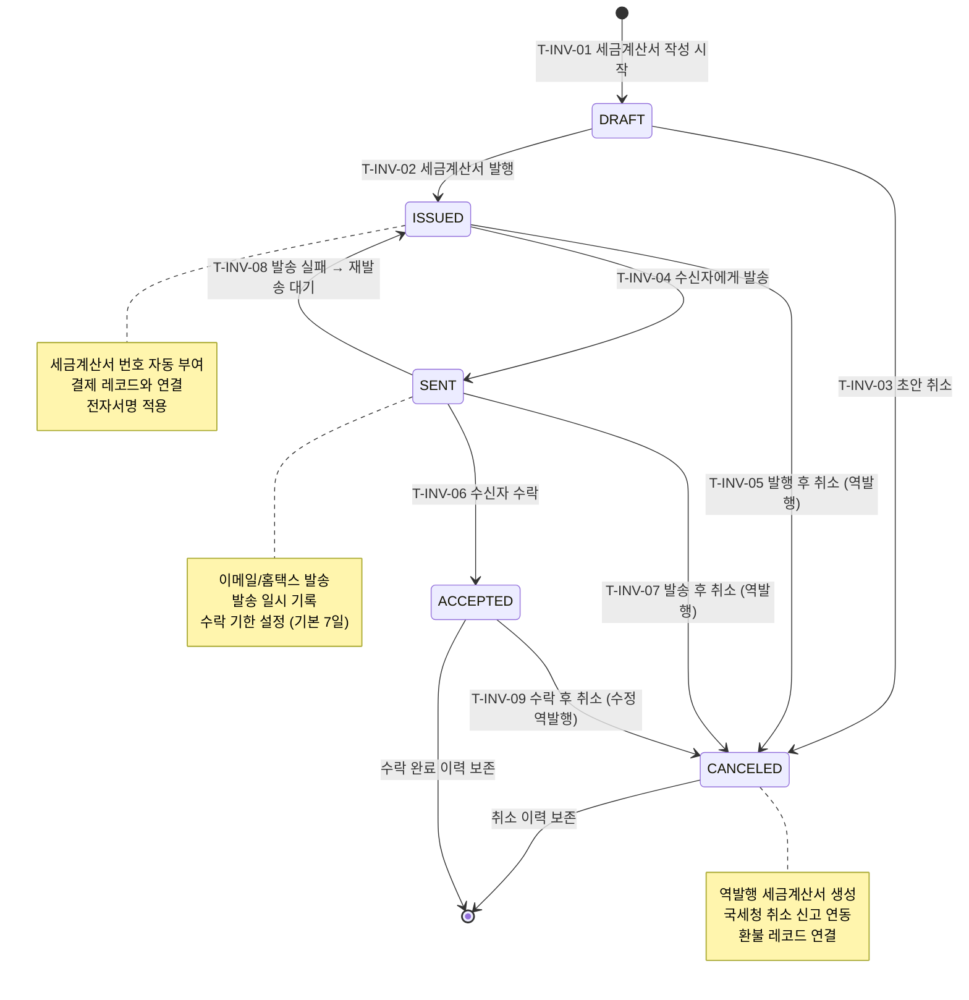

## 1. 개요

세금계산서(Invoice) 엔티티의 생명주기 상태를 정의한다. 작성부터 발행, 발송, 수락, 취소까지의 전자세금계산서 워크플로우를 포함한다.

- **엔티티**: `Invoice`
- **저장 방식**: DB enum
- **관련 화면**: SCR-S003(세금계산서 관리), SCR-S001(매출 현황 - 세금계산서 탭)

---

## 2. 상태 정의

| 상태값 | 한글명 | 설명 | UI 색상 | 종료 여부 | |--------|--------|------|---------|-----------| | `DRAFT` | 초안 | 세금계산서 작성 중 | #9E9E9E (회색) | 비종료 | | `ISSUED` | 발행 | 세금계산서 발행 완료 | #03A9F4 (하늘색) | 비종료 | | `SENT` | 발송 | 수신자에게 발송 완료 | #FF9800 (주황) | 비종료 | | `ACCEPTED` | 수락 | 수신자 수락 완료 | #4CAF50 (녹색) | 종료 | | `CANCELED` | 취소 | 세금계산서 취소 (역발행) | #F44336 (빨강) | 종료 |

---

## 3. 상태 전이 다이어그램

---

## 4. 전이 이벤트 목록

| 이벤트 ID | From | To | 트리거 | 권한 | 부수효과 | TC 후보 | |-----------|------|----|--------|------|----------|---------| | T-INV-01 | [신규] | DRAFT | 관리자 세금계산서 작성 시작 | MANAGER 이상 | 세금계산서 레코드 생성, 결제 레코드 연결 | TC-INV-01 | | T-INV-02 | DRAFT | ISSUED | 관리자 발행 처리 | MANAGER 이상 | 세금계산서 번호 부여, 발행 일시 기록, 전자서명 | TC-INV-02 | | T-INV-03 | DRAFT | CANCELED | 초안 취소 | MANAGER 이상 | 취소 사유 기록 | TC-INV-03 | | T-INV-04 | ISSUED | SENT | 관리자 발송 처리 | MANAGER 이상 | 이메일/홈택스 발송, 발송 일시 기록 | TC-INV-04 | | T-INV-05 | ISSUED | CANCELED | 발행 후 취소 (역발행) | MANAGER 이상 | 역발행 세금계산서 생성, 국세청 신고 | TC-INV-05 | | T-INV-06 | SENT | ACCEPTED | 수신자 수락 확인 | 시스템 / MANAGER | 수락 일시 기록, 매출 확정 | TC-INV-06 | | T-INV-07 | SENT | CANCELED | 발송 후 취소 | MANAGER 이상 | 역발행 생성, 수신자 취소 알림 | TC-INV-07 | | T-INV-08 | SENT | ISSUED | 발송 실패 재처리 | 시스템 / MANAGER | 발송 실패 기록, 재발송 대기 | TC-INV-08 | | T-INV-09 | ACCEPTED | CANCELED | 수락 후 수정 역발행 | MANAGER 이상 | 역발행 세금계산서 생성, 국세청 수정 신고 | TC-INV-09 |

---

## 5. 예외/롤백 분기

| 시나리오 | 조건 | 처리 | 에러 코드 | |----------|------|------|-----------| | 발행 번호 중복 | 동일 번호 중복 발행 시도 | 거부, 번호 재생성 | E401501 | | 홈택스 발송 실패 | 국세청 API 오류 | ISSUED 복귀, 수동 발송 필요 | E501501 | | 수락 기한 경과 | 발송 후 기한 내 미수락 | 관리자 알림, 수동 처리 필요 | E401502 | | 역발행 후 원본 상태 | CANCELED 전환 후 원본 레코드 | 원본 레코드 참조 유지, 역발행 레코드 연결 | - |
