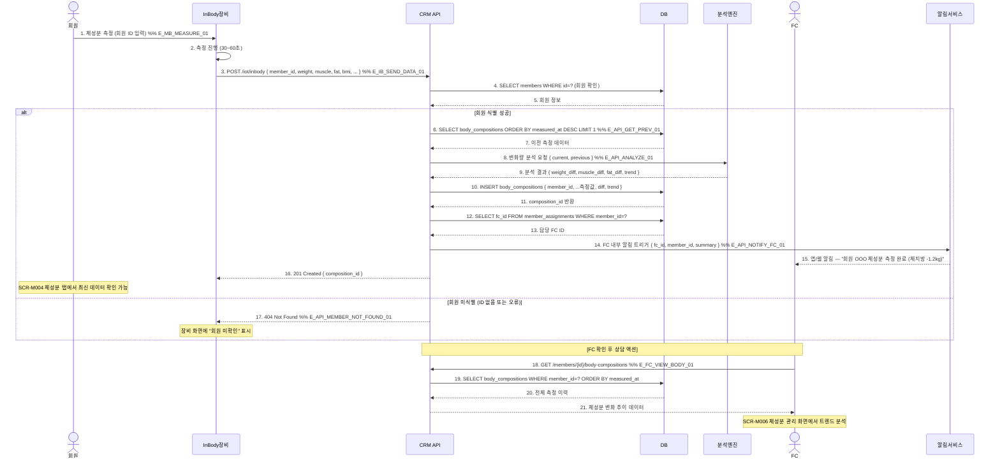

# X04 — 체성분 측정 → IoT 자동 전송 → FC 알림

## 1. 시나리오 개요

회원이 InBody 등 체성분 측정 장비에서 측정 완료 → IoT 연동으로 CRM에 자동 전송 → 이전 측정 대비 변화 분석 → 담당 FC에게 알림 발송하는 시나리오.

| 항목 | 내용 |
|------|------|
| 트리거 | 체성분 장비 측정 완료 이벤트 |
| 종료 조건 | 체성분 데이터 DB 저장 + FC 알림 발송 |
| 참여 도메인 | 통합운영(D11), 회원관리(D2), 수업관리(D4) |

## 2. 전제조건

- InBody 등 체성분 장비가 IoT 연동 설정 완료 (SCR-I006)
- 측정 회원이 장비에 회원 ID 또는 전화번호로 식별 가능
- 담당 FC가 해당 회원에 매핑되어 있음

## 3. 참여 액터

| 액터 | 설명 |
|------|------|
| 회원 | 체성분 측정 당사자 |
| InBody | 체성분 측정 장비 (IoT) |
| CRM API | FitGenie CRM 백엔드 |
| DB | 데이터베이스 |
| 분석엔진 | 체성분 변화 분석 서비스 |
| FC | 담당 피트니스 컨설턴트 |
| 알림서비스 | 내부 알림 발송 |

## 4. 시퀀스 다이어그램

## 5. 주요 메시지 설명

| 번호 | 메시지 | 설명 |
|------|--------|------|
| 3 | POST /iot/inbody | 장비에서 직접 API 호출. member_id는 장비 입력값 또는 QR 코드로 전달 |
| 8 | 변화량 분석 | 이전 측정 대비 각 지표 변화량 계산. 임계값 초과 시 X22 시나리오로 연계 |
| 10 | INSERT body_compositions | 측정값 전체 저장. diff, trend 컬럼도 함께 저장 |
| 14 | FC 알림 트리거 | 담당 FC가 없으면 센터 매니저에게 알림 fallback |
| 15 | FC 내부 알림 | 핵심 수치 요약(체중 변화, 체지방 변화) 포함 |

## 6. 예외/분기

| 상황 | 처리 방법 |
|------|-----------|
| 회원 ID 없음 | 404 반환, 장비 화면에 오류 표시, 수동 입력 유도 |
| 이전 측정 없음 | 이전 데이터 없이 신규 기록으로 저장, 변화량 NULL |
| 임계값 초과 | X22 시나리오 트리거 — 자동 상담 트리거 연동 |
| 담당 FC 미배정 | 센터 매니저에게 알림 fallback |
| 장비 연결 끊김 | IoT 재연결 후 버퍼 데이터 재전송 |

## 7. 관련 화면/모달 링크

| 화면/모달 | 설명 |
|-----------|------|
| SCR-I006 체성분 통합 | IoT 연동 체성분 현황 |
| SCR-M006 체성분 관리 | 회원별 체성분 이력 |
| SCR-M004 회원 상세 > 체성분 탭 | 탭 내 체성분 트렌드 차트 |
| DLG-M015 체성분 등록 | 수동 등록 모달 |
| DLG-M016 체성분 덮어쓰기 | 동일 날짜 재측정 시 덮어쓰기 확인 |

## 8. TC 후보 테이블

| TC ID | 구분 | Given | When | Then |
|-------|:----:|-------|------|------|
| TC-X04-01 | positive | IoT 연동 완료, 회원 ID 등록, 이전 측정 데이터 있음 | InBody 측정 완료 | DB 저장, 변화량 계산, 담당 FC 알림 수신 |
| TC-X04-02 | positive | 첫 측정 회원 | InBody 측정 완료 | 이전 데이터 없이 신규 저장, 변화량 NULL |
| TC-X04-03 | negative | 장비에 잘못된 회원 ID 입력 | 측정 데이터 전송 | 404 반환, 장비 화면에 오류 표시 |
| TC-X04-04 | negative | 담당 FC 미배정 회원 | 측정 완료 후 알림 | 매니저에게 fallback 알림 전송 |
| TC-X04-05 | negative | 체지방률 임계값 초과 측정 | 측정 완료 | X22 상담 트리거 연계 실행 |
