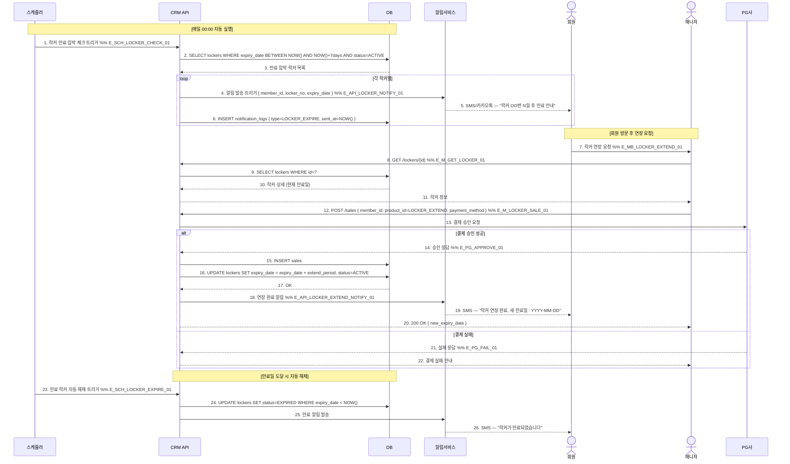

# X07 — 락커 만료 임박 → 자동 알림 → 연장 결제

## 1. 시나리오 개요

락커 만료 N일 전 스케줄러가 만료 임박 회원 목록 추출 → 자동 알림 발송 → 회원이 프론트에서 연장 결제하거나 만료 후 자동 해제되는 시나리오.

| 항목 | 내용 |
|------|------|
| 트리거 | 매일 00:00 스케줄러 실행 |
| 종료 조건 | 연장 결제 완료 또는 만료 후 자동 해제 |
| 참여 도메인 | 시설관리(D6), 마케팅(D8), 매출관리(D3) |

## 2. 전제조건

- 락커 만료 알림 정책이 설정되어 있음 (D-7, D-3, D-1)
- 회원에게 연락처(SMS 수신 동의)가 등록되어 있음
- 락커 연장 상품이 등록되어 있음

## 3. 참여 액터

| 액터 | 설명 |
|------|------|
| 스케줄러 | 매일 00:00 만료 임박 체크 크론잡 |
| CRM API | FitGenie CRM 백엔드 |
| DB | 데이터베이스 |
| 알림서비스 | SMS/카카오톡 발송 |
| 회원 | 락커 사용 중인 회원 |
| 매니저 | 연장 결제 처리 |
| PG | 결제 대행사 |

## 4. 시퀀스 다이어그램

## 5. 주요 메시지 설명

| 번호 | 메시지 | 설명 |
|------|--------|------|
| 2 | SELECT lockers WHERE expiry | D-7, D-3, D-1 각각 알림 발송. 중복 발송 방지를 위해 notification_logs 확인 |
| 6 | INSERT notification_logs | 알림 발송 이력 기록. 동일 락커에 같은 날 중복 발송 방지 |
| 16 | UPDATE lockers expiry_date | 현재 만료일 기준 연장. 이미 만료된 경우 오늘부터 기산 |
| 24 | UPDATE lockers EXPIRED | 자동 해제. 락커 번호는 다른 회원 배정 가능 상태로 전환 |

## 6. 예외/분기

| 상황 | 처리 방법 |
|------|-----------|
| 이미 만료된 락커 연장 | 오늘부터 기산하여 연장 기간 계산 |
| 알림 수신 거부 회원 | 알림 발송 skip, notification_logs에 SKIPPED 기록 |
| 중복 알림 방지 | 동일 날짜 동일 락커 알림 이미 발송 시 skip |
| 만료 후 물건 보관 중 | 보관 기간 정책(3일) 초과 시 매니저 알림 |

## 7. 관련 화면/모달 링크

| 화면/모달 | 설명 |
|-----------|------|
| SCR-050 락커 관리 | 락커 배정/만료 현황 |
| SCR-072 자동 알림 설정 | 만료 임박 알림 정책 설정 |
| SCR-S003 결제 처리 | 락커 연장 결제 |

## 8. TC 후보 테이블

| TC ID | 구분 | Given | When | Then |
|-------|:----:|-------|------|------|
| TC-X07-01 | positive | 락커 만료 D-7, 알림 정책 설정됨 | 00:00 스케줄러 실행 | 해당 회원에게 SMS 발송, notification_log 기록 |
| TC-X07-02 | positive | 매니저 로그인, 만료 임박 락커 | 연장 결제 진행 | 결제 완료, 만료일 갱신, 연장 완료 SMS 발송 |
| TC-X07-03 | negative | 알림 수신 거부 회원의 락커 만료 임박 | 스케줄러 실행 | 알림 skip, SKIPPED 로그 기록 |
| TC-X07-04 | negative | 만료일 도달, 연장 미결제 | 00:00 스케줄러 실행 | 락커 EXPIRED 상태 변경, 만료 SMS 발송 |
| TC-X07-05 | negative | 이미 당일 알림 발송된 락커 | 스케줄러 재실행 | 중복 발송 방지, 기존 로그 유지 |
