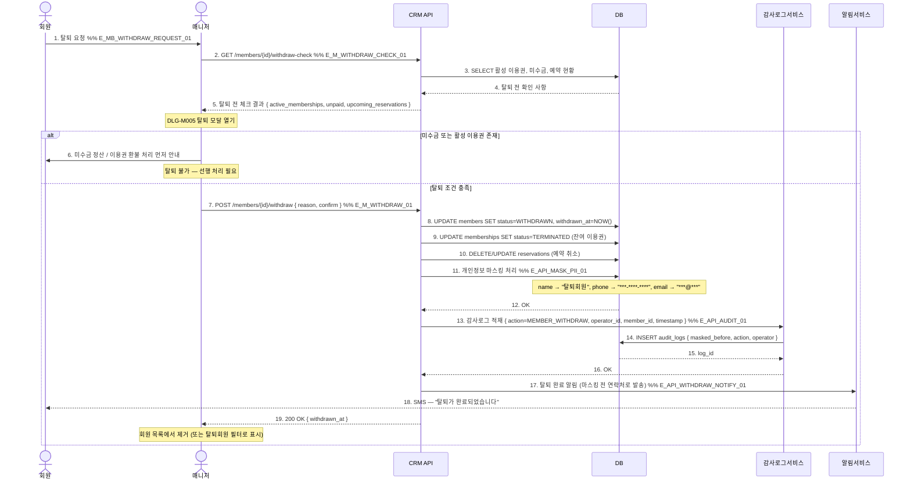

# X11 — 회원 탈퇴 → 개인정보 마스킹 → 감사로그 적재

## 1. 시나리오 개요

회원이 탈퇴 요청 → 매니저가 DLG-M005 탈퇴 모달에서 확인 → 이용권/미수금 확인 → 개인정보 마스킹 처리 → 감사로그 적재까지의 탈퇴 플로우. 개인정보보호법 준수를 위한 마스킹이 핵심.

| 항목 | 내용 |
|------|------|
| 트리거 | 회원 탈퇴 요청 (방문/전화) |
| 종료 조건 | 회원 WITHDRAWN 상태 + 개인정보 마스킹 + 감사로그 |
| 참여 도메인 | 회원관리(D2), 본사관리(D10) |

## 2. 전제조건

- 매니저 계정 로그인 상태 (탈퇴 처리 권한)
- 개인정보 마스킹 정책이 설정되어 있음
- 감사로그 시스템 활성화 상태

## 3. 참여 액터

| 액터 | 설명 |
|------|------|
| 회원 | 탈퇴 요청자 |
| 매니저 | 탈퇴 처리 승인 권한 |
| CRM API | FitGenie CRM 백엔드 |
| DB | 데이터베이스 |
| 감사로그서비스 | 변경 이력 적재 |
| 알림서비스 | 탈퇴 완료 알림 |

## 4. 시퀀스 다이어그램

## 5. 주요 메시지 설명

| 번호 | 메시지 | 설명 |
|------|--------|------|
| 2 | GET /withdraw-check | 탈퇴 전 미수금/활성이용권/예약 존재 여부 확인 |
| 11 | 개인정보 마스킹 | 이름/전화/이메일/주소 마스킹. 결제 이력은 법적 의무 보존 기간 동안 유지 |
| 13 | 감사로그 적재 | 누가, 언제, 어떤 회원을 탈퇴 처리했는지 불변 기록 |
| 17 | 탈퇴 완료 알림 | 마스킹 처리 전 저장된 연락처로 발송 (발송 후 마스킹) |

## 6. 예외/분기

| 상황 | 처리 방법 |
|------|-----------|
| 미수금 보유 | 탈퇴 불가, 먼저 미수금 정산 안내 |
| 활성 이용권 존재 | 환불 처리 후 탈퇴 또는 이용권 포기 확인 |
| readonly 권한 | 탈퇴 처리 불가, 매니저 이상 권한 필요 |
| 마스킹 실패 | 트랜잭션 롤백, 탈퇴 미처리 상태 유지 |

## 7. 관련 화면/모달 링크

| 화면/모달 | 설명 |
|-----------|------|
| DLG-M005 탈퇴 모달 | 탈퇴 확인 및 사유 입력 |
| SCR-M004 회원 상세 | 탈퇴 전 이용권/결제 이력 확인 |
| SCR-097 감사로그 | 탈퇴 처리 이력 조회 |

## 8. TC 후보 테이블

| TC ID | 구분 | Given | When | Then |
|-------|:----:|-------|------|------|
| TC-X11-01 | positive | 매니저, 미수금 없는 회원 | 탈퇴 처리 | 상태 WITHDRAWN, PII 마스킹, 감사로그 기록, SMS 발송 |
| TC-X11-02 | positive | 감사로그 서비스 정상 | 탈퇴 완료 후 | audit_logs에 operator, timestamp, 마스킹 전 데이터 기록 |
| TC-X11-03 | negative | 미수금 보유 회원 | 탈퇴 시도 | 탈퇴 불가 안내, 미수금 정산 유도 |
| TC-X11-04 | negative | staff 권한 계정 | 탈퇴 처리 시도 | 권한 없음, 매니저 승인 요청 안내 |
| TC-X11-05 | negative | DB 마스킹 트랜잭션 실패 | 탈퇴 처리 | 롤백, 회원 상태 유지, 에러 토스트 |
