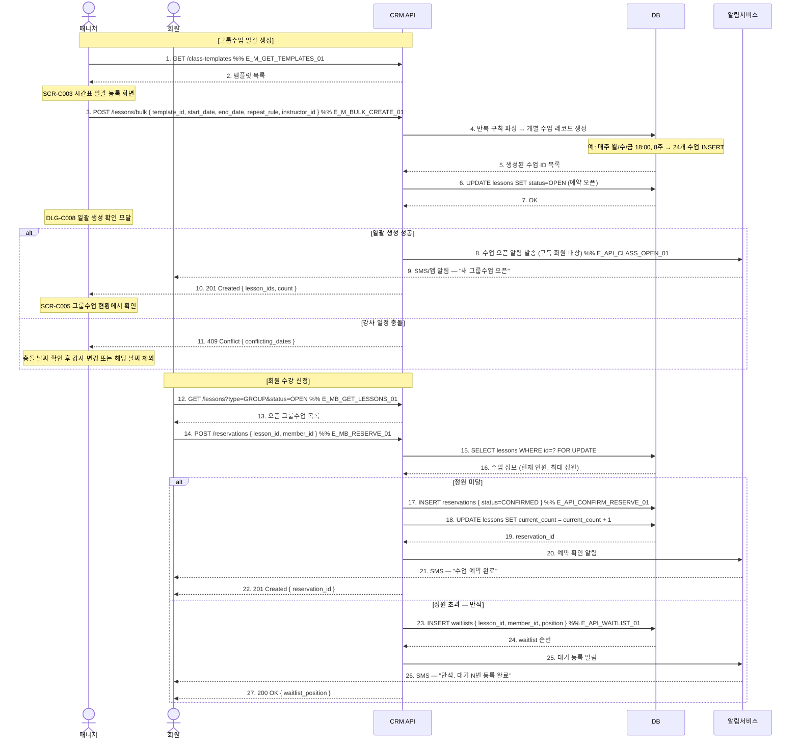

# X12 — 그룹수업 일괄 생성 → 수강 오픈 → 만석 처리

## 1. 시나리오 개요

매니저가 그룹수업 시간표를 일괄 등록 → 수강 신청 오픈 → 회원들이 예약 → 정원 초과 시 만석 처리 및 대기열 등록까지의 시나리오.

| 항목 | 내용 |
|------|------|
| 트리거 | 매니저의 그룹수업 일괄 생성 |
| 종료 조건 | 수업 생성 완료 + 예약 오픈 |
| 참여 도메인 | 수업관리(D4), 회원관리(D2) |

## 2. 전제조건

- 매니저 계정 로그인 상태 (수업 관리 권한)
- 강사가 시스템에 등록되어 있음
- 그룹수업 템플릿이 있거나 직접 입력

## 3. 참여 액터

| 액터 | 설명 |
|------|------|
| 매니저 | 수업 일괄 생성 담당 |
| 회원 | 수강 신청자 |
| CRM API | FitGenie CRM 백엔드 |
| DB | 데이터베이스 |
| 알림서비스 | 수업 오픈/만석 알림 |

## 4. 시퀀스 다이어그램

## 5. 주요 메시지 설명

| 번호 | 메시지 | 설명 |
|------|--------|------|
| 3 | POST /lessons/bulk | repeat_rule: RRULE 또는 커스텀 반복 규칙 (매주/격주/매일) |
| 4 | 반복 규칙 파싱 | 서버에서 각 날짜 계산 후 개별 레코드 INSERT |
| 15 | SELECT FOR UPDATE | 동시 예약 시 race condition 방지. 비관적 락 사용 |
| 23 | INSERT waitlists | 대기열 순번은 등록 시각 기준 자동 부여. X26 대기열 시나리오 연계 |

## 6. 예외/분기

| 상황 | 처리 방법 |
|------|-----------|
| 강사 일정 충돌 | 409 반환, 충돌 날짜 목록 표시, 제외 또는 강사 변경 선택 |
| 동시 예약 경쟁 | SELECT FOR UPDATE로 정원 초과 방지 |
| 회원 이용권 없음 | 예약 불가, 이용권 구매 유도 |
| 일괄 생성 중 오류 | 트랜잭션 전체 롤백 또는 생성 성공한 건만 커밋 (정책 설정) |

## 7. 관련 화면/모달 링크

| 화면/모달 | 설명 |
|-----------|------|
| SCR-C003 시간표 일괄 등록 | 그룹수업 일괄 생성 화면 |
| SCR-C004 그룹수업 템플릿 관리 | 템플릿 목록 |
| SCR-C005 그룹수업 현황 | 생성된 수업 목록 |
| DLG-C008 일괄 생성 확인 | 생성 전 확인 모달 |
| SCR-C012 대기열 관리 | 만석 대기 현황 |

## 8. TC 후보 테이블

| TC ID | 구분 | Given | When | Then |
|-------|:----:|-------|------|------|
| TC-X12-01 | positive | 매니저, 강사 일정 비어있음 | 그룹수업 8주 일괄 생성 | 24개 수업 레코드 생성, 구독 회원 알림 |
| TC-X12-02 | positive | 정원 미달 수업, 유효 이용권 보유 회원 | 수강 신청 | 예약 CONFIRMED, 인원 +1, 확인 SMS |
| TC-X12-03 | positive | 만석 수업 | 수강 신청 | 대기열 등록, 순번 안내 SMS |
| TC-X12-04 | negative | 강사 일정 충돌 날짜 포함 | 일괄 생성 | 409 반환, 충돌 날짜 표시 |
| TC-X12-05 | negative | 유효 이용권 없는 회원 | 수강 신청 | 예약 불가, 이용권 구매 유도 |
