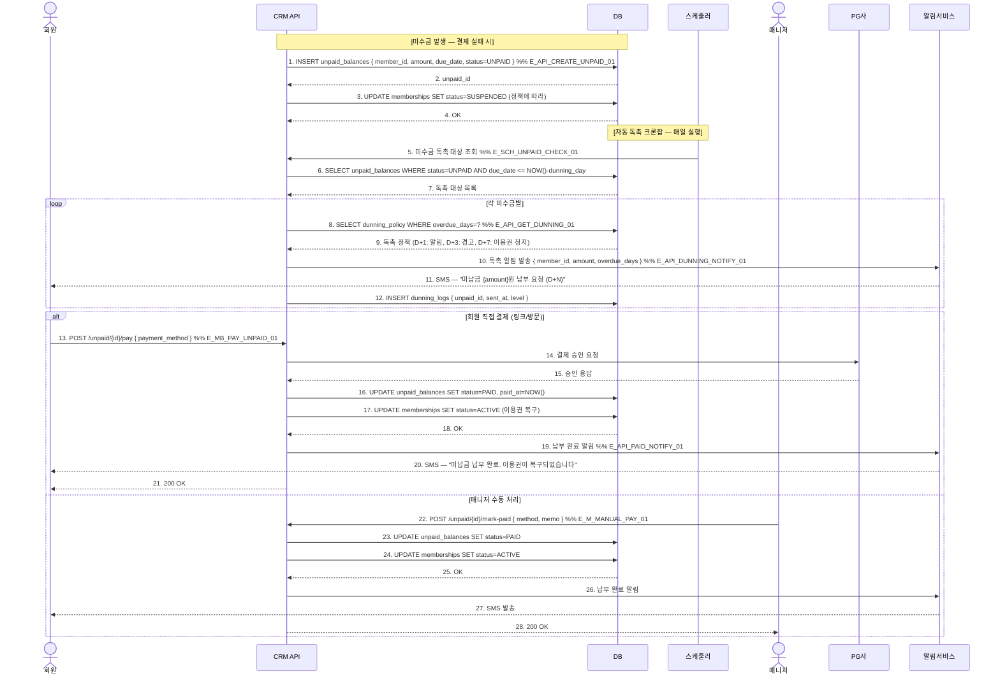

# X17 — 미수금 발생 → 자동 독촉 → 결제 완료

## 1. 시나리오 개요

결제 실패 또는 후불 정책으로 미수금 발생 → 자동 독촉 알림 발송 → 회원이 결제 완료 → 미수금 해소까지의 시나리오.

| 항목 | 내용 |
|------|------|
| 트리거 | 결제 실패 또는 후불 미납 |
| 종료 조건 | 미수금 완납 + 이용권 정상화 |
| 참여 도메인 | 매출관리(D3), 마케팅(D8) |

## 2. 전제조건

- 미수금 독촉 정책이 설정되어 있음 (D+1, D+3, D+7)
- 회원 연락처가 등록되어 있음

## 3. 참여 액터

| 액터 | 설명 |
|------|------|
| 회원 | 미수금 당사자 |
| CRM API | FitGenie CRM 백엔드 |
| DB | 데이터베이스 |
| 스케줄러 | 미수금 독촉 크론잡 |
| 매니저 | 수동 독촉 및 결제 처리 |
| PG | 결제 대행사 |
| 알림서비스 | 독촉 알림 발송 |

## 4. 시퀀스 다이어그램

## 5. 주요 메시지 설명

| 번호 | 메시지 | 설명 |
|------|--------|------|
| 3 | UPDATE memberships SUSPENDED | 미수금 발생 즉시 또는 D+3 이후 정지 (정책 설정) |
| 9 | 독촉 정책 | 단계별 강도 조절: D+1 안내, D+3 경고, D+7 이용권 정지 안내 |
| 12 | INSERT dunning_logs | 중복 발송 방지. 동일 단계 재발송 여부 체크 |
| 17 | UPDATE memberships ACTIVE | 납부 완료 즉시 이용권 복구 |

## 6. 예외/분기

| 상황 | 처리 방법 |
|------|-----------|
| 분할 납부 | partial payment 허용 시 amount 부분 업데이트 |
| 독촉 수신 거부 | 알림 skip, 매니저 수동 연락 필요 |
| PG 재결제 실패 | 에러 코드 안내, 수동 납부 유도 |
| 미수금 탕감 | 매니저가 status=WAIVED 처리 가능 |

## 7. 관련 화면/모달 링크

| 화면/모달 | 설명 |
|-----------|------|
| SCR-S008 미수금 관리 | 미수금 목록 및 독촉 이력 |
| SCR-072 자동 알림 설정 | 독촉 알림 정책 설정 |

## 8. TC 후보 테이블

| TC ID | 구분 | Given | When | Then |
|-------|:----:|-------|------|------|
| TC-X17-01 | positive | 미수금 D+1, 독촉 정책 설정됨 | 스케줄러 실행 | D+1 독촉 SMS 발송, dunning_log 기록 |
| TC-X17-02 | positive | 미수금 보유 회원 | 링크에서 결제 완료 | 미수금 PAID, 이용권 ACTIVE 복구 |
| TC-X17-03 | positive | 매니저, 현금 납부 확인 | 수동 납부 처리 | 미수금 PAID, 이용권 복구, 완납 SMS |
| TC-X17-04 | negative | D+7 미납, 이용권 정지 정책 | 스케줄러 실행 | 이용권 SUSPENDED, 정지 알림 발송 |
| TC-X17-05 | negative | 이미 당일 독촉 발송된 미수금 | 스케줄러 재실행 | 중복 발송 방지, 기존 log 유지 |
