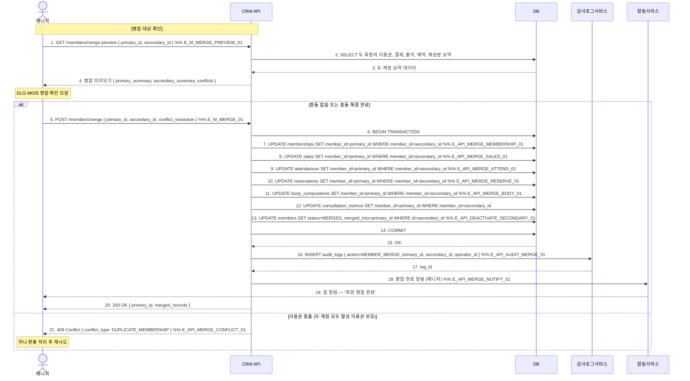

# X20 — 회원 병합 → 이력/결제/예약 통합 🆕

## 1. 시나리오 개요

동일인이 중복 등록된 두 회원 레코드를 병합 → 결제/출석/예약/체성분 이력을 주 계정으로 통합 → 부 계정 비활성화하는 시나리오.

| 항목 | 내용 |
|------|------|
| 트리거 | 중복 회원 발견 또는 회원 요청 |
| 종료 조건 | 주 계정에 전체 이력 통합 + 부 계정 MERGED 처리 |
| 참여 도메인 | 회원관리(D2), 매출관리(D3), 수업관리(D4) |
| 구현 상태 | 🆕 신규 기능 |

## 2. 전제조건

- 매니저 이상 계정 로그인 상태
- 병합 대상 두 회원이 동일인임을 확인
- 주 계정(primary)과 부 계정(secondary) 선택 완료

## 3. 참여 액터

| 액터 | 설명 |
|------|------|
| 매니저 | 병합 처리 권한 |
| CRM API | FitGenie CRM 백엔드 |
| DB | 데이터베이스 |
| 감사로그서비스 | 병합 이력 기록 |
| 알림서비스 | 병합 완료 알림 |

## 4. 시퀀스 다이어그램

## 5. 주요 메시지 설명

| 번호 | 메시지 | 설명 |
|------|--------|------|
| 1 | GET /merge-preview | 실제 병합 전 영향 범위 확인. conflicts 배열에 충돌 항목 표시 |
| 6 | BEGIN TRANSACTION | 모든 UPDATE를 단일 트랜잭션으로 처리. 중간 실패 시 전체 롤백 |
| 13 | UPDATE members MERGED | 부 계정 비활성화. merged_into로 주 계정 참조 유지 |
| 16 | 감사로그 | 누가, 어떤 두 계정을, 언제 병합했는지 불변 기록 |

## 6. 예외/분기

| 상황 | 처리 방법 |
|------|-----------|
| 중복 활성 이용권 | 하나를 환불 처리 후 재시도 |
| 결제 이력 중복 | 날짜 기준으로 중복 제거 또는 모두 유지 |
| 트랜잭션 실패 | 전체 롤백, 양쪽 계정 원상태 유지 |
| 병합 취소 불가 | 병합 완료 후 취소 불가. 재분리 기능 미지원 |

## 7. 관련 화면/모달 링크

| 화면/모달 | 설명 |
|-----------|------|
| SCR-M007 회원 병합 🆕 | 중복 회원 검색 및 병합 |
| DLG-M026 병합 확인 🆕 | 병합 전 요약 확인 모달 |

## 8. TC 후보 테이블

| TC ID | 구분 | Given | When | Then |
|-------|:----:|-------|------|------|
| TC-X20-01 | positive | 매니저, 충돌 없는 두 회원 | 병합 실행 | 모든 이력 주 계정으로 이관, 부 계정 MERGED |
| TC-X20-02 | positive | 병합 완료 후 | 주 계정 조회 | 결제/출석/예약/체성분 통합 이력 표시 |
| TC-X20-03 | negative | 두 계정 모두 활성 이용권 보유 | 병합 시도 | 409 충돌, 하나 환불 후 재시도 안내 |
| TC-X20-04 | negative | 트랜잭션 중간 실패 | 병합 실행 | 전체 롤백, 양쪽 계정 원상태 |
| TC-X20-05 | negative | staff 권한 계정 | 병합 시도 | 권한 없음, 매니저 이상 필요 |
