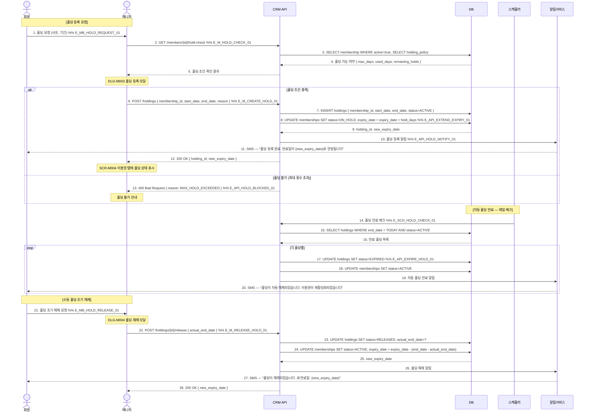

# X21 — 홀딩 등록 → 자동 만료일 연장 → 해제

## 1. 시나리오 개요

부상/여행 등으로 회원이 이용권 홀딩(일시정지) 요청 → 홀딩 기간만큼 이용권 만료일 자동 연장 → 홀딩 해제 시 이용권 재활성화하는 시나리오.

| 항목 | 내용 |
|------|------|
| 트리거 | 회원의 홀딩 요청 |
| 종료 조건 | 홀딩 해제 + 이용권 만료일 연장 재활성화 |
| 참여 도메인 | 회원관리(D2) |

## 2. 전제조건

- 매니저 계정 로그인 상태
- 활성(ACTIVE) 이용권이 존재
- 홀딩 정책이 설정되어 있음 (최대 홀딩 일수, 최대 횟수)

## 3. 참여 액터

| 액터 | 설명 |
|------|------|
| 회원 | 홀딩 요청자 |
| 매니저 | 홀딩 등록/해제 처리 |
| CRM API | FitGenie CRM 백엔드 |
| DB | 데이터베이스 |
| 스케줄러 | 자동 홀딩 만료 처리 |
| 알림서비스 | 홀딩/해제 알림 |

## 4. 시퀀스 다이어그램

## 5. 주요 메시지 설명

| 번호 | 메시지 | 설명 |
|------|--------|------|
| 8 | UPDATE memberships expiry_date | 홀딩 일수만큼 만료일 연장. 이중 홀딩 시 누적 연장 |
| 24 | 조기 해제 만료일 재계산 | end_date - actual_end_date = 미사용 홀딩 일수. 그만큼 만료일 단축 |
| 17 | 자동 만료 처리 | 매일 스케줄러가 end_date 도달한 홀딩 자동 해제 |

## 6. 예외/분기

| 상황 | 처리 방법 |
|------|-----------|
| 최대 홀딩 일수 초과 | 400 반환, 잔여 가능 일수 안내 |
| 이미 홀딩 중 중복 신청 | 기존 홀딩 종료 후 신규 등록 |
| 이용권 만료 후 홀딩 | 만료 이용권에는 홀딩 불가 |
| 홀딩 중 만료일 도달 | 홀딩 종료 후 만료일 연장 적용되므로 만료 안 됨 |

## 7. 관련 화면/모달 링크

| 화면/모달 | 설명 |
|-----------|------|
| DLG-M003 홀딩 등록 | 홀딩 기간 입력 모달 |
| DLG-M004 홀딩 해제 | 홀딩 해제 확인 모달 |
| SCR-M004 회원 상세 > 이용권 탭 | 홀딩 상태 및 이력 |

## 8. TC 후보 테이블

| TC ID | 구분 | Given | When | Then |
|-------|:----:|-------|------|------|
| TC-X21-01 | positive | 매니저, 활성 이용권 보유 회원 | 7일 홀딩 등록 | 이용권 ON_HOLD, 만료일 +7일 연장, SMS 발송 |
| TC-X21-02 | positive | 홀딩 end_date 도달 | 스케줄러 실행 | 자동 ACTIVE 복구, 자동 해제 SMS 발송 |
| TC-X21-03 | positive | 홀딩 5일 후 조기 해제 (7일 중) | 조기 해제 | 만료일 +5일 (미사용 2일 차감), RELEASED |
| TC-X21-04 | negative | 최대 홀딩 횟수 소진 회원 | 홀딩 신청 | 400, MAX_HOLD_EXCEEDED 안내 |
| TC-X21-05 | negative | 만료된 이용권 보유 회원 | 홀딩 신청 | 만료 이용권 홀딩 불가 안내 |
