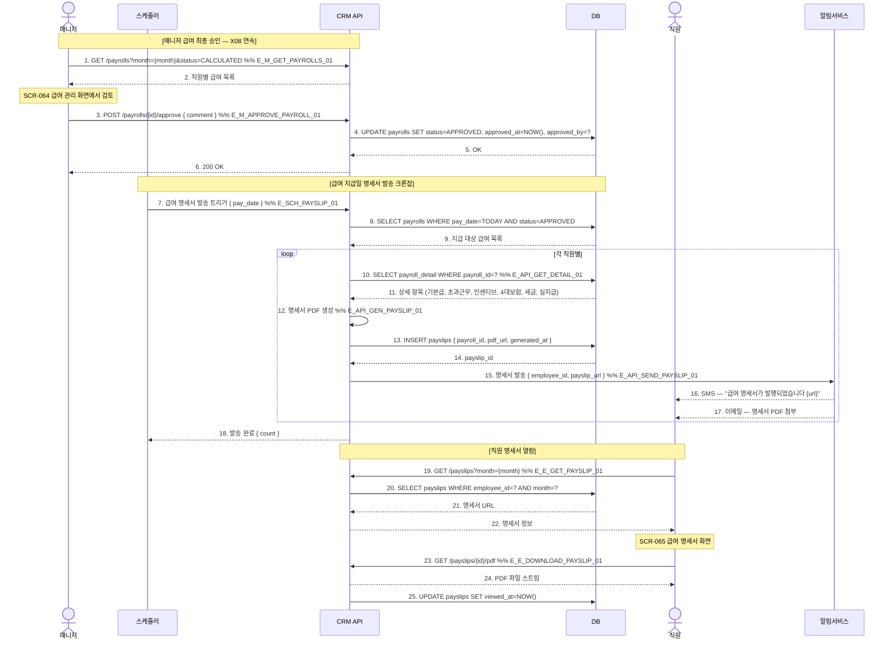

# X24 — 급여 지급일 → 자동 명세서 → 직원 수신

## 1. 시나리오 개요

X08에서 계산된 급여가 매니저 승인 완료 → 급여 지급일에 직원별 명세서 자동 생성 → SMS/이메일로 발송 → 직원이 SCR-065에서 열람하는 시나리오.

| 항목 | 내용 |
|------|------|
| 트리거 | 매니저 급여 승인 완료 또는 지급일 스케줄러 |
| 종료 조건 | 명세서 발송 + 직원 열람 |
| 참여 도메인 | 직원관리(D7) |

## 2. 전제조건

- X08 시나리오에서 급여 계산 완료
- 매니저가 급여 승인 처리
- 직원 이메일/SMS 연락처 등록

## 3. 참여 액터

| 액터 | 설명 |
|------|------|
| 스케줄러 | 급여 지급일 명세서 발송 크론잡 |
| CRM API | FitGenie CRM 백엔드 |
| DB | 데이터베이스 |
| 매니저 | 급여 승인 담당 |
| 직원 | 명세서 수신 및 열람 |
| 알림서비스 | 명세서 발송 |

## 4. 시퀀스 다이어그램

## 5. 주요 메시지 설명

| 번호 | 메시지 | 설명 |
|------|--------|------|
| 3 | POST /payrolls/{id}/approve | 개별 또는 일괄 승인. 승인 후 pay_date 기준 명세서 발송 |
| 11 | 상세 항목 조회 | 기본급, 초과근무수당, 인센티브, 국민연금/건강/고용보험, 소득세 공제 내역 |
| 12 | PDF 생성 | 서버에서 PDF 렌더링. payslip_url에 S3 등 스토리지 URL 저장 |
| 25 | UPDATE viewed_at | 직원이 명세서를 열람한 시각 기록 |

## 6. 예외/분기

| 상황 | 처리 방법 |
|------|-----------|
| 급여 미승인 상태 | pay_date 도달해도 미승인 급여 발송 skip, 매니저 경고 알림 |
| 이메일 없는 직원 | SMS만 발송, 이메일 발송 skip |
| PDF 생성 실패 | 재시도 큐 등록, URL 대신 웹 뷰 링크 제공 |
| 퇴사 직원 | 재직 기간 일할 급여만 포함, 마지막 명세서 발송 |

## 7. 관련 화면/모달 링크

| 화면/모달 | 설명 |
|-----------|------|
| SCR-064 급여 관리 | 매니저용 급여 현황 및 승인 |
| SCR-065 급여 명세서 | 직원용 명세서 열람 화면 |

## 8. TC 후보 테이블

| TC ID | 구분 | Given | When | Then |
|-------|:----:|-------|------|------|
| TC-X24-01 | positive | 매니저, 전 직원 급여 계산 완료 | 급여 승인 | status=APPROVED, 지급일 명세서 발송 예약 |
| TC-X24-02 | positive | 급여 승인 완료, 지급일 도달 | 스케줄러 실행 | PDF 생성, SMS+이메일 발송, 직원 수신 |
| TC-X24-03 | positive | 직원 로그인 | 명세서 클릭 | PDF 열람, viewed_at 기록 |
| TC-X24-04 | negative | 미승인 급여 상태로 지급일 도달 | 스케줄러 실행 | 발송 skip, 매니저 미승인 경고 알림 |
| TC-X24-05 | negative | 이메일 미등록 직원 | 명세서 발송 | SMS만 발송, 이메일 skip |

