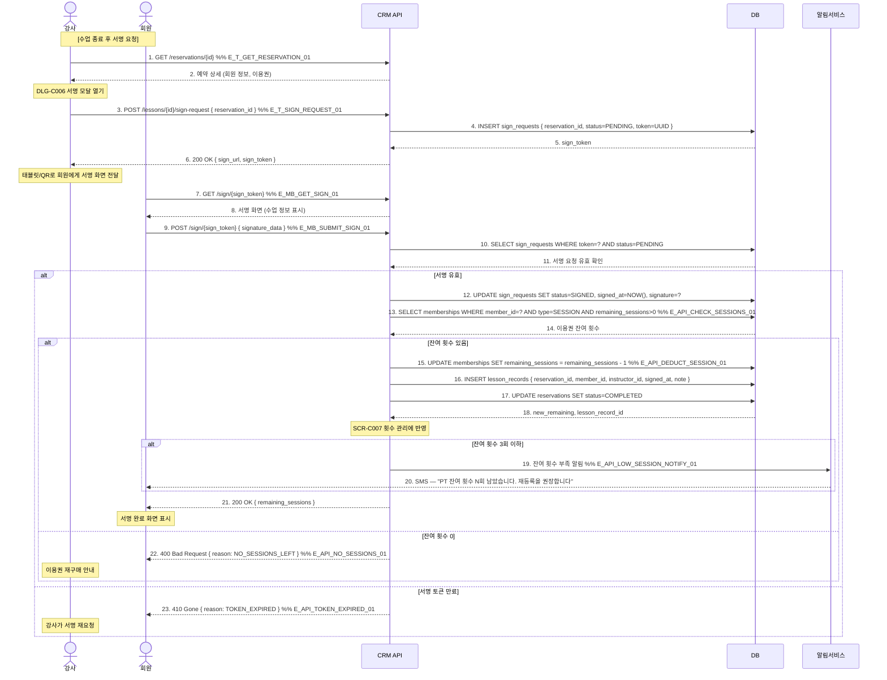

# X27 — 수업 서명 → 횟수 차감 → 이력 기록

## 1. 시나리오 개요

PT/그룹 수업 종료 후 강사가 수업 완료 서명 요청 → 회원이 태블릿/앱에서 서명 → 이용권 횟수 차감 → 수업 이력 기록하는 시나리오.

| 항목 | 내용 |
|------|------|
| 트리거 | 수업 종료 후 강사의 서명 요청 |
| 종료 조건 | 서명 완료 + 횟수 차감 + 이력 저장 |
| 참여 도메인 | 수업관리(D4), 회원관리(D2) |

## 2. 전제조건

- 수업 예약이 CONFIRMED 상태
- 회원이 횟수제 이용권을 보유하고 있음 (잔여 횟수 > 0)
- 강사가 해당 수업의 담당 강사로 등록되어 있음

## 3. 참여 액터

| 액터 | 설명 |
|------|------|
| 강사 | 수업 진행 및 서명 요청 |
| 회원 | 서명 당사자 |
| CRM API | FitGenie CRM 백엔드 |
| DB | 데이터베이스 |
| 알림서비스 | 잔여 횟수 알림 |

## 4. 시퀀스 다이어그램

## 5. 주요 메시지 설명

| 번호 | 메시지 | 설명 |
|------|--------|------|
| 3 | POST /sign-request | sign_token 발급. QR 코드 또는 URL로 회원에게 전달 |
| 9 | POST /sign/{token} | signature_data: Base64 인코딩된 서명 이미지 |
| 15 | UPDATE remaining_sessions | 서명 완료 즉시 차감. 트랜잭션으로 중복 차감 방지 |
| 16 | INSERT lesson_records | 수업 완료 이력. instructor_id, 메모, 서명 포함 |

## 6. 예외/분기

| 상황 | 처리 방법 |
|------|-----------|
| 잔여 횟수 0 | 차감 불가, 이용권 재구매 안내 |
| 서명 토큰 만료 (N분) | 강사가 재요청하여 새 토큰 발급 |
| 회원 서명 거부 | 서명 없이 수업 완료 처리 가능 (매니저 권한) |
| 기간제 이용권 | 횟수 차감 없이 출석만 기록 |

## 7. 관련 화면/모달 링크

| 화면/모달 | 설명 |
|-----------|------|
| DLG-C006 서명 모달 | 강사가 서명 요청하는 모달 |
| SCR-C007 횟수 관리 | 이용권 잔여 횟수 현황 |
| SCR-M004 회원 상세 > 이용권 탭 | 잔여 횟수 확인 |

## 8. TC 후보 테이블

| TC ID | 구분 | Given | When | Then |
|-------|:----:|-------|------|------|
| TC-X27-01 | positive | 강사, 예약 CONFIRMED, 잔여 횟수 5 | 수업 서명 완료 | 횟수 4로 차감, lesson_record 생성, COMPLETED |
| TC-X27-02 | positive | 잔여 횟수 3회 이하 | 서명 완료 | 횟수 차감 + 잔여 부족 SMS 발송 |
| TC-X27-03 | negative | 잔여 횟수 0 회원 | 서명 시도 | 400 NO_SESSIONS_LEFT, 재구매 안내 |
| TC-X27-04 | negative | 서명 토큰 만료 후 접근 | 서명 시도 | 410 TOKEN_EXPIRED, 재요청 안내 |
| TC-X27-05 | negative | 기간제 이용권 보유 | 서명 완료 | 횟수 차감 없이 출석만 기록 |
