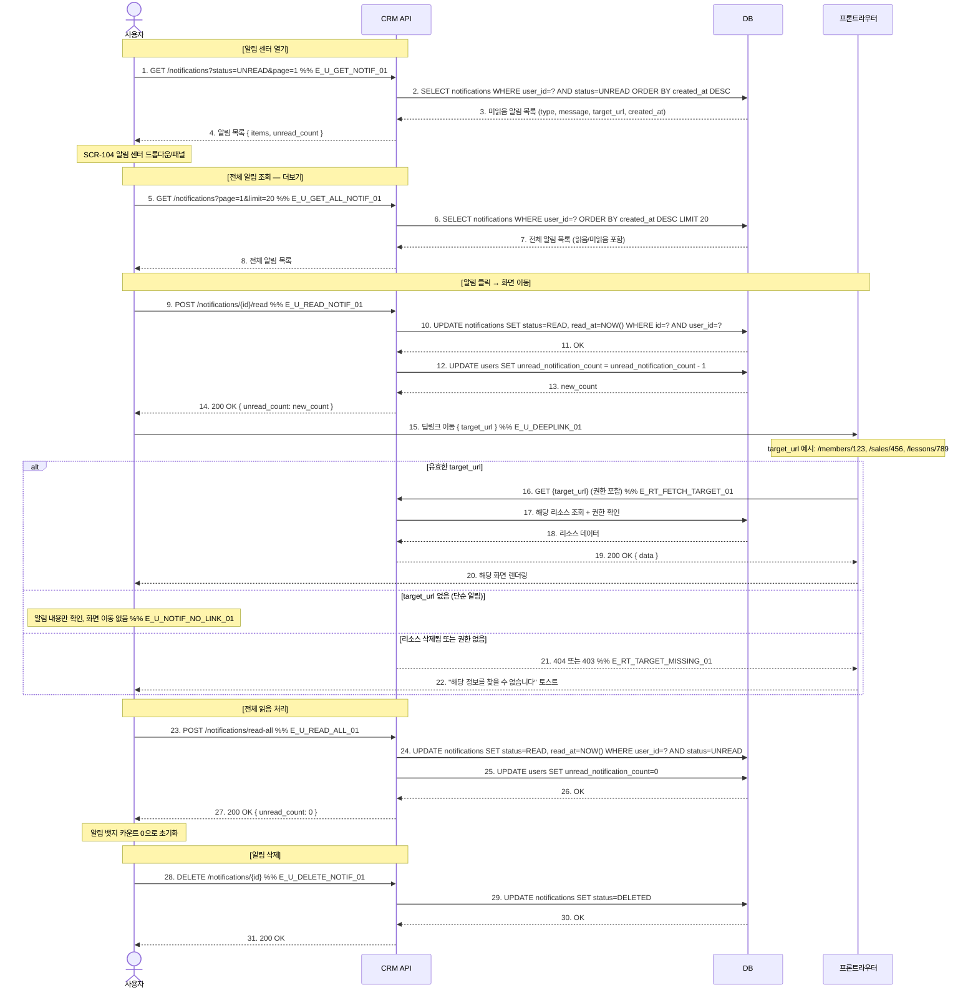

# X30 — 알림 센터 클릭 → 해당 화면 이동 → 읽음 처리

## 1. 시나리오 개요

사용자가 알림 센터 아이콘 클릭 → 미읽음 알림 목록 조회 → 알림 클릭 시 관련 화면으로 이동 → 읽음 처리까지의 시나리오.

| 항목 | 내용 |
|------|------|
| 트리거 | 사용자의 알림 센터 접근 |
| 종료 조건 | 알림 읽음 처리 + 관련 화면 이동 |
| 참여 도메인 | 공통(D1) |

## 2. 전제조건

- 사용자가 로그인 상태
- 시스템에 발송된 알림이 존재함
- 알림에 딥링크(target_url)가 설정되어 있음

## 3. 참여 액터

| 액터 | 설명 |
|------|------|
| 사용자 | 알림 수신 및 확인 |
| CRM API | FitGenie CRM 백엔드 |
| DB | 데이터베이스 |
| 라우터 | 프론트엔드 라우팅 |

## 4. 시퀀스 다이어그램

## 5. 주요 메시지 설명

| 번호 | 메시지 | 설명 |
|------|--------|------|
| 1 | GET /notifications?status=UNREAD | 헤더 뱃지용 미읽음 목록. 최신 5개만 표시 |
| 9 | POST /{id}/read | 클릭과 동시에 읽음 처리. 화면 이동 전 호출 |
| 12 | unread_count 업데이트 | 헤더 뱃지 숫자 실시간 감소 |
| 15 | 딥링크 이동 | target_url은 알림 생성 시 설정. 해당 리소스의 상세 화면으로 이동 |
| 24 | 전체 읽음 처리 | 한 번에 모든 미읽음 알림 읽음 처리 |

## 6. 예외/분기

| 상황 | 처리 방법 |
|------|-----------|
| 알림 없음 | 빈 상태 화면 표시 "알림이 없습니다" |
| 딥링크 대상 삭제 | 404 처리, "삭제된 항목" 안내 |
| 권한 없는 화면으로 이동 | 403 처리, 권한 없음 토스트 |
| 오프라인 상태 | 로컬 캐시 알림 표시, 온라인 복구 후 동기화 |

## 7. 관련 화면/모달 링크

| 화면/모달 | 설명 |
|-----------|------|
| SCR-104 알림 센터 | 알림 목록 및 읽음/삭제 |
| SCR-101 대시보드 | 알림 뱃지 표시 |
| SCR-102 사이드바 | 알림 카운트 뱃지 |

## 8. TC 후보 테이블

| TC ID | 구분 | Given | When | Then |
|-------|:----:|-------|------|------|
| TC-X30-01 | positive | 미읽음 알림 5개, 딥링크 있음 | 알림 클릭 | 읽음 처리, 해당 화면 이동, 뱃지 -1 |
| TC-X30-02 | positive | 미읽음 알림 다수 | 전체 읽음 클릭 | 전체 READ 처리, 뱃지 0 |
| TC-X30-03 | positive | 딥링크 없는 단순 알림 | 알림 클릭 | 읽음 처리만, 화면 이동 없음 |
| TC-X30-04 | negative | 삭제된 회원 정보 링크 알림 | 알림 클릭 | 읽음 처리, "삭제된 항목" 토스트 |
| TC-X30-05 | negative | 권한 없는 화면 링크 알림 | 알림 클릭 | 읽음 처리, 권한 없음 토스트 |
