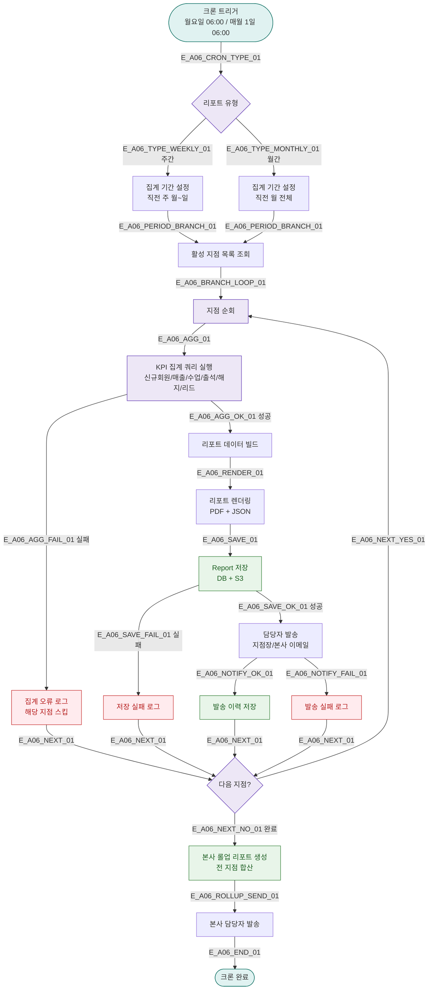

# A06 — 주간/월간 리포트 자동 생성

## 1. 개요

| 항목 | 내용 |
|------|------|
| 트리거 | 크론 — 주 월요일 06:00 / 매월 1일 06:00 |
| 대상 엔티티 | Branch, Report |
| 조건 | 활성 지점 전체 |
| 결과 | 주간/월간 KPI 리포트 생성, 본사/지점장 발송 |
| 관련 화면 | SCR-093 지점 성과 리포트, SCR-099 리포트 생성 |

## 2. 발생 조건

- 주간: 매주 월요일 06:00 — 직전 주 월~일 집계
- 월간: 매월 1일 06:00 — 직전 월 1일~말일 집계
- 지점 status = ACTIVE인 지점만 대상
- 집계 항목: 신규회원수, 매출, 수업수, 출석률, 해지율, 리드전환율

## 3. 다이어그램

## 4. 복구/재시도 전략

| 상황 | 전략 |
|------|------|
| 집계 쿼리 실패 | 해당 지점 스킵, 오류 로그, 관리자 알림 |
| 저장 실패 | 재시도 1회, 실패 시 오류 로그 |
| 발송 실패 | 발송 실패 로그, 관리자 수동 재발송 |

## 5. 사용자 노출 메시지

| 대상 | 메시지 |
|------|--------|
| 지점장 이메일 | "[FitGenie] {지점명} {기간} 리포트가 생성되었습니다. 첨부 파일을 확인하세요." |
| 본사 이메일 | "[FitGenie] 전 지점 {기간} 종합 리포트가 생성되었습니다." |

## 6. TC 후보

| TC ID | 타입 | Given | When | Then |
|-------|------|-------|------|------|
| TC-A06-01 | positive | 활성 지점 3개 | 월요일 06:00 | 지점별 주간 리포트 3개 + 롤업 생성 |
| TC-A06-02 | positive | 매월 1일 | 크론 06:00 | 월간 리포트 생성, 이메일 발송 |
| TC-A06-03 | negative | 집계 쿼리 타임아웃 | 크론 실행 | 해당 지점 스킵, 나머지 계속 |
| TC-A06-04 | edge | 지점 없음 | 크론 실행 | 빈 리포트 없이 정상 종료 |
