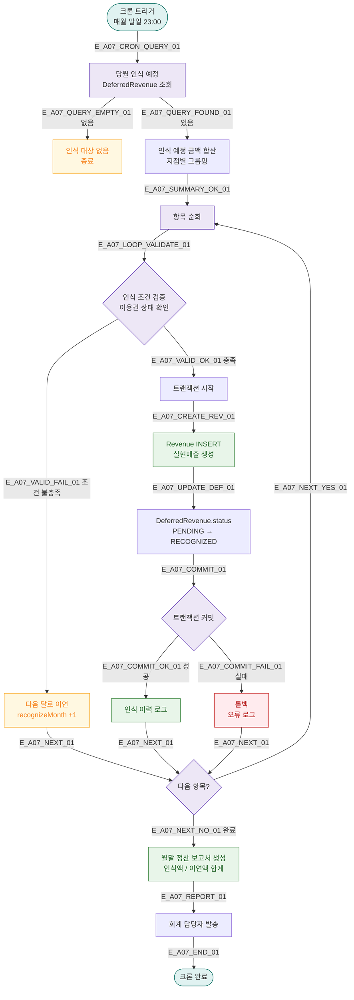

# A07 — 선수익금 월말 매출 인식

## 1. 개요

| 항목 | 내용 |
|------|------|
| 트리거 | 크론 — 매월 말일 23:00 |
| 대상 엔티티 | DeferredRevenue, Revenue |
| 조건 | 당월 인식 예정 이연매출 항목 |
| 결과 | DeferredRevenue → Revenue 이관, 매출 확정 |
| 관련 화면 | SCR-S006 선수익금 조회, SCR-S004 매출 통계 |

## 2. 발생 조건

- `DeferredRevenue.recognizeMonth = 이번 달`
- `DeferredRevenue.status = PENDING`
- 이용권 판매 시 선수익금으로 등록된 항목
- 수업 진행 비율 또는 만료일 기준 인식

## 3. 다이어그램

## 4. 복구/재시도 전략

| 상황 | 전략 |
|------|------|
| 트랜잭션 실패 | 롤백, 오류 로그, 다음 달 재처리 대기 |
| 인식 조건 불충족 | 다음 달로 자동 이연 |
| 크론 실패 | 익월 1일 보정 크론 수동 실행 |

## 5. 사용자 노출 메시지

| 대상 | 메시지 |
|------|--------|
| 회계 이메일 | "[FitGenie] {월} 선수익금 인식 완료. 인식액: {금액}원, 잔여 이연: {금액}원" |
| 관리자 대시보드 | SCR-S006 선수익금 조회 화면 자동 갱신 |

## 6. TC 후보

| TC ID | 타입 | Given | When | Then |
|-------|------|-------|------|------|
| TC-A07-01 | positive | 당월 인식 예정 항목 5건 | 말일 23:00 | Revenue 5건 생성, RECOGNIZED |
| TC-A07-02 | positive | 이용권 중도 해지 | 말일 크론 | 인식 조건 불충족 → 다음 달 이연 |
| TC-A07-03 | negative | 트랜잭션 실패 | 크론 실행 | 롤백, 오류 로그 |
| TC-A07-04 | edge | 당월 인식 대상 0건 | 크론 실행 | 빈 보고서, 정상 종료 |
