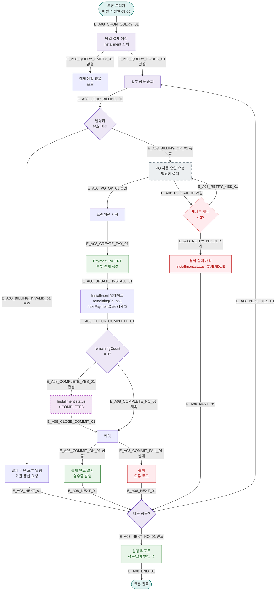

# A08 — 할부 자동 승인 🆕

## 1. 개요

| 항목 | 내용 |
|------|------|
| 트리거 | 크론 — 매월 지정일 09:00 |
| 대상 엔티티 | Installment, Payment |
| 조건 | 당일이 할부 결제일인 미결제 할부 항목 |
| 결과 | PG 자동 결제 승인, Payment 생성, 회원 알림 |
| 관련 화면 | SCR-S009 할부 결제 관리 🆕 |

## 2. 발생 조건

- `Installment.nextPaymentDate = TODAY`
- `Installment.status = ACTIVE`
- `Installment.remainingCount > 0`
- 등록된 자동 결제 수단(빌링키) 유효

## 3. 다이어그램

## 4. 복구/재시도 전략

| 상황 | 전략 |
|------|------|
| PG 결제 실패 | 최대 3회 재시도, 초과 시 OVERDUE 처리 |
| 빌링키 만료 | 즉시 회원 알림, 수동 결제 유도 |
| 트랜잭션 실패 | 롤백, PG 취소 요청, 오류 로그 |
| OVERDUE 상태 | SCR-S009에서 관리자 수동 처리 |

## 5. 사용자 노출 메시지

| 상황 | 메시지 |
|------|--------|
| 결제 성공 | "[FitGenie] {N}회차 할부 결제 완료. 잔여 {M}회. 영수증을 확인하세요." |
| 결제 실패 | "[FitGenie] 할부 결제에 실패했습니다. 결제 수단을 확인하고 지점에 문의하세요." |
| 완납 | "[FitGenie] 할부 결제가 모두 완료되었습니다. 감사합니다!" |

## 6. TC 후보

| TC ID | 타입 | Given | When | Then |
|-------|------|-------|------|------|
| TC-A08-01 | positive | 3회차 할부, 오늘 결제일 | 크론 09:00 | Payment 생성, remainingCount-1 |
| TC-A08-02 | positive | 마지막 회차 | 크론 실행 | COMPLETED, 완납 알림 |
| TC-A08-03 | negative | 빌링키 만료 | 크론 실행 | 결제 실패 알림, 수동 처리 대기 |
| TC-A08-04 | negative | PG 3회 모두 실패 | 크론 실행 | OVERDUE, 실패 로그 |
| TC-A08-05 | negative | 트랜잭션 실패 | PG 승인 후 | 롤백, PG 취소 |
