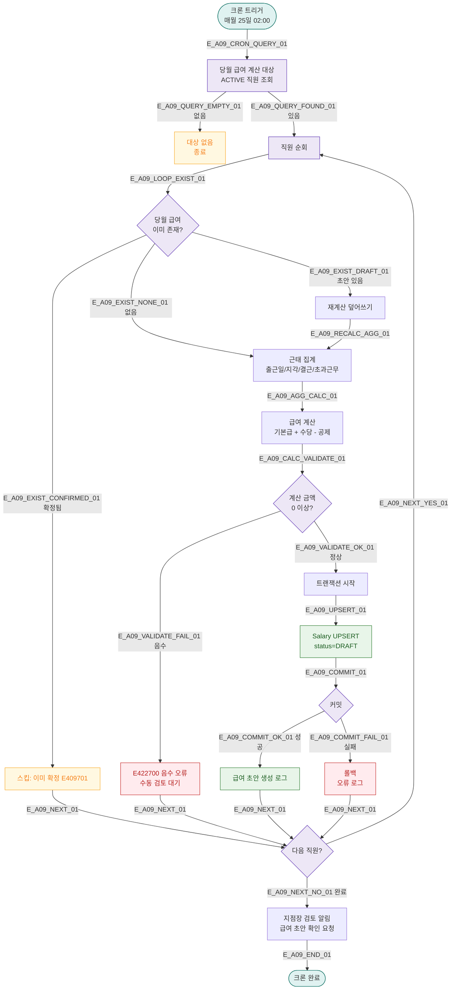

# A09 — 근태 집계 → 급여 자동 계산

## 1. 개요

| 항목 | 내용 |
|------|------|
| 트리거 | 크론 — 매월 25일 02:00 |
| 대상 엔티티 | Attendance, Salary, Staff |
| 조건 | 당월 근태 데이터가 확정된 직원 |
| 결과 | 월 급여 자동 계산, 명세서 초안 생성 |
| 관련 화면 | SCR-063 직원 근태 관리, SCR-064 급여 관리, SCR-065 급여 명세서 |

## 2. 발생 조건

- `Staff.status = ACTIVE`
- 당월 근태 기록(AttendanceRecord) 존재
- 급여 계산 기준: 기본급 + 수당 - 공제 (지점 정책 기반)
- `Salary.status = DRAFT` 인 경우만 (기확정 제외)

## 3. 다이어그램

## 4. 복구/재시도 전략

| 상황 | 전략 |
|------|------|
| 급여 금액 음수 | E422700 오류, 수동 검토 대기 상태로 표시 |
| 트랜잭션 실패 | 롤백, 오류 로그, 관리자 수동 재실행 |
| 이미 확정된 급여 | E409701 스킵, 수정 불가 |
| 크론 실패 | 관리자 수동 실행 (SCR-064 급여 관리) |

## 5. 사용자 노출 메시지

| 대상 | 메시지 |
|------|--------|
| 지점장 알림 | "[FitGenie] {월} 급여 초안이 생성되었습니다. 검토 후 확정해주세요." |
| 관리자 화면 | SCR-064 급여 관리 목록에 DRAFT 상태로 표시 |

## 6. TC 후보

| TC ID | 타입 | Given | When | Then |
|-------|------|-------|------|------|
| TC-A09-01 | positive | ACTIVE 직원 5명, 당월 근태 완비 | 25일 02:00 | 급여 초안 5건 생성 |
| TC-A09-02 | positive | 기존 DRAFT 급여 있음 | 크론 실행 | 재계산 덮어쓰기 |
| TC-A09-03 | negative | 이미 확정(PAID) 급여 | 크론 실행 | E409701 스킵 |
| TC-A09-04 | negative | 급여 계산 음수 결과 | 크론 실행 | E422700, 수동 검토 대기 |
| TC-A09-05 | edge | 근태 기록 없는 직원 | 크론 실행 | 0원 초안 또는 스킵 |
