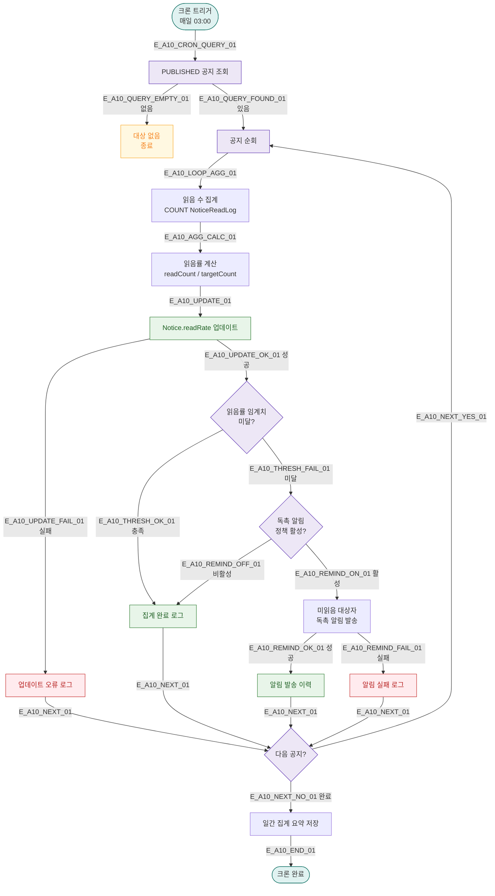

# A10 — 공지 읽음률 집계

## 1. 개요

| 항목 | 내용 |
|------|------|
| 트리거 | 크론 — 매일 03:00 |
| 대상 엔티티 | Notice, NoticeReadLog |
| 조건 | status = PUBLISHED 인 모든 공지 |
| 결과 | Notice.readRate 갱신, 미읽음 독촉 알림 (선택) |
| 관련 화면 | SCR-085 공지사항 관리 |

## 2. 발생 조건

- `Notice.status = PUBLISHED`
- `NoticeReadLog` 에서 읽음 수 집계
- 읽음률 = 읽은 수 / 발송 대상 수 × 100
- 읽음률 < 설정 임계치(기본 30%) 이면 독촉 알림 발송 (정책 설정 시)

## 3. 다이어그램

## 4. 복구/재시도 전략

| 상황 | 전략 |
|------|------|
| 업데이트 실패 | 오류 로그, 다음 크론에서 재집계 |
| 알림 발송 실패 | 알림 실패 로그, 읽음률은 유지 |
| 임계치 정책 없음 | 집계만 수행, 독촉 알림 없음 |

## 5. 사용자 노출 메시지

| 대상 | 메시지 |
|------|--------|
| 미읽음 직원 | "[FitGenie] 미확인 공지가 있습니다. 확인해주세요: {공지 제목}" |
| 관리자 화면 | SCR-085 공지사항 관리 목록 읽음률 컬럼 갱신 |

## 6. TC 후보

| TC ID | 타입 | Given | When | Then |
|-------|------|-------|------|------|
| TC-A10-01 | positive | 공지 3개, 읽음 기록 존재 | 03:00 크론 | readRate 갱신 |
| TC-A10-02 | positive | 읽음률 20% (임계치 30% 미달) | 크론 실행 | 독촉 알림 발송 |
| TC-A10-03 | negative | 독촉 정책 비활성 | 크론 실행 | 집계만, 알림 없음 |
| TC-A10-04 | edge | 공지 대상자 0명 | 크론 실행 | readRate=0, 오류 없음 |
