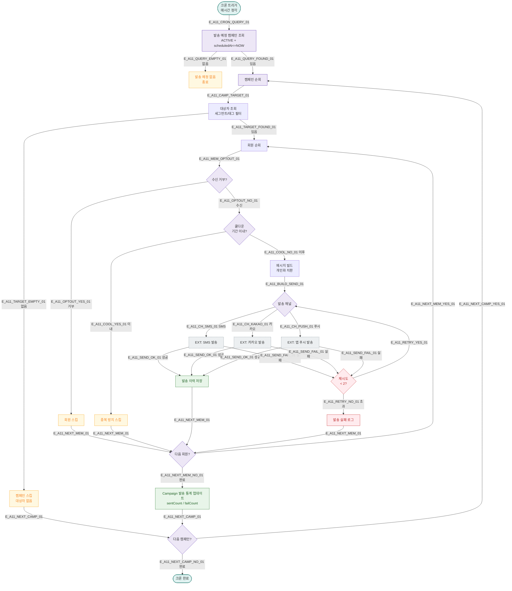

# A11 — 캠페인 자동 발송

## 1. 개요

| 항목 | 내용 |
|------|------|
| 트리거 | 크론 + 조건 기반 — 매시간 정각 |
| 대상 엔티티 | Campaign, Member, Message |
| 조건 | 발송 조건 충족 + 발송 시간 도래 |
| 결과 | 조건 일치 회원에게 메시지 자동 발송 |
| 관련 화면 | SCR-071 메시지 발송, SCR-072 자동 알림 설정 |

## 2. 발생 조건

- `Campaign.status = ACTIVE`
- `Campaign.scheduledAt <= NOW()`
- 세그먼트/태그 기반 대상자 필터
- 1인당 동일 캠페인 중복 발송 방지 (cooldown 기간)

## 3. 다이어그램

## 4. 복구/재시도 전략

| 상황 | 전략 |
|------|------|
| 채널 발송 실패 | 최대 2회 재시도, 실패 로그 |
| 개인화 치환 실패 | 기본 메시지로 대체 발송 |
| 쿨다운 위반 | 중복 발송 방지 스킵 |
| 캠페인 대량 실패 | 관리자 알림, 일시 정지 가능 |

## 5. 사용자 노출 메시지

| 캠페인 유형 | 예시 메시지 |
|------------|------------|
| 재등록 유도 | "[FitGenie] {이름}님, 이용권 만료 후 30일이 지났습니다. 재등록 시 10% 할인!" |
| 생일 축하 | "[FitGenie] {이름}님 생일을 축하합니다! 오늘 방문 시 특별 선물을 드려요." |
| 휴면 복귀 | "[FitGenie] 오랫동안 뵙지 못했어요. 지금 방문하면 1주일 무료!" |

## 6. TC 후보

| TC ID | 타입 | Given | When | Then |
|-------|------|-------|------|------|
| TC-A11-01 | positive | ACTIVE 캠페인, 대상자 10명 | 매시간 크론 | 10명 발송, 통계 업데이트 |
| TC-A11-02 | positive | 재등록 조건 캠페인 | 크론 실행 | 조건 일치 회원만 발송 |
| TC-A11-03 | negative | 수신 거부 회원 | 크론 실행 | 스킵 |
| TC-A11-04 | negative | 쿨다운 기간 이내 | 크론 실행 | 중복 발송 없음 |
| TC-A11-05 | negative | 채널 2회 실패 | 크론 실행 | 실패 로그, 다음 회원 진행 |
