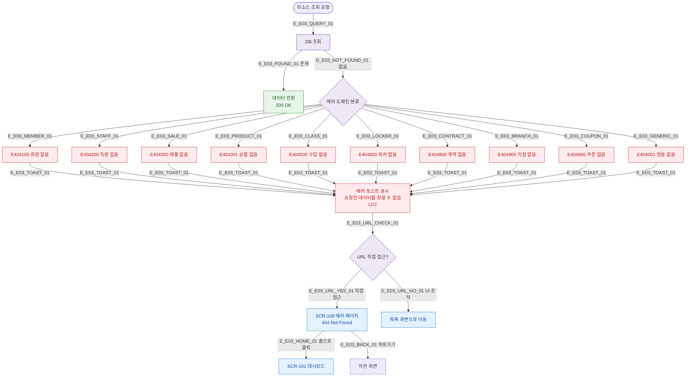

# E03 — 리소스 없음 (404)

## 1. 개요

| 항목 | 내용 |
|------|------|
| 에러코드 | E404001 / E404100 / E404200 / E404300 / E404301 / E404500 / E404600 / E404800 / E404900 / E404950 |
| HTTP | 404 Not Found |
| 발생 모듈 | 전 모듈 |
| 영향 화면 | SCR-108 에러 페이지, 각 도메인 상세 화면 |

## 2. 발생 조건

| 에러코드 | 조건 |
|----------|------|
| E404001 | 범용 리소스 미존재 |
| E404100 | memberId 조회 실패 |
| E404200 | staffId 조회 실패 |
| E404300 | saleId 조회 실패 |
| E404301 | productId 조회 실패 |
| E404500 | classId 조회 실패 |
| E404600 | lockerId 조회 실패 |
| E404800 | contractId 조회 실패 |
| E404900 | branchId 조회 실패 |
| E404950 | couponId 조회 실패 |

## 3. 다이어그램

## 4. 복구/재시도 전략

| 상황 | 복구 경로 |
|------|-----------|
| UI 조작으로 발생 | 토스트 + 목록 화면 복귀 |
| URL 직접 접근 | 404 에러 페이지 + 홈 버튼 |
| 삭제된 리소스 | 목록 새로고침 후 정상 상태 확인 |

## 5. 사용자 노출 메시지

| 에러코드 | 메시지 |
|----------|--------|
| E404001 | 요청한 데이터를 찾을 수 없습니다 |
| E404100 | 회원을 찾을 수 없습니다 |
| E404200 | 직원을 찾을 수 없습니다 |
| E404300 | 매출 내역을 찾을 수 없습니다 |
| E404301 | 상품을 찾을 수 없습니다 |
| E404500 | 수업을 찾을 수 없습니다 |
| E404600 | 락커를 찾을 수 없습니다 |
| E404800 | 계약 정보를 찾을 수 없습니다 |
| E404900 | 지점을 찾을 수 없습니다 |
| E404950 | 쿠폰을 찾을 수 없습니다 |

## 6. TC 후보

| TC ID | 타입 | Given | When | Then |
|-------|------|-------|------|------|
| TC-E03-01 | negative | 존재하지 않는 memberId | 회원 상세 접근 | E404100 토스트, 목록 복귀 |
| TC-E03-02 | negative | 삭제된 수업 ID | 수업 상세 접근 | E404500 토스트 |
| TC-E03-03 | negative | 잘못된 URL 직접 접근 | 브라우저 주소창 | SCR-108 에러 페이지 |
| TC-E03-04 | negative | 존재하지 않는 쿠폰 | 쿠폰 적용 시도 | E404950 토스트 |
