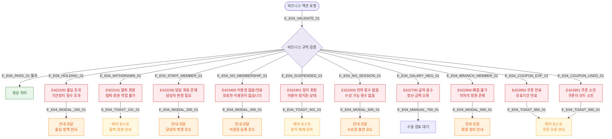

# E04 — 유효성 실패 (422)

## 1. 개요

| 항목 | 내용 |
|------|------|
| 에러코드 | E422100 / E422101 / E422200 / E422400 / E422401 / E422500 / E422700 / E422900 / E422950 / E422951 |
| HTTP | 422 Unprocessable Entity |
| 발생 모듈 | 회원/직원/출석/수업/급여/지점/마케팅 |
| 영향 화면 | 각 도메인 등록/수정/처리 화면 |

## 2. 발생 조건

| 에러코드 | 조건 |
|----------|------|
| E422100 | 홀딩 가능 횟수 초과 |
| E422101 | 탈퇴 회원에게 작업 시도 |
| E422200 | 담당 회원 있는 직원 퇴사 시도 |
| E422400 | 이용권 없음/만료 회원 출석 시도 |
| E422401 | SUSPENDED 회원 출석 시도 |
| E422500 | 수강권 잔여 횟수 0 |
| E422700 | 급여 계산 결과 음수 |
| E422900 | 미처리 회원 있는 지점 폐점 시도 |
| E422950 | 유효기간 만료 쿠폰 사용 |
| E422951 | 쿠폰 수량 소진 |

## 3. 다이어그램

## 4. 복구/재시도 전략

| 에러 | 복구 경로 |
|------|-----------|
| E422100 | 홀딩 정책 안내 모달, 관리자 예외 처리 가능 |
| E422200 | 담당자 변경 화면으로 이동 |
| E422400 | 이용권 등록 화면 유도 |
| E422500 | 수강권 충전 또는 별도 결제 유도 |
| E422900 | 회원 이관/환불 처리 후 재시도 |

## 5. 사용자 노출 메시지

| 에러코드 | 메시지 |
|----------|--------|
| E422100 | 기간정지 가능 횟수를 초과했습니다 |
| E422101 | 탈퇴한 회원에 대해서는 해당 작업을 수행할 수 없습니다 |
| E422200 | 담당 회원이 있어 퇴사 처리할 수 없습니다. 담당자를 변경해주세요 |
| E422400 | 유효한 이용권이 없습니다 |
| E422401 | 이용이 정지된 상태입니다. 관리자에게 문의해주세요 |
| E422500 | 수강 가능한 잔여 횟수가 없습니다 |
| E422700 | 정산 금액이 올바르지 않습니다 |
| E422900 | 이관/환불 미처리 회원이 있어 폐점할 수 없습니다 |
| E422950 | 유효기간이 만료된 쿠폰입니다 |
| E422951 | 쿠폰이 모두 소진되었습니다 |

## 6. TC 후보

| TC ID | 타입 | Given | When | Then |
|-------|------|-------|------|------|
| TC-E04-01 | negative | 홀딩 횟수 최대 도달 | 홀딩 등록 시도 | E422100 모달 |
| TC-E04-02 | negative | 탈퇴 회원 | 이용권 등록 시도 | E422101 토스트 |
| TC-E04-03 | negative | 담당 회원 있는 직원 | 퇴사 처리 | E422200 모달 |
| TC-E04-04 | negative | 이용권 없는 회원 | 키오스크 출석 | E422400 안내 |
| TC-E04-05 | negative | 잔여 횟수 0 | 수업 예약 | E422500 모달 |
| TC-E04-06 | negative | 만료된 쿠폰 | 쿠폰 적용 | E422950 토스트 |
