# E05 — 중복/충돌 (409)

## 1. 개요

| 항목 | 내용 |
|------|------|
| 에러코드 | E409100~E409101, E409200, E409300, E409600~E409602, E409700~E409701, E409800, E409900 |
| HTTP | 409 Conflict |
| 발생 모듈 | 전 모듈 |
| 영향 화면 | 각 도메인 등록/수정 화면 |

## 2. 발생 조건

| 에러코드 | 조건 |
|----------|------|
| E409100 | 전화번호 UNIQUE 위반 |
| E409101 | 잘못된 상태 전이 시도 |
| E409200 | 이미 퇴사 처리된 직원 중복 처리 |
| E409300 | 이미 환불된 매출 재환불 시도 |
| E409600 | 이미 사용 중인 락커 배정 |
| E409601 | RFID 태그 UNIQUE 위반 |
| E409602 | 점검 중 락커 배정 시도 |
| E409700 | 이미 확정된 급여 수정 시도 |
| E409701 | 동일 월 급여 중복 생성 |
| E409800 | 이미 서명 완료된 계약 재서명 |
| E409900 | 지점코드 UNIQUE 위반 |

## 3. 다이어그램

```mermaid
flowchart TD
    ACTION([저장/처리 요청]) -->|E_E05_UNIQUE_CHECK_01| UNIQUE_CHECK{중복/충돌 검사}

    UNIQUE_CHECK -->|E_E05_PASS_01 없음| PROCESS[정상 처리]

    UNIQUE_CHECK -->|E_E05_PHONE_01| E409100[E409100 전화번호 중복<br/>이미 등록된 전화번호]
    UNIQUE_CHECK -->|E_E05_STATE_01| E409101[E409101 상태 충돌<br/>현재 상태에서 불가]
    UNIQUE_CHECK -->|E_E05_STAFF_RESIGN_01| E409200[E409200 이미 퇴사<br/>중복 퇴사 처리]
    UNIQUE_CHECK -->|E_E05_REFUND_01| E409300[E409300 이미 환불<br/>재환불 불가]
    UNIQUE_CHECK -->|E_E05_LOCKER_01| E409600[E409600 락커 사용 중<br/>배정 불가]
    UNIQUE_CHECK -->|E_E05_RFID_01| E409601[E409601 RFID 중복<br/>이미 등록된 RFID]
    UNIQUE_CHECK -->|E_E05_MAINTAIN_01| E409602[E409602 점검 중 락커<br/>배정 불가]
    UNIQUE_CHECK -->|E_E05_SALARY_LOCK_01| E409700[E409700 급여 확정<br/>수정 불가]
    UNIQUE_CHECK -->|E_E05_SALARY_DUP_01| E409701[E409701 급여 중복<br/>해당 월 급여 존재]
    UNIQUE_CHECK -->|E_E05_CONTRACT_SIGN_01| E409800[E409800 서명 완료<br/>재서명 불가]
    UNIQUE_CHECK -->|E_E05_BRANCH_CODE_01| E409900[E409900 지점코드 중복<br/>이미 사용 중]

    E409100 -->|E_E05_PHONE_GUIDE_01| PHONE_GUIDE[기존 회원 조회 안내<br/>DLG-M006 중복 확인]
    E409101 -->|E_E05_STATE_TOAST_01| STATE_TOAST[상태 충돌 토스트<br/>현재 상태 안내]
    E409200 & E409300 & E409700 & E409800 -->|E_E05_READONLY_01| READONLY_TOAST[이미 처리됨 토스트<br/>변경 불가]
    E409600 & E409601 & E409602 -->|E_E05_LOCKER_GUIDE_01| LOCKER_GUIDE[다른 락커 선택 안내]
    E409701 -->|E_E05_SALARY_GUIDE_01| SALARY_GUIDE[기존 급여 조회 안내]
    E409900 -->|E_E05_CODE_GUIDE_01| CODE_GUIDE[다른 코드 입력 안내]

    classDef error fill:#FFEBEE,stroke:#C62828,color:#B71C1C
    classDef success fill:#E8F5E9,stroke:#2E7D32,color:#1B5E20
    classDef system fill:#EDE7F6,stroke:#5E35B2
    classDef warning fill:#FFF8E1,stroke:#F9A825,color:#F57F17
    classDef modal fill:#FFF3E0,stroke:#F57C00,color:#E65100

    class E409100,E409101,E409200,E409300,E409600,E409601,E409602,E409700,E409701,E409800,E409900 error
    class PROCESS success
    class UNIQUE_CHECK system
    class STATE_TOAST,READONLY_TOAST warning
    class PHONE_GUIDE,LOCKER_GUIDE modal
```

## 4. 복구/재시도 전략

| 에러 | 복구 경로 |
|------|-----------|
| E409100 | 기존 회원 조회 모달 표시, 신규 등록 또는 기존 회원 이동 |
| E409101 | 현재 상태 안내, 올바른 상태 전이 유도 |
| E409600~602 | 다른 락커 선택 유도 |
| E409700 | 확정 취소는 관리자 권한 필요 |

## 5. 사용자 노출 메시지

| 에러코드 | 메시지 |
|----------|--------|
| E409100 | 이미 등록된 전화번호입니다 |
| E409101 | 현재 상태에서는 해당 작업을 수행할 수 없습니다 |
| E409200 | 이미 퇴사 처리된 직원입니다 |
| E409300 | 이미 환불 처리된 매출입니다 |
| E409600 | 이미 사용 중인 락커입니다 |
| E409601 | 이미 등록된 RFID입니다 |
| E409602 | 점검 중인 락커는 배정할 수 없습니다 |
| E409700 | 이미 확정된 급여는 수정할 수 없습니다 |
| E409701 | 해당 월 급여가 이미 존재합니다 |
| E409800 | 이미 서명이 완료된 계약입니다 |
| E409900 | 이미 사용 중인 지점 코드입니다 |

## 6. TC 후보

| TC ID | 타입 | Given | When | Then |
|-------|------|-------|------|------|
| TC-E05-01 | negative | 기존 등록 전화번호 | 회원 등록 | E409100, 중복 확인 모달 |
| TC-E05-02 | negative | EXPIRED 이용권 | ACTIVE→EXPIRED 재시도 | E409101 상태 충돌 |
| TC-E05-03 | negative | 이미 환불된 매출 | 환불 재시도 | E409300 토스트 |
| TC-E05-04 | negative | 사용 중인 락커 | 배정 시도 | E409600 안내 |
| TC-E05-05 | negative | 확정된 급여 | 수정 시도 | E409700 수정 불가 |
