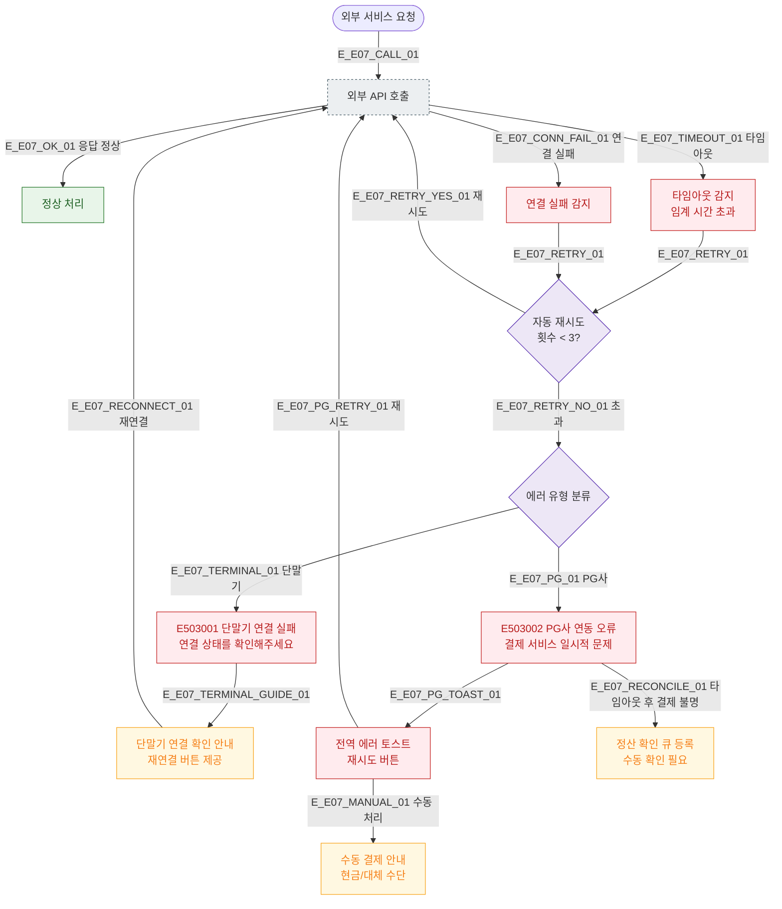

# E07 — 타임아웃 (503/504)

## 1. 개요

| 항목 | 내용 |
|------|------|
| 에러코드 | E503001 / E503002 |
| HTTP | 503 Service Unavailable |
| 발생 모듈 | 매출/결제, 시설(IoT), 외부 연동 |
| 영향 화면 | SCR-S002 POS, SCR-S003 결제 처리, SCR-083 IoT |

## 2. 발생 조건

| 에러코드 | 조건 |
|----------|------|
| E503001 | 결제 단말기 통신 오류 (타임아웃/연결 끊김) |
| E503002 | PG API 타임아웃 또는 에러 응답 |

## 3. 다이어그램

## 4. 복구/재시도 전략

| 상황 | 전략 |
|------|------|
| 자동 재시도 3회 이내 성공 | 정상 처리, 사용자 인지 불필요 |
| 3회 모두 실패 | 에러 표시, 수동 처리 유도 |
| 결제 타임아웃 불명 상태 | 정산 확인 큐 등록, 관리자 수동 확인 |
| 단말기 연결 실패 | 재연결 안내, 네트워크 점검 |

## 5. 사용자 노출 메시지

| 에러코드 | 메시지 |
|----------|--------|
| E503001 | 결제 단말기 연결에 실패했습니다. 연결 상태를 확인해주세요 |
| E503002 | 결제 서비스에 일시적인 문제가 발생했습니다 |

## 6. TC 후보

| TC ID | 타입 | Given | When | Then |
|-------|------|-------|------|------|
| TC-E07-01 | negative | PG 타임아웃 | 결제 요청 | 3회 재시도, 실패 토스트 |
| TC-E07-02 | negative | 단말기 연결 끊김 | POS 결제 | E503001, 재연결 안내 |
| TC-E07-03 | edge | 타임아웃 후 결제 불명 | PG 응답 없음 | 정산 확인 큐 등록 |
| TC-E07-04 | positive | 2회 실패 후 3회 성공 | 자동 재시도 | 정상 처리 |
