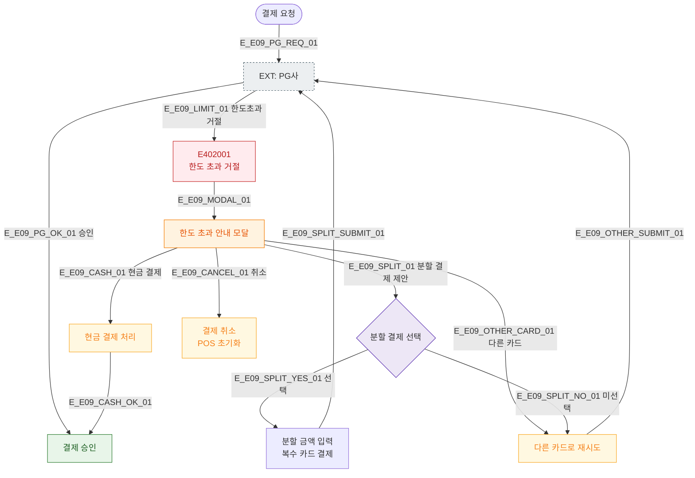

# E09 — 결제 한도 초과

## 1. 개요

| 항목 | 내용 |
|------|------|
| 에러코드 | E402001 (한도초과 사유) |
| HTTP | 402 Payment Required |
| 발생 모듈 | 매출/결제 |
| 영향 화면 | SCR-S002 POS 판매, SCR-S003 결제 처리 |

## 2. 발생 조건

- PG사로부터 한도 초과 거절 코드 수신
- 신용카드 월 한도 초과
- 일일 결제 한도 초과
- 카드사별 단일 결제 한도 초과

## 3. 다이어그램

## 4. 복구/재시도 전략

| 상황 | 전략 |
|------|------|
| 한도 초과 | 다른 카드 시도, 분할 결제, 현금 결제 유도 |
| 분할 결제 | 복수 카드로 금액 분할 처리 |
| 모두 불가 | 결제 취소, 추후 재방문 안내 |

## 5. 사용자 노출 메시지

| 상황 | 메시지 |
|------|--------|
| 한도 초과 감지 | "카드 한도를 초과했습니다. 다른 결제 수단을 선택해주세요." |
| 분할 결제 제안 | "분할 결제를 이용하시겠습니까?" |

## 6. TC 후보

| TC ID | 타입 | Given | When | Then |
|-------|------|-------|------|------|
| TC-E09-01 | negative | 한도 초과 카드 | 결제 요청 | E402001 한도 초과 모달 |
| TC-E09-02 | positive | 한도 초과 후 다른 카드 | 카드 교체 | 정상 승인 |
| TC-E09-03 | positive | 한도 초과 후 분할 결제 | 분할 선택 | 복수 카드 처리 |
| TC-E09-04 | positive | 한도 초과 후 현금 | 현금 선택 | 현금 결제 처리 |
