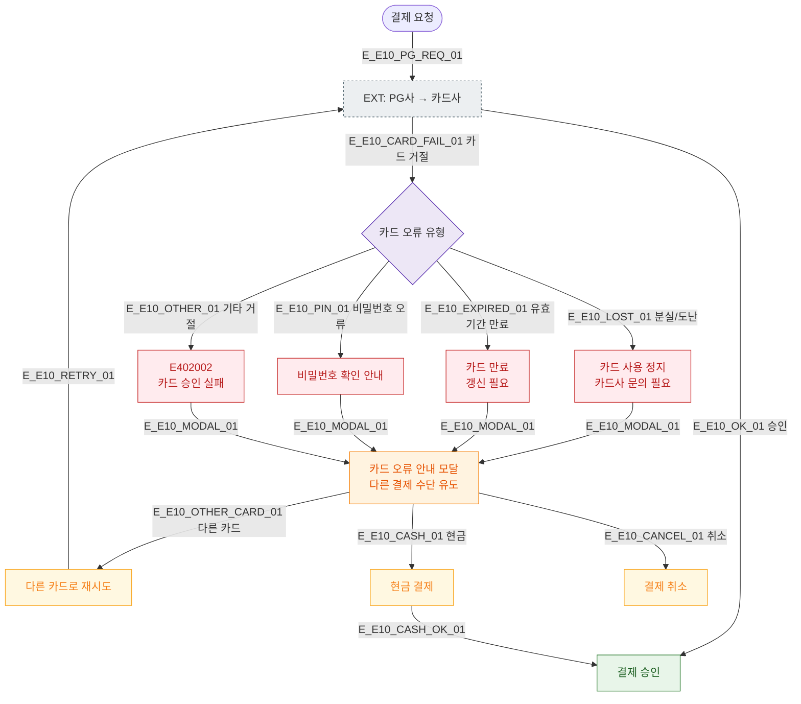

# E10 — 결제 카드 오류

## 1. 개요

| 항목 | 내용 |
|------|------|
| 에러코드 | E402002 |
| HTTP | 402 Payment Required |
| 발생 모듈 | 매출/결제 |
| 영향 화면 | SCR-S002 POS 판매, SCR-S003 결제 처리 |

## 2. 발생 조건

- 카드사로부터 승인 거절
- 분실/도난 카드
- 유효기간 만료 카드
- 비밀번호 오류 누적
- 해외 결제 차단된 카드

## 3. 다이어그램

## 4. 복구/재시도 전략

| 상황 | 전략 |
|------|------|
| 분실/도난 | 카드사 문의 안내, 다른 카드 유도 |
| 유효기간 만료 | 갱신 카드 사용 안내 |
| 비밀번호 오류 | 비밀번호 재확인 안내 |
| 기타 거절 | 다른 카드 또는 현금 결제 유도 |

## 5. 사용자 노출 메시지

| 에러코드 | 메시지 |
|----------|--------|
| E402002 | 카드 승인에 실패했습니다. 다른 결제 수단을 이용해주세요 |

## 6. TC 후보

| TC ID | 타입 | Given | When | Then |
|-------|------|-------|------|------|
| TC-E10-01 | negative | 분실 신고된 카드 | 결제 요청 | E402002, 카드사 문의 안내 |
| TC-E10-02 | negative | 유효기간 만료 카드 | 결제 요청 | E402002, 갱신 안내 |
| TC-E10-03 | positive | 오류 카드 후 다른 카드 | 카드 교체 | 정상 승인 |
| TC-E10-04 | positive | 오류 카드 후 현금 | 현금 선택 | 현금 결제 처리 |
