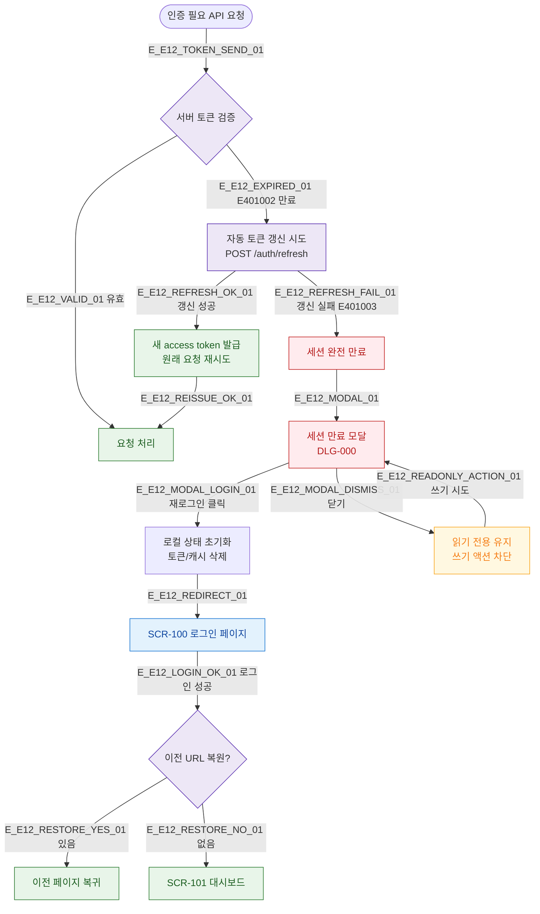

# E12 — 세션 만료

## 1. 개요

| 항목 | 내용 |
|------|------|
| 에러코드 | E401002 / E401003 |
| HTTP | 401 Unauthorized |
| 발생 모듈 | 공통 (인증) |
| 영향 화면 | 전체 인증 필요 화면, DLG-000 세션 만료 모달 |

## 2. 발생 조건

| 에러코드 | 조건 |
|----------|------|
| E401002 | JWT access token exp 초과 |
| E401003 | refresh token 만료 또는 무효 |

## 3. 다이어그램

## 4. 복구/재시도 전략

| 상황 | 전략 |
|------|------|
| access token 만료 | refresh token으로 자동 갱신, 원래 요청 재실행 |
| refresh token 만료 | 세션 만료 모달, 재로그인 유도 |
| 재로그인 후 | 이전 URL로 복원 |
| 모달 닫기 | 읽기 전용 모드 유지 |

## 5. 사용자 노출 메시지

| 에러코드 | 메시지 |
|----------|--------|
| E401002 (자동 갱신 실패) | 세션이 만료되었습니다. 다시 로그인해주세요 |
| E401003 | 인증 정보가 유효하지 않습니다 |
| 모달 타이틀 | 세션이 만료되었습니다 |

## 6. TC 후보

| TC ID | 타입 | Given | When | Then |
|-------|------|-------|------|------|
| TC-E12-01 | negative | access token 만료, refresh 유효 | API 요청 | 자동 갱신, 원래 요청 재실행 |
| TC-E12-02 | negative | 두 토큰 모두 만료 | API 요청 | 세션 만료 모달 |
| TC-E12-03 | positive | 모달에서 재로그인 | 로그인 성공 | 이전 URL 복원 |
| TC-E12-04 | edge | 폼 입력 중 세션 만료 | API 요청 | 모달 + 입력값 보존 여부 |
