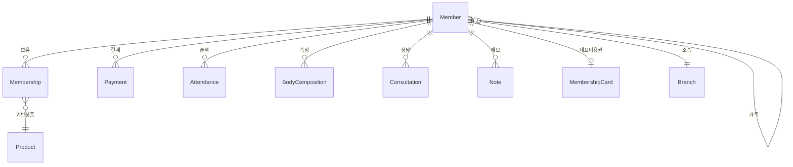
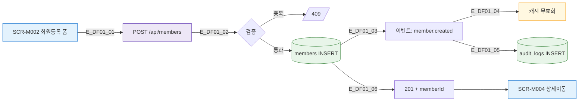
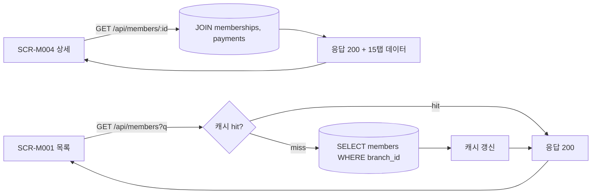

## 1. 엔티티 개요

회원 도메인의 핵심 엔티티는 `Member`이며, 이용권(`Membership`), 출석(`Attendance`), 결제(`Payment`), 체성분(`BodyComposition`), 상담(`Consultation`)과 연결된다.

## 2. ER 다이어그램

## 3. 쓰기 경로 (등록)

## 4. 읽기 경로 (목록/상세)

## 5. 주요 필드

| 필드 | 타입 | 제약 | 비고 |
|------|------|------|------|
| id | uuid | PK | |
| branch_id | uuid | FK | 필수 |
| name | text | not null | |
| phone | text | unique(branch_id) | 중복 검증 대상 |
| gender | enum | M/F/O | |
| birth | date | | |
| status | enum | 8종 | S1 MemberStatus |
| membership_expiry | date | | 자동 계산 |
| last_visit | timestamp | | 휴면 판정 기준 |
| deleted_at | timestamp | | 소프트 삭제 |

## 6. 인덱스/제약

- `UNIQUE(branch_id, phone) WHERE deleted_at IS NULL`
- `INDEX(status, membership_expiry)` — 만료 임박 조회
- `INDEX(last_visit)` — 휴면 판정
- `FK(branch_id) ON DELETE RESTRICT`

## 7. TC 후보

| TC ID | 타입 | 설명 |
|-------|:----:|------|
| TC-DF01-01 | positive | 신규 회원 등록 → DB INSERT + 이벤트 발행 |
| TC-DF01-02-NEG | negative | 동일 지점 내 동일 전화번호 등록 시 409 |
| TC-DF01-03 | boundary | 소프트 삭제된 회원의 전화번호로 재등록 허용 |
| TC-DF01-04 | positive | 회원 조회 시 캐시 hit 응답시간 < 50ms |
| TC-DF01-05-EXC | exception | branch_id 없는 요청 400 |
