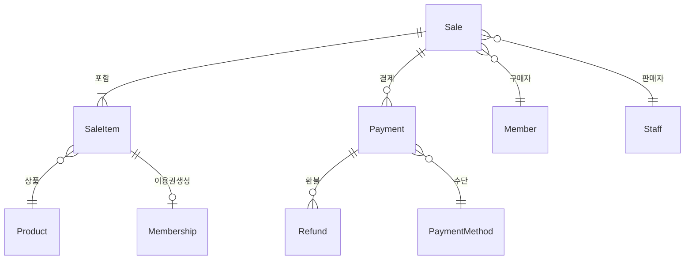
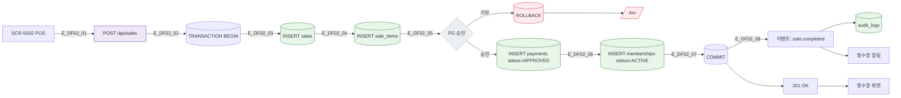
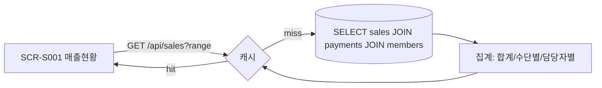

## 1. 엔티티 개요

결제(`Payment`)는 판매(`Sale`) 단위로 묶이며, 상품 라인아이템(`SaleItem`)과 환불(`Refund`)이 연결된다. 이용권 자동 개시의 트리거.

## 2. ER 다이어그램

## 3. 쓰기 경로 (POS 결제)

## 4. 읽기 경로 (매출 현황)

## 5. 주요 필드

| 필드 | 테이블 | 타입 | 비고 |
|------|--------|------|------|
| id | sales | uuid | PK |
| member_id | sales | uuid | FK |
| total_amount | sales | bigint | 원 단위 |
| status | sales | enum | DRAFT/COMPLETED/CANCELED |
| payment_id | payments | uuid | PK |
| method | payments | enum | CARD/CASH/TRANSFER/POINT |
| approval_code | payments | text | PG 응답 |
| installment | payments | int | 할부 개월 🆕 |
| refund_amount | refunds | bigint | 부분 환불 |

## 6. 인덱스/제약

- `INDEX(sales.member_id, sales.created_at DESC)`
- `INDEX(sales.status, sales.created_at)` — 미수금/환불 조회
- `FK(sale_items.product_id)` ON DELETE RESTRICT
- 트랜잭션 무결성: 판매-결제-이용권 한 묶음

## 7. TC 후보

| TC ID | 타입 | 설명 |
|-------|:----:|------|
| TC-DF02-01 | positive | POS 결제 성공 → 이용권 ACTIVE 자동 생성 |
| TC-DF02-02-NEG | negative | PG 거부 → 전체 트랜잭션 롤백 |
| TC-DF02-03 | boundary | 할부 12개월 결제 🆕 |
| TC-DF02-04-EXC | exception | PG 타임아웃 → 정산 확인 큐 |
| TC-DF02-05 | positive | 부분 환불 → refund_amount 누적, sale.status 유지 |
