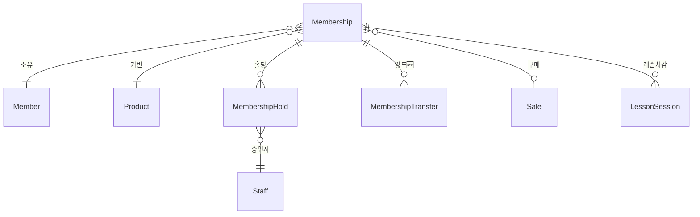
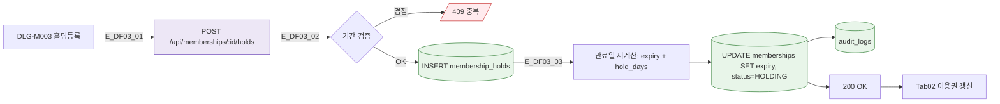
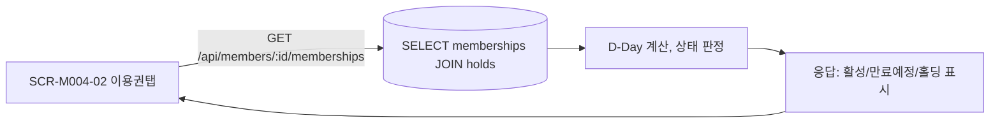

## 1. 엔티티 개요

이용권(`Membership`)은 상품 구매로 생성되며, 홀딩/양도/환불/만료 이벤트에 따라 상태 변화. S2 MembershipStatus 참조.

## 2. ER 다이어그램

## 3. 쓰기 경로 (홀딩 등록)

## 4. 읽기 경로 (이용권 탭)

## 5. 주요 필드

| 필드 | 타입 | 비고 |
|------|------|------|
| id | uuid | PK |
| member_id | uuid | FK |
| product_id | uuid | FK |
| start_date | date | |
| end_date | date | 홀딩 시 재계산 |
| original_end_date | date | 원본 보존 |
| remaining_count | int | 횟수제 |
| status | enum | 6종 S2 |
| transferred_from | uuid | 양도 원본 🆕 |

## 6. 인덱스/제약

- `INDEX(member_id, status, end_date)`
- `INDEX(end_date)` — 만료 크론 A03
- `CHECK(end_date >= start_date)`

## 7. TC 후보

| TC ID | 타입 | 설명 |
|-------|:----:|------|
| TC-DF03-01 | positive | 홀딩 등록 시 만료일 자동 연장 |
| TC-DF03-02-NEG | negative | 홀딩 기간 겹침 시 409 |
| TC-DF03-03 | positive | 크론(A03) 실행 시 자동 EXPIRED 전환 |
| TC-DF03-04 | boundary | 홀딩 해제 시 원본 만료일로 복원 |
