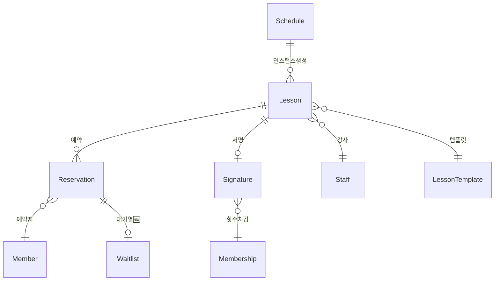
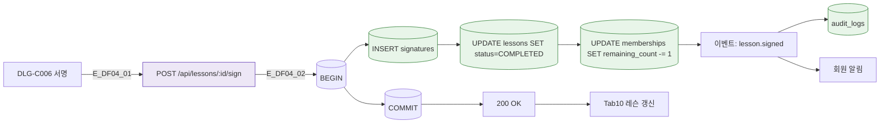
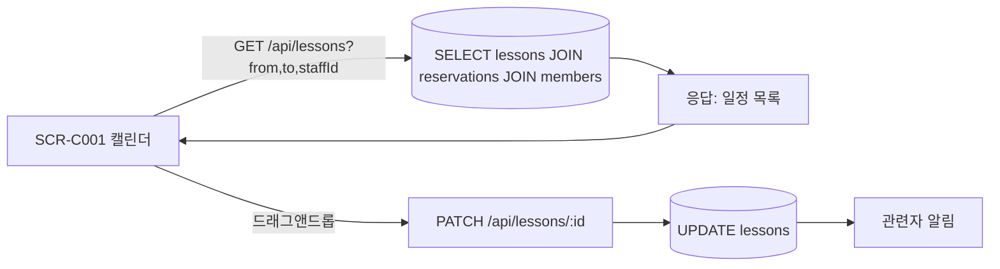

## 1. 엔티티 개요

수업(`Lesson`)은 반복 스케줄(`Schedule`)로부터 생성되며, 예약(`Reservation`)-체크인-진행-서명-횟수차감 플로우를 거친다. S5/S6 상태 참조.

## 2. ER 다이어그램

## 3. 쓰기 경로 (서명→차감)

## 4. 읽기 경로 (캘린더)

## 5. 주요 필드

| 필드 | 테이블 | 비고 |
|------|--------|------|
| id | lessons | PK |
| schedule_id | lessons | FK (반복 스케줄) |
| staff_id | lessons | FK 강사 |
| start_at / end_at | lessons | timestamp |
| status | lessons | S5 |
| type | lessons | PT/GROUP/OT |
| capacity | lessons | 정원 |
| reserved_count | lessons | 예약수 |

## 6. 인덱스/제약

- `INDEX(staff_id, start_at)` — 강사별 일정 조회
- `INDEX(start_at, status)` — 캘린더 쿼리
- `UNIQUE(lesson_id, member_id)` on reservations — 중복 예약 방지

## 7. TC 후보

| TC ID | 타입 | 설명 |
|-------|:----:|------|
| TC-DF04-01 | positive | 서명 시 이용권 횟수 차감 |
| TC-DF04-02-NEG | negative | 만료 이용권으로 서명 시도 시 거부 |
| TC-DF04-03-EXC | exception | 동시 서명 경쟁 → 한 번만 차감 |
| TC-DF04-04 | positive | 노쇼 발생 시 페널티 자동 생성 (A05 연결) |
