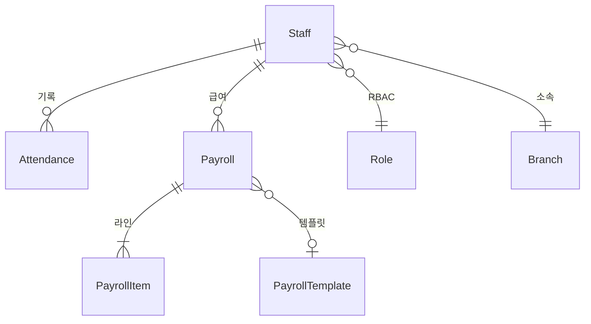
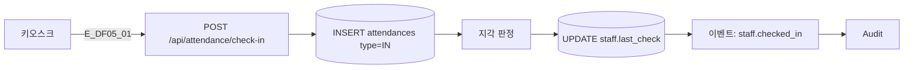
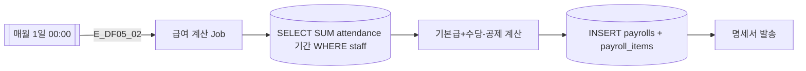

## 1. 엔티티 개요

직원(`Staff`)의 근태 로그(`Attendance`)를 집계해 급여(`Payroll`)가 월별 자동 계산된다. S8 EmployeeStatus, S13 AttendanceStatus 참조.

## 2. ER 다이어그램

## 3. 쓰기 경로 (근태 체크인)

## 4. 자동 급여 계산 (크론 A09)

## 5. 주요 필드

| 필드 | 테이블 | 비고 |
|------|--------|------|
| staff.role | staff | 6종 RBAC |
| staff.status | staff | S8 |
| attendance.type | attendances | IN/OUT/BREAK |
| attendance.recorded_at | attendances | timestamp |
| payroll.period | payrolls | YYYY-MM |
| payroll_item.kind | payroll_items | BASE/BONUS/DEDUCTION |

## 6. 인덱스/제약

- `INDEX(attendance.staff_id, recorded_at)`
- `UNIQUE(payrolls.staff_id, period)`

## 7. TC 후보

| TC ID | 타입 | 설명 |
|-------|:----:|------|
| TC-DF05-01 | positive | 체크인 시 지각 자동 판정 |
| TC-DF05-02 | positive | 크론 실행 시 전 직원 급여 정상 생성 |
| TC-DF05-03-NEG | negative | 중복 체크인 방지 |
