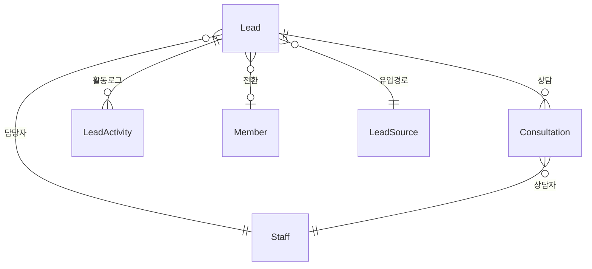
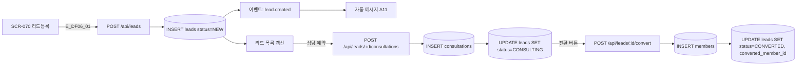
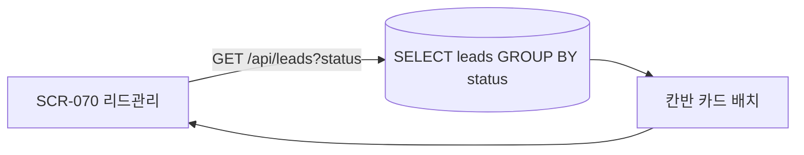

## 1. 엔티티 개요

리드(`Lead`)는 유입→상담→전환 파이프라인으로 관리. 전환 시 `Member`로 승격. S7 LeadStatus 참조.

## 2. ER 다이어그램

## 3. 쓰기 경로 (리드 등록→전환)

## 4. 읽기 경로 (리드 파이프라인)

## 5. 주요 필드

| 필드 | 비고 |
|------|------|
| leads.source_id | 유입경로 (광고/추천/내방/온라인) |
| leads.status | 7종 S7 |
| leads.assigned_to | 담당자 staff_id |
| leads.converted_member_id | 전환 결과 회원 |
| consultations.scheduled_at | 상담 예약일 |

## 6. 인덱스/제약

- `INDEX(leads.status, leads.created_at DESC)`
- `INDEX(leads.assigned_to)` — FC별 리드

## 7. TC 후보

| TC ID | 타입 | 설명 |
|-------|:----:|------|
| TC-DF06-01 | positive | 리드 등록 → 자동 메시지 발송 (A11) |
| TC-DF06-02 | positive | 전환 성공 → Member 생성 + 리드 CONVERTED |
| TC-DF06-03-NEG | negative | 이미 전환된 리드 재전환 시 409 |
