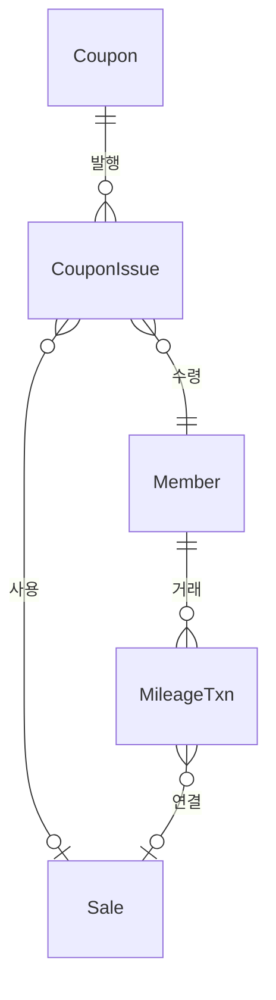
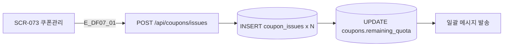
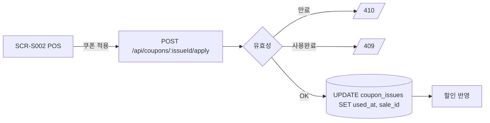

## 1. 엔티티 개요

쿠폰(`Coupon`)은 템플릿 기반으로 회원에게 발행(`CouponIssue`)되고 사용 시 결제에 할인 적용. 마일리지(`MileageTxn`)는 적립/사용 트랜잭션 로그. S10 CouponStatus 참조.

## 2. ER 다이어그램

## 3. 쓰기 경로 (쿠폰 발행)

## 4. 사용 플로우

## 5. 주요 필드

| 필드 | 비고 |
|------|------|
| coupon.discount_type | FIXED / PERCENT |
| coupon.min_amount | 최소 결제액 |
| coupon.valid_from / valid_to | 기간 |
| coupon_issue.status | S10 |
| mileage_txn.kind | EARN / USE / EXPIRE / ADJUST |

## 6. 인덱스/제약

- `INDEX(coupon_issues.member_id, status)`
- `INDEX(mileage_txns.member_id, created_at DESC)`
- 합계 계산은 뷰/머터리얼라이즈드 뷰 권장

## 7. TC 후보

| TC ID | 타입 | 설명 |
|-------|:----:|------|
| TC-DF07-01 | positive | 쿠폰 발행 → 배포 → 사용 전 생명주기 |
| TC-DF07-02-NEG | negative | 만료된 쿠폰 사용 시 거부 |
| TC-DF07-03 | boundary | 마일리지 음수 잔액 방지 |
