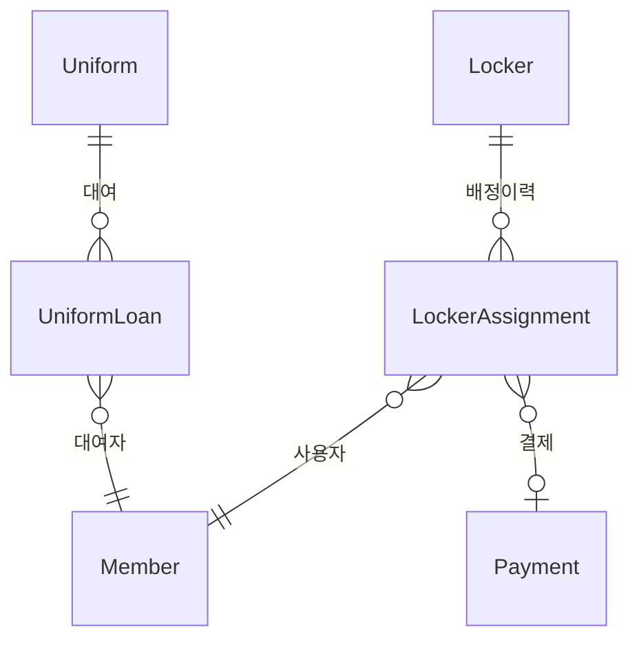
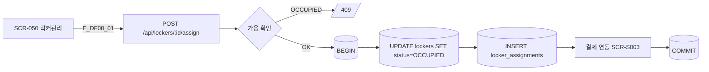
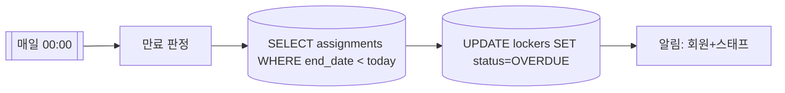

## 1. 엔티티 개요

락커(`Locker`)는 번호 단위로 관리되며, 배정(`LockerAssignment`)으로 회원과 연결. 운동복(`Uniform`)도 대여 이력 관리. S11 LockerStatus 참조.

## 2. ER 다이어그램

## 3. 쓰기 경로 (락커 배정)

## 4. 자동 만료 (크론)

## 5. 주요 필드

| 필드 | 비고 |
|------|------|
| lockers.number | 번호 |
| lockers.zone | 구역 |
| lockers.status | S11 |
| assignments.start_date / end_date | 이용 기간 |

## 6. 인덱스/제약

- `UNIQUE(locker_id) WHERE status IN ('RESERVED','OCCUPIED')`
- `INDEX(end_date)` — 만료 크론

## 7. TC 후보

| TC ID | 타입 | 설명 |
|-------|:----:|------|
| TC-DF08-01 | positive | 락커 배정 성공 → 결제 연동 |
| TC-DF08-02-NEG | negative | 이미 점유된 락커 배정 시 409 |
| TC-DF08-03 | positive | 만료 크론 실행 시 OVERDUE 자동 전환 |
