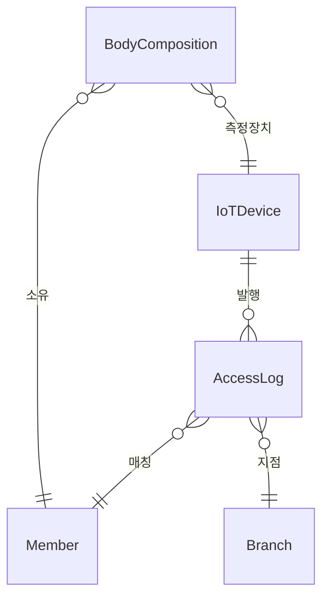
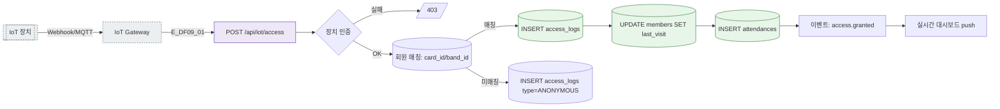
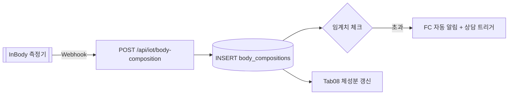

## 1. 엔티티 개요

IoT 장치(`IoTDevice`: 키오스크/밴드/카드/InBody)가 이벤트를 발행하면 출입/출석/체성분 데이터가 자동 적재된다. 외부 시스템 연동.

## 2. ER 다이어그램

## 3. 쓰기 경로 (출입 이벤트)

## 4. 체성분 자동 반영

## 5. 주요 필드

| 필드 | 비고 |
|------|------|
| iot_devices.type | KIOSK/BAND/CARD/INBODY |
| iot_devices.public_key | 장치 인증 |
| access_logs.gate_id | 출입문 식별 |
| body_compositions.weight/bfr/smm | InBody 지표 |

## 6. 인덱스/제약

- `INDEX(access_logs.member_id, recorded_at DESC)`
- `INDEX(body_compositions.member_id, measured_at DESC)`
- 장치 JWT/공개키 인증 필수

## 7. TC 후보

| TC ID | 타입 | 설명 |
|-------|:----:|------|
| TC-DF09-01 | positive | 밴드 태깅 → 출입 + 출석 동시 기록 |
| TC-DF09-02-NEG | negative | 미등록 밴드 → ANONYMOUS 로그 |
| TC-DF09-03-EXC | exception | 장치 인증 실패 → 403 + 경보 |
| TC-DF09-04 | positive | 체성분 임계치 초과 → FC 알림 (X22) |
